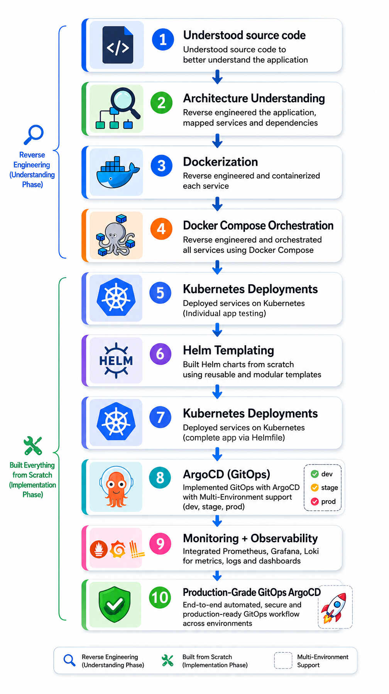
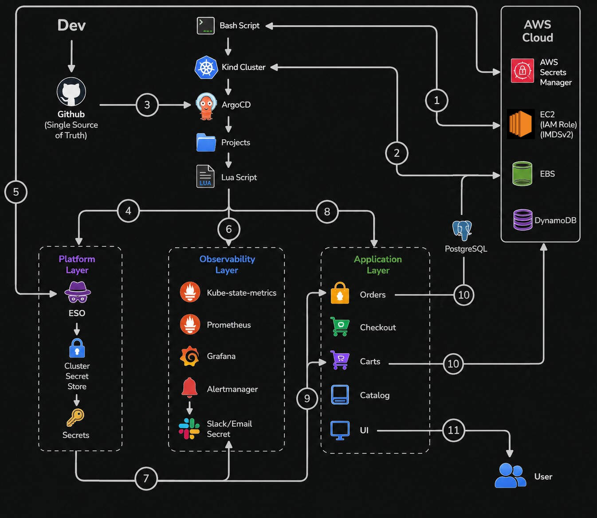
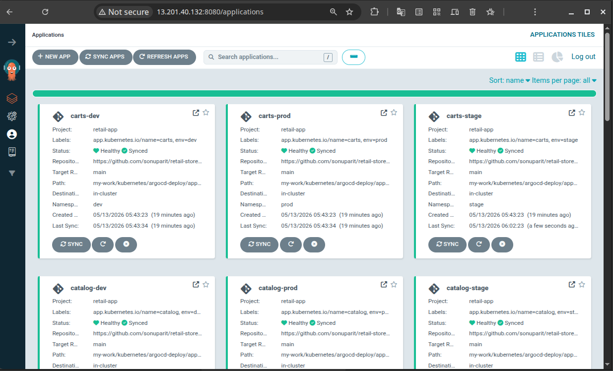
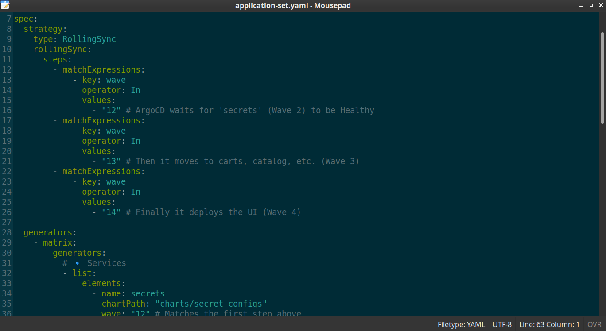
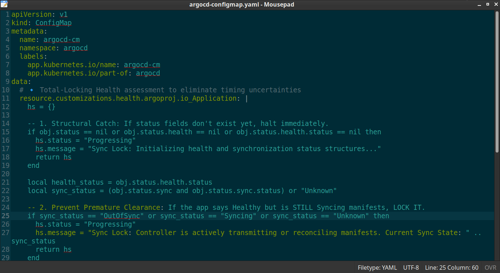
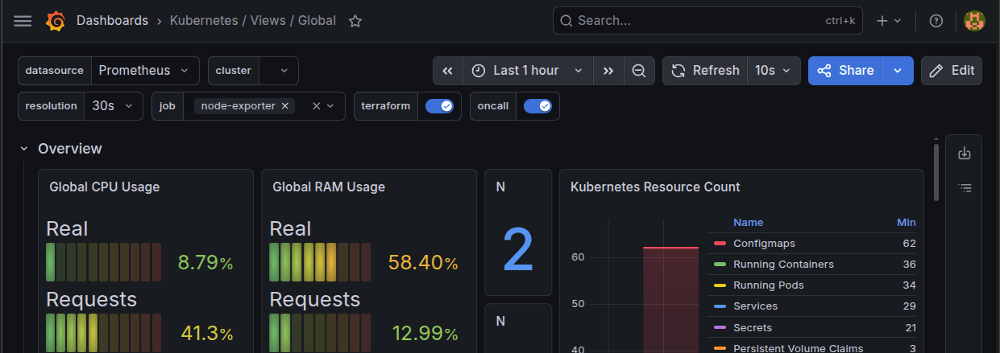
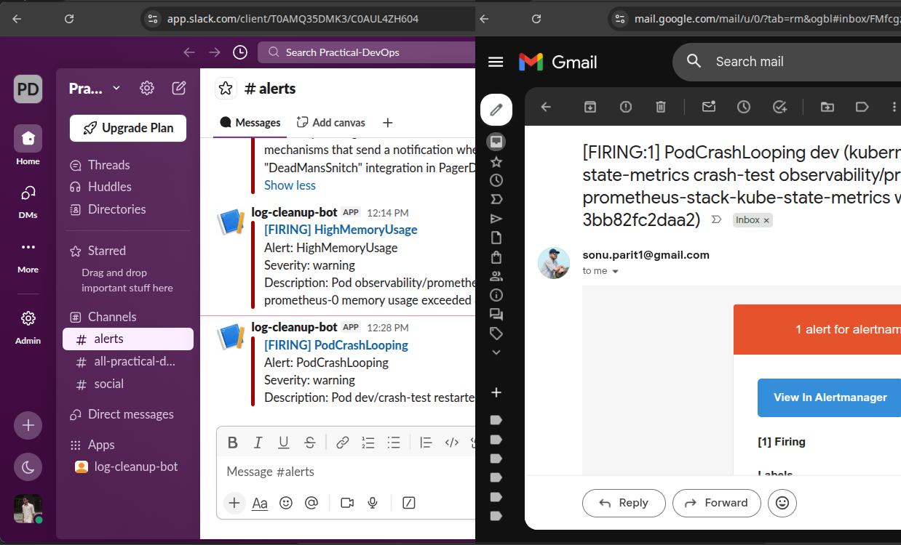
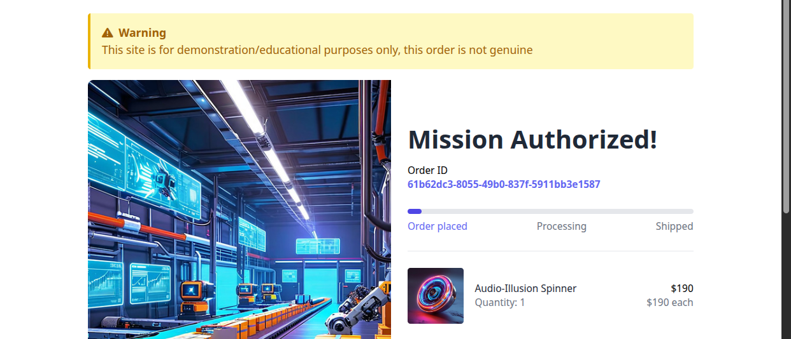

# 🚀 Productionizing a Microservices Application (Reverse-Engineered)

> [!NOTE]
> This project is based on an existing application that I reverse-engineered and enhanced → [(original repo)](https://github.com/aws-containers/retail-store-sample-app).

> [!NOTE]
> Beyond this implementation, the Application layer of the project was deployed on AWS EKS Auto Mode, Terraform-provisioned infrastructure, and full ArgoCD-driven GitOps CI/CD workflows → [(View Implementation)](https://github.com/sonuparit/terraform-gitops-pipeline).

This project focuses on reverse engineering and productionizing a distributed microservices application using Kubernetes, GitOps, observability tooling, and cloud-native operational practices.

The implementation emphasizes real-world DevOps engineering challenges including multi-environment deployments, stateful workloads, secret management, deployment orchestration, monitoring, alerting, and production-grade operational workflows.

## 📑 Table of Contents

- [Tech Stack & Ecosystem](#️-tech-stack--ecosystem)
- [Implementation Roadmap](#️-implementation-roadmap)
- [Project Architecture](#️-project-architecture)
- [Repository Structure](#-repository-structure)
- [Project Navigation](#-project-navigation)
- [Engineering Highlights](#️-engineering-highlights)
- [Operational Screenshots](#-operational-screenshots)
- [Deployment Guide](#-deployment-guide)
- [Future Improvements](#-future-improvements)

## 🛠️ Tech Stack & Ecosystem

| Layer                        | Technologies Used                                                                           | Purpose                                                                                                 |
| ---------------------------- | ------------------------------------------------------------------------------------------- | ------------------------------------------------------------------------------------------------------- |
| **Cloud & Infrastructure**   | `AWS` `Kubernetes` `Kind` `Docker` `Docker Compose` `Linux`                                  | Cloud-native infrastructure, containerization, orchestration, and runtime environments.                 |
| **GitOps & Delivery**        | `ArgoCD` `ApplicationSets` `Sync Waves` `Lua Health Checks` `Helm` `Helmfile` `Kustomize`   | Multi-environment GitOps delivery, deployment orchestration, and declarative infrastructure management. |
| **Data & Storage**           | `PostgreSQL` `DynamoDB` `AWS EBS` `PV/PVC`                                                  | Persistent storage, stateful workloads, and distributed data management.                                |
| **Security & Secrets**       | `External Secrets Operator (ESO)` `AWS Secrets Manager` `Kubernetes Secrets` `IAM` `IMDSv2` | Secret injection, least-privilege access control, and credential-less cloud authentication.             |
| **Observability**            | `Prometheus` `Grafana` `Loki` `Alertmanager` `PostgreSQL Exporter`                          | Metrics collection, log aggregation, alerting, monitoring, and operational visibility.                  |
| **Application & Validation** | `Node.js` `Go` `Java` `TypeScript` `E2E Testing` `Health Checks`                            | Application runtime behavior, service validation, and end-to-end operational testing.                   |

## 🗺️ Implementation Roadmap

<p align="left">
  
</p>

## 🏗️ Project Architecture



## 📂 Repository Structure

```text
.
├── README.md
├── LICENSE
├── overview.jpg
├── my-work
│   ├── 01-infrastructure
│   ├── 02-platform
│   ├── 03-observability
│   ├── 04-applications
│   ├── bootstrap
│   └── screenshots
└── src-code
    ├── cart
    ├── catalog
    ├── checkout
    ├── orders
    ├── ui
    ├── misc
    └── screenshots
```

## 🧭 Project Navigation

### 1. Understanding Phase (Reverse Engineered)

- [Source Code Understanding](https://github.com/sonuparit/retail-store-reverse-engineered/tree/main/src-code)
- [Architecture Understanding](https://github.com/sonuparit/retail-store-reverse-engineered/tree/main/my-work/04-applications/architecture)
- [Containerization (Docker)](https://github.com/sonuparit/retail-store-reverse-engineered/tree/main/my-work/04-applications/docker)
- [Docker Compose Orchestration](https://github.com/sonuparit/retail-store-reverse-engineered/tree/main/my-work/04-applications/docker-compose)

### 2. Implementation Phase (Kubernetes)

- [Individual Service Testing](https://github.com/sonuparit/retail-store-reverse-engineered/tree/main/my-work/04-applications/kubernetes/ind-svc-test)
  - [Carts](https://github.com/sonuparit/retail-store-reverse-engineered/tree/main/my-work/04-applications/kubernetes/ind-svc-test/cart-dynamodb-test)
  - [Catalog](https://github.com/sonuparit/retail-store-reverse-engineered/tree/main/my-work/04-applications/kubernetes/ind-svc-test/catalog-test)
  - [Checkout](https://github.com/sonuparit/retail-store-reverse-engineered/tree/main/my-work/04-applications/kubernetes/ind-svc-test/checkout-test)
  - [Orders](https://github.com/sonuparit/retail-store-reverse-engineered/tree/main/my-work/04-applications/kubernetes/ind-svc-test/orders-postgreSQL-test)
  - [UI](https://github.com/sonuparit/retail-store-reverse-engineered/tree/main/my-work/04-applications/kubernetes/ind-svc-test/ui-test)
- [Helm Templating](https://github.com/sonuparit/retail-store-reverse-engineered/tree/main/my-work/04-applications/kubernetes/helm-template)
- [Full App Deployment via Helmfile](https://github.com/sonuparit/retail-store-reverse-engineered/tree/main/my-work/04-applications/kubernetes/helmfile-deploy)
- [Multi-Environment GitOps via ArgoCD](https://github.com/sonuparit/retail-store-reverse-engineered/tree/main/my-work/04-applications/kubernetes/argocd-deploy)

### 3. Production phase

- [Monitoring & Observability](https://github.com/sonuparit/retail-store-reverse-engineered/tree/main/my-work/03-observability)
- [Production-Grade GitOps Workflow](https://github.com/sonuparit/retail-store-reverse-engineered/tree/main/my-work)

## ⚙️ Engineering Highlights

### 1. 🏗️ Architecture & Reverse Engineering

- Reverse-engineered a distributed 5-service microservices application
- Analyzed service communication, runtime dependencies, and Kubernetes-oriented design
- Built deployment architecture from source code understanding

### 2. 📦 Containerization & Local Orchestration

- Productionized Docker images across all services
- Reduced container footprint and enforced non-root security practices
- Built complete multi-service orchestration using Docker Compose

### 3. ☸️ Kubernetes Platform Engineering

- Individually validated and productionized all microservices on Kubernetes
- Implemented persistent and stateless workload strategies based on application behavior
- Built reusable Helm-based deployment architecture with Helmfile orchestration

### 4. 🚀 GitOps & Multi-Environment Delivery

- Designed multi-environment GitOps workflows using ArgoCD ApplicationSets
- Implemented environment-aware deployments across `dev`, `stage`, and `prod`
- Solved complex deployment, reconciliation, and dependency-ordering challenges

### 5. 📊 Observability & Production Operations

- Implemented production-grade monitoring using Prometheus, Grafana, Loki, Alertmanager  and exporters
- Built reusable observability workflows for Kubernetes workloads
- Improved operational visibility, troubleshooting, and deployment reliability

## 📸 Operational Screenshots

### 1. 🚀 Multi-Environment GitOps Deployments

ArgoCD-based automated deployments across isolated `dev`, `stage`, and `prod` environments.



### 2. 🧠 Deployment Orchestration & Sync Control

Custom ApplicationSet orchestration and Lua-based deployment health synchronization.





### 3. 📊 Monitoring & Observability

Infrastructure and PostgreSQL monitoring using Prometheus, Grafana, exporters, and ServiceMonitors.




### 4. 🔔 Operational Alerting

Integrated Slack and Email alert delivery using Alertmanager-based routing workflows.



### 5. 🧪 End-to-End Application Validation

Validated full application functionality after Kubernetes and GitOps deployment workflows.



## 📦 Deployment Guide

| Deployment Type                                                 | Description                                                  |
| --------------------------------------------------------------- | ------------------------------------------------------------ |
| [Docker Compose Deployment](./my-work/04-applications/docker-compose/)          | Local multi-service container orchestration                  |
| [Kubernetes Deployment](./my-work/04-applications/kubernetes/ind-svc-test/)                  | Individual service validation and Kubernetes workloads       |
| [Helmfile Deployment](./my-work/04-applications/kubernetes/helmfile-deploy/)    | Full application deployment using modular Helm orchestration |
| [ArgoCD Production Workflow](./my-work/)                               | End-to-end production-grade deployment          |

## ⭐ Future Improvements

- Transition to EKS
- GitOps CI Pipeline
- IaC via Terraform
