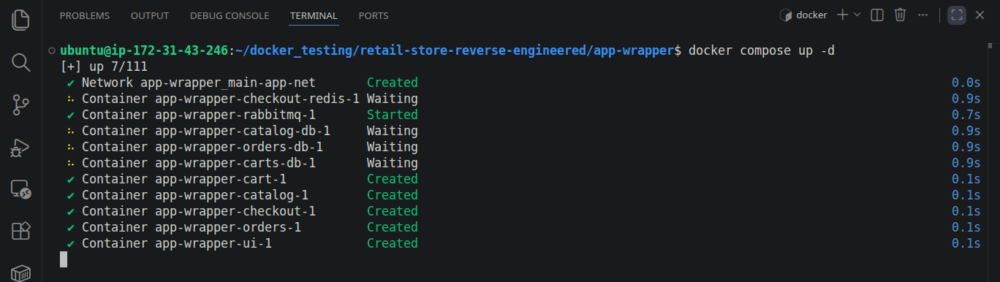

# 🚀 Retail Store Microservices — Containerization Deep Dive

## 📌 Overview

This project demonstrates a structured and analytical approach to containerizing a multi-service retail application using Docker Compose. Instead of building from scratch, the focus was on reverse engineering and deeply understanding an existing production-like setup.

The application consists of **5 microservices**, each independently containerized and orchestrated using Docker Compose.

---

## 🧠 What This Project Demonstrates

This work reflects a strong understanding of:

- Microservices-based architecture
- Container orchestration using Docker Compose
- Service-to-service communication
- Environment configuration and dependency mapping
- Debugging and runtime validation

---

## 🔍 Key Contributions

### 1. Compose File Analysis  
Thoroughly analyzed all provided `docker-compose` configurations across services, understanding:
- Service definitions
- Security enforcement
- Env mappings
- Dependency chains
- DB connection

### 2. Configuration Understanding  
Decoded the intent behind each directive:
- Why specific ports are exposed  
- How services communicate internally  
- The role of restart policies and build contexts
- Health checks implementation based on container env
- Strict security handling  

### 3. Environment Variable Discovery  
Identified required environment variables by:
- Tracing source code  
- Mapping configuration usage across services  
- Ensuring correct runtime injection  

### 4. Centralized Execution  
Created a unified override setup to run the entire system:

- Clone the repo:

```yml
https://github.com/sonuparit/retail-store-reverse-engineered.git
```

- Move into app-wrapper

```yml
cd retail-store-reverse-engineered/app-wrapper/
```
- Run the command

```yml
docker compose up -d
```

This enabled seamless startup of all services with proper configuration.



### 5. Runtime Validation  
Verified:
- Service health and communication  
- Application functionality through end-to-end testing  
- Stability of containerized environment  


---

## ⚙️ Tech Stack

- Docker  
- Docker Compose  
- Microservices Architecture  

---

## 🚀 Outcome

Successfully containerized and executed a multi-service retail application with a clear understanding of its internal architecture and runtime behavior.


---

## 🔭 What’s Next

Moving forward, this setup will be transitioned to Kubernetes to explore:

- Pod orchestration  
- Service abstraction  
- Ingress and networking  
- ConfigMaps and Secrets  
- Scalability and production-grade deployments  

---

## 📌 Final Thoughts

This project was not just about running containers — it was about breaking down a system, understanding every moving part, and rebuilding confidence in orchestrating complex applications.


