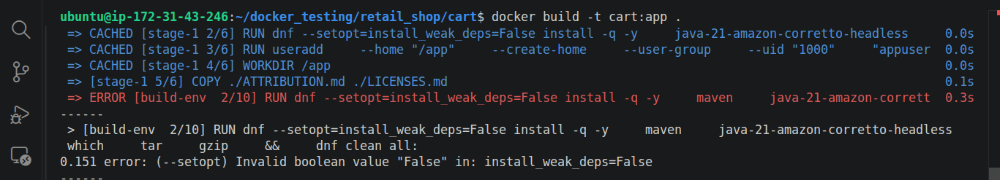
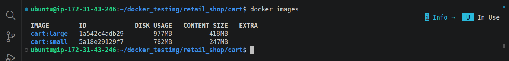
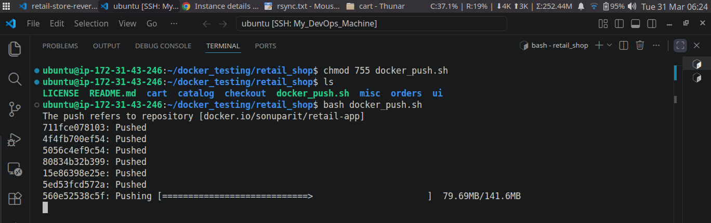

# 🚀 Retail Store Containerization

A hands-on reverse-engineered microservices project to better understand containerization using Docker.

## 📌 Overview

This project represents a retail store application composed of multiple
microservices. I took an existing
Dockerfile as a starting point and reverse-engineered the system to
deeply understand:

-   Microservices architecture
-   Service communication
-   Containerization workflow
-   Env variable lifecycle

**This project focuses on understanding real-world trade-offs in containerization rather than just building from scratch.**

## 🧠 What I Learned

-   How independent microservices are structured so they can be containerized
-   Writing and understanding Dockerfiles
-   How to make informed decisions when choosing base images
-   Debugging container-related issues

## 🏗️ Architecture

The application consists of 5 microservices:

-   Service 1 -- `UI` (**main Interface**)
-   Service 2 -- `Catalog` (**Content**)
-   Service 3 -- `Cart` (**Manages user session state**)
-   Service 4 -- `Checkout` (**Handles order processing workflow**)
-   Service 5 -- `Orders` (**Stores finalized transactions**)

Each service runs in its own container and communicates over Docker
networks.

## 🔍 Dockerfile Breakdown (Key Insights)

Instead of just running the service, I analyzed the Dockerfile to understand the design decisions behind it and identified key insights.

### 🧱 Base Image Strategy

While analyzing the Dockerfile, I initially attempted to replace the base image with a smaller Alpine-based image to reduce the final image size.

However, after **experimentation and research**, I identified key compatibility constraints:

**1. The Dockerfile relies on the _`dnf`_ package manager, whereas Alpine-based images use a different ecosystem (typically apk).**

**2. When testing with minimal Amazon Linux variant (*`AL2023:minimal`*), the build failed due to unsupported flag *`--setopt=install_weak_deps=False`*, This occurs because AL2023:minimal uses microdnf, which does not support this flag. And this flag alone was reducing 100s of MBs of junk.**

**3. The current image is based on *`glibc`*, while Alpine uses *`musl libc`*, which can introduce compatibility issues with certain binaries and dependencies.**

- **👉 Conclusion:**
*Switching to an Alpine-based image is not straightforward in this case without significant changes to dependency management and source code.*

- **👉 Insight:**
*The current base image choice prioritizes compatibility and stability over minimal size, which is often a practical decision in real-world production systems.*

### 🔐 Security Considerations

The application inside the container does not run with root privileges.

- **👉 Insight:**
*Running the application as a non-root user is a best practice to improve container security and align with production standards.*

### 💡 Overall Takeaway

*This Dockerfile reflects practical, production-oriented decisions where compatibility, stability, and security are prioritized over aggressive size optimization. While lightweight alternatives were explored, system-level constraints (package manager behavior and libc differences) justify the current approach, demonstrating the importance of balancing optimization with real-world reliability.*

## 🔍 My Contribution

-   Reverse engineered an existing Dockerfile
-   Understood and documented the system architecture
-   Improved my practical DevOps skills

## 💡 Why This Project Matters

This project demonstrates my ability to:

-   Learn from existing systems
-   Break down complex architectures
-   Take initiative and build understanding independently

## 📈 Next Improvements

-   Refactor setup for production-ready **Docker Compose usage**
-   Add **Kubernetes deployment**
-   IaC Provisioning via **Terraform**
-   Implement **CI/CD** pipeline
-   Adding **email notification**
-   Add monitoring (**Prometheus + Grafana**)

## 🤝 Let's Connect

If you're interested in DevOps, microservices, or cloud-native
development, feel free to connect with me!

------------------------------------------------------------------------

⭐ If you found this interesting, consider giving it a star!

------------------------------------------------------------------------

## Screenshots

- **Building Images**

- **LF CRLF Issue**

- **Correction**

- **Multi image push via script**

