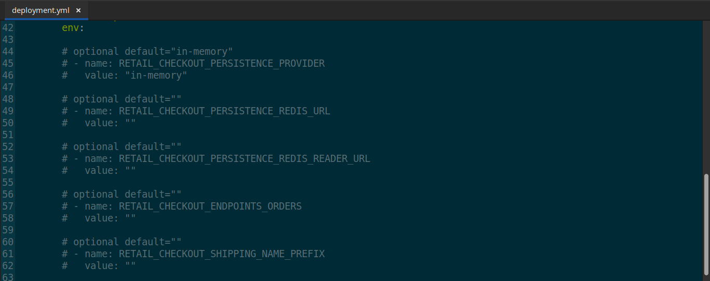
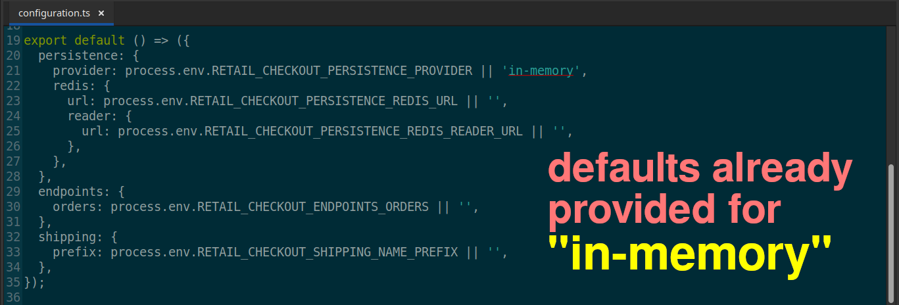
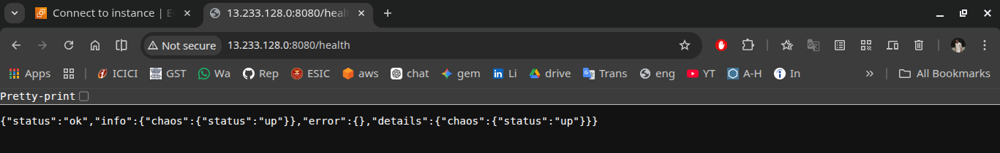

# 🚀 Checkout Service Solo Testing
*Implementation:* ***`In-Memory`** storage*

## 📑 Table of Contents

- **[Overview](#-overview)**
- **[Key Implementations](#-key-implementations)**
- **[Challenges & Solutions](#️-challenges--solutions)**
- **[Outcome](#-outcome)**
- **[Architectural Decision Record (ADR)](#️-architectural-decision-record--adr)**
- **[Key Learnings](#-key-learnings)**
- **[Next Steps](#-next-steps)**
- **[Extra Screenshots](#-extra-screenshots)**

## 📌 Overview

*While reverse engineering this retail microservices app, I **`focused on understanding service interactions, persistence strategies, and deployment across Docker and Kubernetes`**.*

*Instead of replicating everything blindly, I made **`selective architectural decisions`**—keeping implementations that added real learning value (**`DynamoDB for Cart, PostgreSQL for Orders`**) and removing redundant ones.*

*This approach helped me stay focused on orchestration, system behavior, and production-relevant trade-offs **`rather than repeating similar integrations`**.*

------------------------------------------------------------------------

## 🔧 Key Implementations

*Analyzed from top to bottom for env dependencies to **`decouple database from application`** to implement in-memory storage*

-   *Created all deployment resources.*

    

-   ***`Removed all env variables`** not required for in-memory storage*

    

------------------------------------------------------------------------

## ⚠️ Challenges & Solutions

*Requirement for database was not obvious. So, I wanted to seperate out the database connection from application.*

***My approach:***

-   *Analyzed requirement from source code (**`configuration.ts`**)*

    

-   *Confirmed everywhere for **requirements for** **`in-memory storage`** implementation*

    

    

-   ***`Removed all env variables`** not required for in-memory storage*

    

------------------------------------------------------------------------

## ✅ Outcome

***`Simplified the architecture while preserving learning depth where it mattered`**. This allowed faster iteration and better focus on system design, service interaction, and deployment strategies.*

*App working as intended:*

------------------------------------------------------------------------

## 🏛️ Architectural Decision Record 📝 (ADR)

***Context:***

*For this checkout service, **`the workflow does not require durable or shared state across instances. The checkout process can be deterministically reconstructed from the cart at any time`**. Given this, Redis looked like an over-engineered solution, adding infrastructure and maintenance complexity without clear benefit.*

***Rationale:***

- **`No requirement for persisted intermediate orchestration data.`**
- *Persistence patterns already implemented using DynamoDB (Cart) and PostgreSQL (Orders).*
- *Avoided unnecessary database integration.*
- *Reduced unnecessary operational overhead.*
- **`Kept focus on Kubernetes orchestration and infrastructure automation.`**

### The Decision:
***`Removed Redis`** integration from the Checkout service.*

------------------------------------------------------------------------

## 💡 Key Learnings

- *Learned to **`validate systems incrementally`** — testing services in isolation before full orchestration improved reliability and debugging clarity.*

- *Gianed hands-on experience in reverse engineering systems — **`an invaluable skill for translating legacy applications into scalable microservices architectures`**.*

- *Built practical experience in **`choosing the right persistence layer based on use case`**, instead of applying everything to everywhere.*

- ***`Realized the importance of intentional architecture decisions`** — removing components that add complexity without adding learning or value.*

- *Strengthened my ability to think in terms of system design trade-offs, not just implementation*

------------------------------------------------------------------------

## 🚀 Next Steps

1. *Full app deployment on **`Kubernetes`***
2. *IaC Provisioning via **`Terraform`***
3. *Implement **`CI/CD`** pipeline*
4. *Add **`email notification`** system*
5. *Add monitoring (**`Prometheus + Grafana`**)*
6. *Full Automation via one command **`terraform apply`** on **`EKS`***

## 📸 Extra Screenshots

- *Creation of KinD Cluster for local development*

    

- *Created all K8s resources and validated them*

    

-   Result:

    