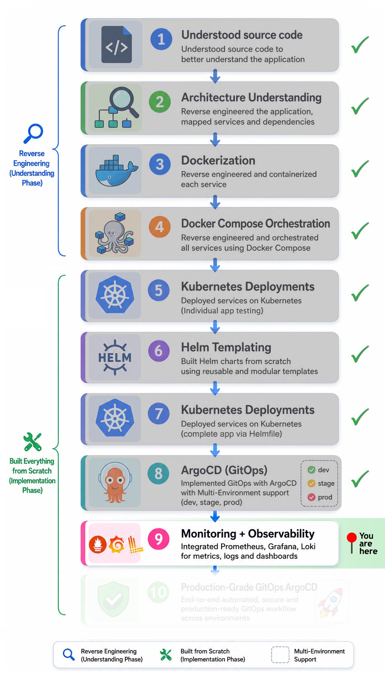

# 🚀 Kubernetes Observability Layer

This implementation focuses on production-oriented Kubernetes observability practices including centralized monitoring, logging, alerting, telemetry collection, and operational visibility across multi-environment workloads.

## 📑 Table of Contents

**🧭 Navigation:**

- [Implementation Roadmap](#️-implementation-roadmap)
- [Project Navigation](#-project-navigation)

**📘 Project Documentation:**

- [Overview](#-overview)
- [Metrics & Observability Flow](#-metrics--observability-flow)
- [Repository Structure](#-repository-structure)
- [Tech Stack](#️-tech-stack)
- [Features](#-features)
- [Core Implementation](#️-core-implementation)
- [Architectural Decisions](#️-architectural-decisions)
- [Challenges & Solutions](#️-challenges--solutions)
- [Operational Outcomes](#-operational-outcomes)
- [Key Learnings](#-key-learnings)
- [Next Phase](#-next-phase)
- [Screenshots](#-screenshots)

## 🗺️ Implementation Roadmap

<p align="left">
  
</p>

## 🔗 Project Navigation

- [Root Directory](https://github.com/sonuparit/retail-store-reverse-engineered)

### 📖 Understanding Phase

- [Source Code Understanding](https://github.com/sonuparit/retail-store-reverse-engineered/tree/main/src-code)
- [Architecture Understanding](https://github.com/sonuparit/retail-store-reverse-engineered/tree/main/my-work/04-applications/architecture)
- [Containerization (Docker)](https://github.com/sonuparit/retail-store-reverse-engineered/tree/main/my-work/04-applications/docker)
- [Docker Compose Orchestration](https://github.com/sonuparit/retail-store-reverse-engineered/tree/main/my-work/04-applications/docker-compose)

### ☸️ Kubernetes Implementation Phase

- [Individual Service Testing](https://github.com/sonuparit/retail-store-reverse-engineered/tree/main/my-work/04-applications/kubernetes/ind-svc-test)
  - [Carts](https://github.com/sonuparit/retail-store-reverse-engineered/tree/main/my-work/04-applications/kubernetes/ind-svc-test/cart-dynamodb-test)
  - [Catalog](https://github.com/sonuparit/retail-store-reverse-engineered/tree/main/my-work/04-applications/kubernetes/ind-svc-test/catalog-test)
  - [Checkout](https://github.com/sonuparit/retail-store-reverse-engineered/tree/main/my-work/04-applications/kubernetes/ind-svc-test/checkout-test)
  - [Orders](https://github.com/sonuparit/retail-store-reverse-engineered/tree/main/my-work/04-applications/kubernetes/ind-svc-test/orders-postgreSQL-test)
  - [UI](https://github.com/sonuparit/retail-store-reverse-engineered/tree/main/my-work/04-applications/kubernetes/ind-svc-test/ui-test)
- [Helm Templating](https://github.com/sonuparit/retail-store-reverse-engineered/tree/main/my-work/04-applications/kubernetes/helm-template)
- [Full App Deployment via Helmfile](https://github.com/sonuparit/retail-store-reverse-engineered/tree/main/my-work/04-applications/kubernetes/helmfile-deploy)
- [Multi-Environment GitOps via ArgoCD](https://github.com/sonuparit/retail-store-reverse-engineered/tree/main/my-work/04-applications/kubernetes/argocd-deploy)

### 📊 Production & Observability

- [Monitoring & Observability](https://github.com/sonuparit/retail-store-reverse-engineered/tree/main/my-work/03-observability) ← (📍 You are here )
- [Production-Grade GitOps Workflow](https://github.com/sonuparit/retail-store-reverse-engineered/tree/main/my-work)

## 📖 Overview

The observability stack integrates:

- Prometheus + Grafana for metrics and visualization
- Loki + Promtail for centralized logging
- Alertmanager for alert routing
- PostgreSQL monitoring through exporter-based telemetry collection

The implementation focuses on:

- centralized observability workflows
- multi-environment telemetry isolation
- Kubernetes-native monitoring
- scalable metrics collection
- centralized logging architecture
- operational troubleshooting visibility

## 📊 Metrics & Observability Flow

- ### Metrics Flow

  ```text
  Application
    ↓
  Service
    ↓
  ServiceMonitor
    ↓
  Prometheus
    ↓
  Grafana / Alertmanager
  ```

- ### Logs Flow

  ```text
  Container Logs
    ↓
  Promtail
    ↓
  Loki
    ↓
  Grafana Explore
  ```

## 📂 Repository Structure

```txt
.
├── README.md
├── challenges_&_solutions.md
├── 9-Observe.jpg
├── alertmanager
├── argocd
├── kube-state-metrics
├── loki
├── manifests
├── postgresql
├── prometheus-stack
└── screenshots
```

## 🛠️ Tech Stack

- ### 📊 Monitoring & Metrics

  - Prometheus
  - Prometheus Operator
  - kube-prometheus-stack
  - Grafana
  - postgres-exporter
  - kube-state-metrics

- ### 📜 Logging

  - Loki
  - Promtail
  - Grafana Explore

- ### 🚨 Alerting

  - Alertmanager
  - Slack Webhooks
  - Email Notifications

## 🎯 Features

- Centralized metrics collection using Prometheus
- Centralized logging using Loki + Promtail
- Real-time alerting with Alertmanager
- `Slack and Email` integration for alerts
- PostgreSQL telemetry collection using `postgres-exporter`
- Kubernetes-native monitoring using `ServiceMonitor`
- Environment-aware monitoring and logging
- Helm-based reusable observability configuration
- Multi-environment observability workflows
- Centralized Grafana dashboards and log exploration

## ⚙️ Core Implementation

- ### 1. Monitoring Stack Deployment

  Installed a production-oriented monitoring stack using Helm charts:

  - Prometheus
  - Grafana
  - Alertmanager
  - Node Exporter
  - kube-state-metrics

  via:

  ```bash
  kube-prometheus-stack
  ```

  This provided:

  - Centralized metrics collection
  - Kubernetes cluster monitoring
  - Grafana dashboard integration
  - Prometheus Operator support
  - Alertmanager
  - ServiceMonitor CRDs

- ### 2. ServiceMonitor-Based Metrics Discovery

  Implemented Kubernetes-native monitoring using `ServiceMonitor` resources instead of annotation-based scraping.

  Created dedicated `ServiceMonitor` manifests for microservices to enable:

  

  - automatic target discovery
  - Prometheus Operator integration
  - environment-aware monitoring
  - declarative observability configuration

  ```yaml
  apiVersion: monitoring.coreos.com/v1
  kind: ServiceMonitor
  ```

- ### 3. Operational Validation on Single Microservice

  Before scaling observability cluster-wide, initially tested monitoring integration on a single microservice (Catalog).

  Validated:

  - metrics endpoint exposure
  - Prometheus target discovery
  - ServiceMonitor selectors
  - Grafana metric visibility
  - Kubernetes service-to-target resolution

  This reduced debugging complexity and enabled controlled observability rollout.

- ### 4. Helmified ServiceMonitors for Multi-Environment Deployment

  Converted observability resources into reusable Helm templates to support scalable multi-service and multi-environment deployments.

  Helmified:

  - labels
  - Services
  - ServiceMonitors
  - environment metadata
  - namespace-aware monitoring

   

  Successfully implemented centralized metrics aggregation for:

  - carts
  - checkout
  - orders
  - catalog
  - ui

  across env:

  - dev
  - stage
  - prod

  

  This enabled:

  - reusable monitoring architecture
  - centralized observability
  - environment-aware metrics discovery
  - cross-service visibility
  - simplified GitOps workflows
  - scalable Kubernetes monitoring

- ### 5. Loki & Promtail Deployment with Persistent Storage

  Installed Loki and Promtail using Helm charts with custom `values.yaml` configuration.

  Implemented:

  - PVC-backed persistent storage
  - filesystem-based log retention
  - Promtail Kubernetes discovery
  - resource-aware deployment configuration

  

  This ensured:

  - persistent log storage
  - centralized log ingestion
  - scalable observability architecture

- ### 6. Centralized Logging via Loki

  Implemented centralized Kubernetes logging using:

  - Loki
  - Promtail
  - Grafana Explore

  to aggregate logs from all microservices into a centralized observability platform.

  Enabled:

  - label-based log querying
  - namespace-aware filtering
  - application-specific log searches
  - real-time log visibility

  using LogQL queries such as:

  ```logql
  {app="carts"}
  ```

  

  and:

  ```logql
  {namespace="dev"}
  ```

  

- ### 7. Helmified Environment & Application Labeling Strategy

  Helmified Kubernetes metadata labeling to standardize observability across multiple microservices and environments.

  Implemented reusable labels for:

  - application identification
  - environment separation
  - namespace-aware observability

  using:

  ```yaml
  metadata:
    labels:
      app: {{ .Chart.Name }}
      env: {{ .Release.Namespace }}
  ```

  This enabled:

  - clean metrics filtering
  - centralized log separation
  - multi-environment observability
  - Grafana label-based queries
  - reusable environment-aware deployments

- ### 8. Troubleshooting & Operational Problem Solving

  Resolved multiple production-oriented observability challenges during implementation, including:

  - Prometheus target discovery failures
  - ServiceMonitor selector mismatches
  - Incorrect ServiceMonitor port configuration
  - Environment label propagation
  - Promtail CrashLoopBackOff
  - Loki integration issues
  - Linux filesystem watcher exhaustion
  - Kubernetes service-to-container port mapping confusion
  - Understood Postgre exporter architecture

  This significantly improved operational understanding of:

  - Prometheus Operator internals
  - Kubernetes networking
  - Centralized logging architecture
  - Linux kernel tuning
  - Observability scaling considerations
  - Postgre exporter

- ### 9. Observability Validation

  Validated the complete observability pipeline through:

  - Prometheus Targets
  - Grafana Dashboards
  - Loki Explore
  - LogQL Queries
  - PromQL Queries
  - Custom alerting
  - Email & Slack Notification

  Successfully verified:

  - metrics scraping
  - multi-environment monitoring
  - centralized logging
  - live log ingestion
  - application-level telemetry
  - Kubernetes metadata enrichment

## 🏛️ Architectural Decisions

- ### 1. Prometheus Operator-Based Monitoring

  Used `kube-prometheus-stack` with `ServiceMonitor` CRDs for Kubernetes-native metrics discovery.

  Why

  - declarative monitoring
  - scalable metrics discovery
  - Prometheus Operator integration
  - easier long-term maintainability

- ### 2. Centralized Logging Architecture

  Implemented:

  - Loki for storage
  - Promtail for collection
  - Grafana for querying

  Why

  - centralized cluster-wide logging
  - label-based querying
  - easier cross-service debugging

- ### 3. Environment-Based Observability Segregation

  Implemented namespace-aware labeling for:

  - metrics
  - logs
  - telemetry queries

  Why

  - cleaner multi-environment isolation
  - faster troubleshooting
  - safer operational workflows

- ### 4. Postgre Exporter [(view implementation)](./postgresql/)

  Used dedicated exporters such as:

  - `postgres-exporter`

  Why

  - Decoupled observability architecture
  - Standardized Prometheus metrics exposure
  - Easier monitoring scalability

- ### 5. Helm-Based Observability Standardization

  Standardized observability resources through reusable Helm templates.

  Why

  - reduced configuration duplication
  - scalable environment management
  - reusable observability workflows

- ### 6. Kubernetes-Native Observability Stack

  Built the entire monitoring and logging pipeline using Kubernetes-native controllers and CRDs.

  Why

  - Better ecosystem integration
  - Declarative infrastructure management
  - Easier operational automation
  - Production-style observability workflows

## ⚔️ Challenges & Solutions

### Summary Only (Read full section - [here](./challenges_&_solutions.md))

| Area                    | Challenge                                   | Solution                                          |
| ----------------------- | ------------------------------------------- | ------------------------------------------------- |
| Prometheus              | ServiceMonitors silently ignored            | Reordered CRD installation lifecycle              |
| Loki                    | Promtail crashed with `too many open files` | Tuned Linux inotify kernel limits                 |
| Alertmanager            | Pods never created                          | Fixed Operator validation + storage configuration |
| Postgre Exporter        | Exporter architecture confusion             | Created architecture validation diagrams          |
| Multi-env Observability | Logs/metrics mixed across environments      | Implemented environment-aware labeling            |

## 📈 Operational Outcomes

- Achieved centralized monitoring across multiple Kubernetes environments
- Implemented cluster-wide centralized logging and log aggregation
- Enabled environment-aware metrics and log isolation
- Improved troubleshooting visibility through unified observability workflows
- Standardized observability configuration using reusable Helm templates
- Improved operational visibility into PostgreSQL and Kubernetes workloads
- Integrated real-time alert delivery through Slack and email notifications

## 🎓 Key Learnings

- Learned how Prometheus Operator manages monitoring through CRDs and reconciliation
- Improved understanding of Kubernetes networking and service discovery
- Gained hands-on experience troubleshooting exporter-based telemetry pipelines
- Learned how Linux kernel limits affect log aggregation systems
- Improved observability design through structured labeling and metadata enrichment
- Strengthened troubleshooting methodology through runtime validation and telemetry analysis

## 🔭 Next Phase

*Production GitOps with ArgoCD [(read here)](../)*

## 📸 Screenshots

ArgoCD ServiceMonitors


Postgre exporter


Custom Prometheus alerts


Prometheus and ArgoCD


Apps Metrics


Apps Logs


ArgoCD Metrics


ArgoCD Logs


Prometheus Alert Simulation


Alert Manager


Slack Notification


Email Notification


Kubernetes Dashboard


PostgreSQL


3 env deployment


Deployment verification


Node Exporter


API Server


Kube-state-matrics


