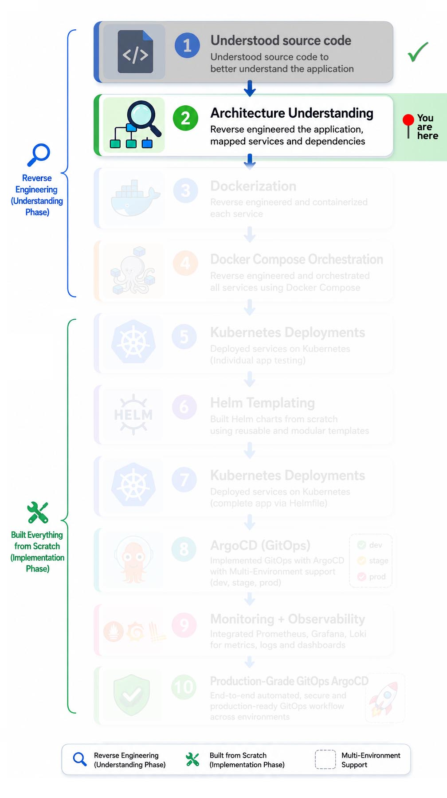
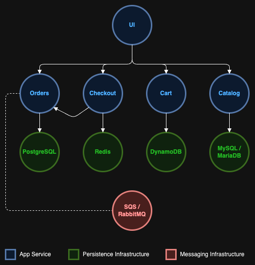

# 🏗️ Reverse Engineered to gain Architectural Understanding

This project is a retail store application built using a microservices architecture (5 services). I reverse-engineered the system to gain a deep understanding of service communication, dependencies, and Kubernetes-oriented design patterns.

## 📑 Table of contents

**🧭 Navigation:**

- [Implementation Roadmap](#️-implementation-roadmap)
- [Project Navigation](#-project-navigation)

**📘 Project Documentation:**

- [Overview](#-overview)
- [Architecture](#️-architecture-original)
- [What I Discovered](#-what-i-discovered)
- [Why this design?](#-why-this-design)
- [Key Learnings](#-key-learnings)
- [Conclusion](#-conclusion)
- [Next Phase](#-next-phase)

## 🗺️ Implementation Roadmap

  

## 🔗 Project Navigation

- [Root Directory](https://github.com/sonuparit/retail-store-reverse-engineered)

### 📖 Understanding Phase

- [Source Code Understanding](https://github.com/sonuparit/retail-store-reverse-engineered/tree/main/src-code)
- [Architecture Understanding](https://github.com/sonuparit/retail-store-reverse-engineered/tree/main/my-work/04-applications/architecture) ← (📍 You are here )
- [Containerization (Docker)](https://github.com/sonuparit/retail-store-reverse-engineered/tree/main/my-work/04-applications/docker)
- [Docker Compose Orchestration](https://github.com/sonuparit/retail-store-reverse-engineered/tree/main/my-work/04-applications/docker-compose)

### ☸️ Kubernetes Implementation Phase

- [Individual Service Testing](https://github.com/sonuparit/retail-store-reverse-engineered/tree/main/my-work/04-applications/kubernetes/ind-svc-test)
  - [Carts](https://github.com/sonuparit/retail-store-reverse-engineered/tree/main/my-work/04-applications/kubernetes/ind-svc-test/cart-dynamodb-test)
  - [Catalog](https://github.com/sonuparit/retail-store-reverse-engineered/tree/main/my-work/04-applications/kubernetes/ind-svc-test/catalog-test)
  - [Checkout](https://github.com/sonuparit/retail-store-reverse-engineered/tree/main/my-work/04-applications/kubernetes/ind-svc-test/checkout-test)
  - [Orders](https://github.com/sonuparit/retail-store-reverse-engineered/tree/main/my-work/04-applications/kubernetes/ind-svc-test/orders-postgreSQL-test)
  - [UI](https://github.com/sonuparit/retail-store-reverse-engineered/tree/main/my-work/04-applications/kubernetes/ind-svc-test/ui-test)
- [Helm Templating](https://github.com/sonuparit/retail-store-reverse-engineered/tree/main/my-work/04-applications/kubernetes/helm-template)
- [Full App Deployment via Helmfile](https://github.com/sonuparit/retail-store-reverse-engineered/tree/main/my-work/04-applications/kubernetes/helmfile-deploy)
- [Multi-Environment GitOps via ArgoCD](https://github.com/sonuparit/retail-store-reverse-engineered/tree/main/my-work/04-applications/kubernetes/argocd-deploy)

### 📊 Production & Observability

- [Monitoring & Observability](https://github.com/sonuparit/retail-store-reverse-engineered/tree/main/my-work/03-observability)
- [Production-Grade GitOps Workflow](https://github.com/sonuparit/retail-store-reverse-engineered/tree/main/my-work)

## 📌 Overview

**Performed architectural analysis of the application by studying:**

- *Application source code*
- *Service dependencies*
- *Environment variables and runtime configurations*
- *API communication patterns*
- *Containerization requirements*

**This process helped map the end-to-end service flow and identify how microservices interact within a Kubernetes-oriented environment.**

## 🏗️ Architecture (Original)

| Component            | Language |  Description                            |
| -------------------- | -------- | --------------------------------------- |
| UI                   | Java     | Store user interface                    |
| Catalog              | Go       | Product catalog API                     |
| Cart                 | Java     | User shopping carts API                 |
| Orders               | Java     | User orders API                         |
| Checkout             | Node     | API to orchestrate the checkout process |

## 🧠 What I Discovered

**Architecture Insights:**

- *Stateless microservices architecture*
- *Cloud-native service design patterns*
- *Container-oriented application structure*
- *Internal API-based service communication*
- *Kubernetes-friendly workload separation*
- *Ephemeral workload design*
- *Supports optional integration with external databases if needed*

## 🧬 Why this design?

**This architecture appears intentionally optimized for:**

- *State/Stateless workload orchestration*
- *Production oriented workflows*
- *Reduced infrastructure dependency management*
- *Cloud-native deployment environments*
- *Rapid experimentation in Kubernetes ecosystems*
- *Service-level isolation and modularity*

## 🎓 Key Learnings

**This reverse-engineering process strengthened my understanding of:**

- *Distributed system architecture*
- *Microservices communication patterns*
- *Container-first application design*
- *Kubernetes-oriented deployment models*
- *Service dependency mapping*
- *Operational considerations in cloud-native environments*

**It also established the architectural foundation required for later implementation phases involving containerization, orchestration, GitOps workflows, observability, and infrastructure automation.**

## 📌 Conclusion

This architectural analysis phase provided a strong foundation for understanding how modern cloud-native microservices are structured, deployed, and orchestrated within Kubernetes-oriented environments.

The project served as a practical entry point into distributed systems design, containerized workloads, service communication patterns, and production-style application architecture.

## 🔭 Next Phase

*Containerization with Docker [(read here)](../docker/)*
