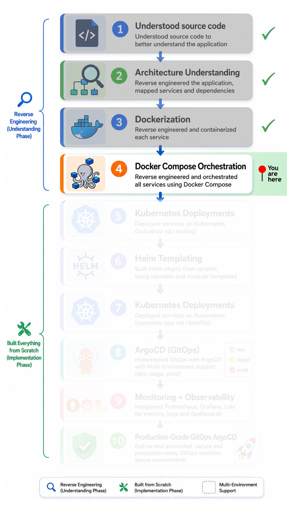
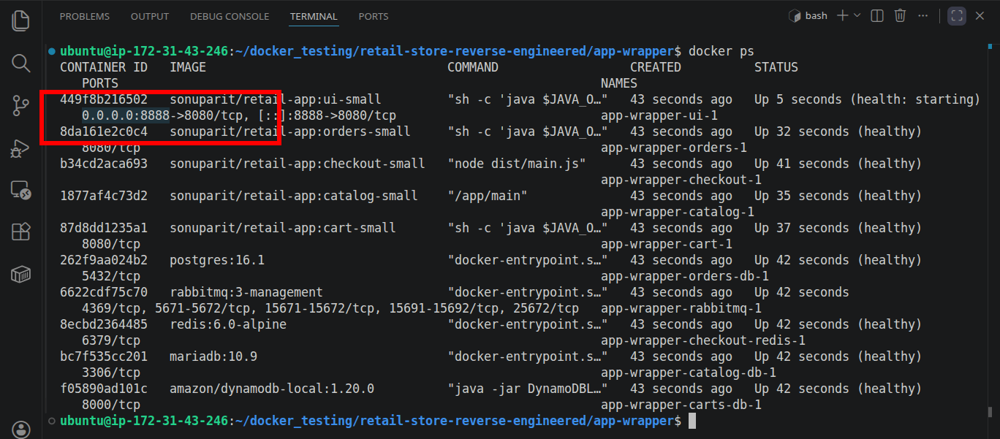
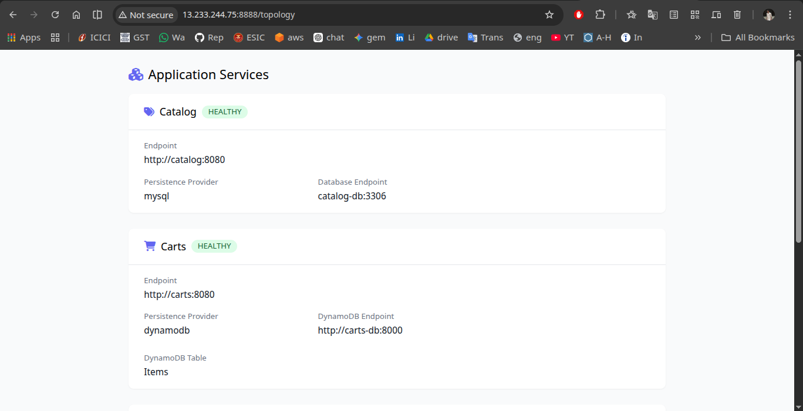

# 🚀 Docker Compose Orchestration for Microservices

A production-oriented Docker Compose orchestration setup focused on reverse engineering, understanding, and validating how independently containerized microservices communicate and operate within a unified runtime environment.

## 📑 Table of Contents

1. [Implementation Roadmap](#️-implementation-roadmap)
2. [Overview](#-overview)
3. [What this Project Demonstrates](#-what-this-project-demonstrates)
4. [Key Contribution](#-key-contributions)
5. [How to Run](#️-how-to-run)
6. [Tech Stack](#️-tech-stack)
7. [Key Technical Learnings](#-key-technical-learnings)
8. [Next Phase](#-next-phase)
9. [Final thoughts](#-final-thoughts)

## 🗺️ Implementation Roadmap

<p align="left">
  
</p>

> [!TIP]
> 📍 Current Focus: Docker Compose Orchestration

### 🔗 Jump to Other Phases

- [Source Code Understanding](../../../src-code/)
- [Architectural Understanding](../architecture/)
- [Containerization (Docker)](../docker/)
- Docker Compose ← (📍 You are here )
- [Kubernetes](../kubernetes/)
  - [Individual Microservice Testing](../kubernetes/ind-svc-test/)
  - [Helm Templating](../kubernetes/helm-template/)
  - [Full App Deployment via Helmfile](../kubernetes/helmfile-deploy/)
  - [Multi Env Deployment via ArgoCD](../kubernetes/argocd-deploy/)
- [Monitoring & Observability](../../03-observability/)
- [Production grade GitOps](../../)

## 📌 Overview

> [!NOTE]
> This phase intentionally uses local development environment variables and secrets.
>
> In later Kubernetes phases, secrets were migrated to **AWS Secrets Manager** for production-grade secret handling.

*This phase focused on reverse engineering and orchestrating a production-style multi-service retail application using Docker Compose.*

*The objective was not only to run containers, but to understand how independently deployed microservices communicate, share configuration, manage dependencies, and operate within a unified runtime environment.*

## 🧠 What This Project Demonstrates

**This implementation demonstrates practical understanding of:**

- *Multi-service orchestration using Docker Compose*
- *Container networking and service discovery*
- *Configuration-driven application architecture*
- *Environment variable management*
- *Service dependency coordination*
- *Runtime validation and debugging workflows*
- *Production-oriented microservices operation*

## 🔍 Key Contributions

### 1. Compose Configuration Analysis

**Analyzed service orchestration patterns across all Docker Compose configurations, including:**

- *Service definitions*
- *Environment mappings*
- *Dependency chains*
- *Database connectivity*
- *Security-related configurations*
- *Container startup coordination*

### 2. Configuration Behavior Analysis

**Validated the operational purpose behind key orchestration directives, including:**

- *Port exposure strategy*
- *Internal service communication*
- *Restart policy behavior*
- *Build context separation*
- *Health check implementation*
- *Runtime environment isolation*

### 3. Environment Variable Discovery  

*Identified required environment variables by:*

- *Tracing source code*  
- *Mapping configuration usage across services*  
- *Ensuring correct runtime injection*  

### 4. Unified Multi-Service Orchestration

*Designed a modular Compose-based orchestration workflow using shared configuration and a centralized bridge network (**`main-app-net`**) to enable seamless communication across independently managed services.*

## ▶️ How to Run

- Clone the repo:

```yml
https://github.com/sonuparit/retail-store-reverse-engineered.git
```

- Navigate to Wrapper

```yml
cd retail-store-reverse-engineered/my-work/docker-compose/app-wrapper/
```

- Start All Services

```yml
docker compose up -d
```

This enabled seamless startup of all services with proper configuration.


- Run `docker ps` command to get the port of UI

```yml
docker ps
```



- After health check, access the app at port `8888`

  - for local development access at `localhost:8888`

  - for EC2 development access at `<EC2 public IP>:8888`

    

### 5. Operational Validation

**Verified:**

- Service health and communication

    

- Application functionality through end-to-end testing  

    

- Stability of containerized environment  

    

---

## ⚙️ Tech Stack

- **Docker**
- **Docker Compose**
- **Microservices Architecture**

## 🚀 Key Technical Learnings

- *How independently deployed microservices communicate within shared container networks*
- *Practical orchestration patterns using Docker Compose*
- *Runtime dependency coordination and startup sequencing*
- *Environment-driven configuration management*
- *Container health validation and operational debugging*
- *Reverse engineering and understanding production-style application setups*

## 🔭 Next Phase

The next implementation phase transitions this Compose-based orchestration workflow into Kubernetes-native deployments, including:

- *Individual workload deployment testing [(read here)](../kubernetes/)*
- *Helm templating*
- *Helmfile-based orchestration*
- *Multi-Environment GitOps workflows with ArgoCD*
- *Monitoring and observability integration*

## 📌 Final Thoughts

This phase was not only about orchestrating containers, but about understanding the operational behavior of distributed services within a shared runtime environment.

The reverse-engineering process strengthened my ability to analyze existing systems, validate runtime behavior, and reason about production-oriented orchestration workflows.
