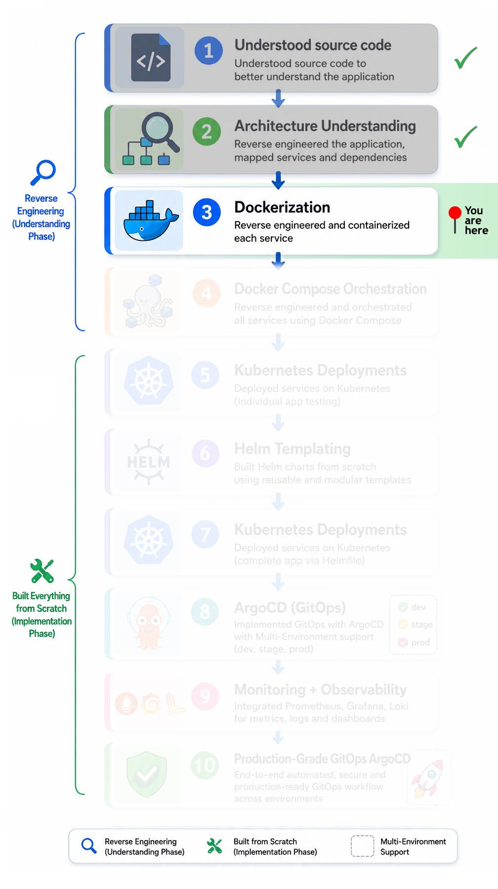
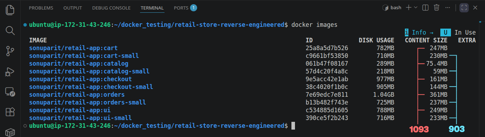
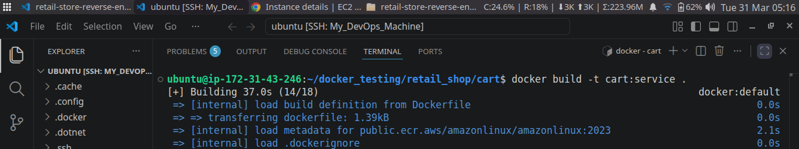
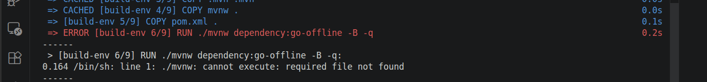
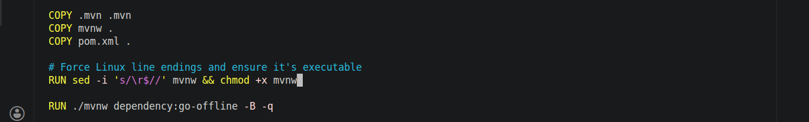
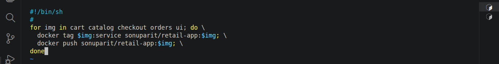

# 🚀 Microservices Containerization & Docker Engineering

A hands-on reverse-engineered microservices project focused on understanding production-grade container design decisions, not just building containers.

## 📑 Table of Contents

1. [Implementation Roadmap](#️-implementation-roadmap)
2. [Overview](#-overview)
3. [Architecture](#️-architecture-original)
4. [Dockerfile Breakdown](#-dockerfile-breakdown-key-insights)
5. [What I choose](#-what-i-chose-for-my-project)
6. [My Contribution](#-my-contribution)
7. [Key Technical Learnings](#-key-technical-learnings)
8. [Why This Project Matters](#-why-this-project-matters)
9. [Next Phase](#-next-phase)
10. [Screenshots](#-screenshots)

## 🗺️ Implementation Roadmap

<p align="left">
  
</p>

> [!TIP]
> 📍 Current Focus: Containerization with Docker

### 🔗 Jump to Other Phases

- [Source Code Understanding](../../../src-code/)
- [Architectural Understanding](../architecture/)
- Containerization (Docker) ← (📍 You are here )
- [Docker Compose](../docker-compose/)
- [Kubernetes](../kubernetes/)
  - [Individual Microservice Testing](../kubernetes/ind-svc-test/)
  - [Helm Templating](../kubernetes/helm-template/)
  - [Full App Deployment via Helmfile](../kubernetes/helmfile-deploy/)
  - [Multi Env Deployment via ArgoCD](../kubernetes/argocd-deploy/)
- [Monitoring & Observability](../../03-observability/)
- [Production grade GitOps](../../)

## 📌 Overview

> [!NOTE]
> This phase intentionally uses local development environment variables and secrets.
>
> In later Kubernetes phases, secrets were migrated to **AWS Secrets Manager** for production-grade secret handling.

**This phase of the project focused on understanding real-world containerization strategies used in a microservices-based retail application.**

**Through reverse engineering and experimental optimization, I analyzed:**

- *Containerization workflows*
- *Base image trade-offs*
- *Runtime compatibility constraints*
- *Microservices isolation patterns*
- *Production-oriented Docker practices*

**The primary objective was not just building containers, but understanding the engineering decisions behind production-grade Docker implementations.**

## 🏗️ Architecture (Original)


**The application consists of 5 microservices:**

- *Service 1 -- `UI` (**main Interface**)*
- *Service 2 -- `Catalog` (**Content**)*
- *Service 3 -- `Cart` (**Manages user session state**)*
- *Service 4 -- `Checkout` (**Handles order processing workflow**)*
- *Service 5 -- `Orders` (**Stores finalized transactions**)*

**Each service runs in its own container and communicates over a Docker network.**

## 🔍 Dockerfile Breakdown (Key Insights)

**Instead of just running the service, I analyzed the Dockerfile to understand the design decisions behind it and identified key insights:**

### 🧱 Base Image Strategy

While analyzing the container build strategy, I explored whether the existing base image could be optimized without introducing runtime instability or dependency issues.

1. *The Dockerfile relies on the **`dnf`** package manager, whereas Alpine-based images use a different ecosystem (typically **`apk`**).*

2. *The current image is based on **`glibc`**, while Alpine uses **`musl libc`**, which may introduce binary compatibility and dependency-related issues.*

3. *Based on these constraints, I focused on finding a smaller image that still supports the dnf package manager.*

4. *I tested with **`Amazon Linux 2023 (AL2023-minimal)`**, which uses the **`microdnf`** package manager. The build was successful, resulting in a significant reduction in the final image size.*

    - ***`190MB`** reduction in total file size:*
    

5. *This raised an important question:*

    **Optimization vs Stability Trade-off**

    During experimentation, a key architectural question emerged:

    > *Why use larger image if smaller alternatives function correctly?*

    Further analysis revealed that production-grade base image selection often prioritizes:

    - *Runtime stability*
    - *Dependency compatibility*
    - *Predictable package management behavior*
    - *Reduced environment-specific failures*
    - *Long-term maintainability*

    This highlighted an important real-world engineering principle:

    > *Image size optimization should never compromise operational reliability.*

    **Amazon docs:**
    

- **👉 Insight:**
*The current base image choice prioritizes compatibility and stability over minimal size, which is often a practical decision in real-world production systems.*

### 🔐 Security Considerations

**The application inside the container does not run with root privileges.**

- **👉 Insight:**
*Running the application as a non-root user is a best practice to improve container security and align with production standards.*

### 💡 Overall Takeaway

```text
This Dockerfile reflects practical, production-oriented decisions where compatibility, stability, and security are prioritized over aggressive size optimization. While lightweight alternatives were explored, system-level constraints (package manager behavior and libc differences) justify the current approach, demonstrating the importance of balancing optimization with real-world reliability.
```

## 🧪 What I Chose for My Project

**Experimental Optimization:**\
To better understand container optimization trade-offs, I implemented and tested a lightweight container strategy using **`AL2023-minimal`**.

This helped evaluate:

- *Compatibility limitations*
- *Package manager behavior*
- *Dependency constraints*
- *Image size reduction impact*
- *Production viability of minimal images*

*I chose a **`minimal base image`** to intentionally explore its limitations and identify potential compatibility issues, even though the original image works reliably.*

## 🔍 My Contribution

- *Reverse engineered existing Docker build workflows*
- *Analyzed production-oriented Dockerfile design decisions*
- *Experimented with alternative base image strategies*
- *Validated compatibility constraints between libc ecosystems*
- *Reduced container image size by approximately **190MB***
- *Documented architectural trade-offs between optimization and stability*
- *Improved understanding of production-grade container engineering*

## 🧠 Key Technical Learnings

- *How microservices are isolated and packaged into independent containers*
- *Production-oriented Dockerfile design patterns*
- *Base image selection trade-offs in Linux container ecosystems*
- *glibc vs musl compatibility considerations*
- *Container security best practices*
- *Debugging and validating container runtime issues*
- *Balancing optimization with operational reliability*

## 💡 Why This Project Matters

**This project strengthened my understanding of:**

- *Production-oriented containerization workflows*
- *Container runtime behavior*
- *Docker image optimization trade-offs*
- *Microservices packaging strategies*
- *Operational reliability considerations*
- *Real-world debugging and compatibility analysis*

**It also established the foundation for later orchestration, Kubernetes deployments, GitOps workflows, and observability implementation phases.**

## 🚀 Next Phase

➡️ Continue to:

- Docker Compose orchestration  → [(read here)](../docker-compose/)
- Helm templating
- Kubernetes deployments
- GitOps workflows with ArgoCD
- Monitoring and observability
- Production-grade infrastructure automation

------------------------------------------------------------------------

## 📸 Screenshots

**Building Images:**


**LF CRLF Issue:**


**Correction:**


**Multi image push via script:**



