# 🚀 ArgoCD-Based Deployment on K8s

This project demonstrates a production-style GitOps workflow using ArgoCD and Kubernetes, focused on multi-environment deployments, secret management, persistent storage, and real-world deployment orchestration challenges.

## 📑 Table of Contents

1. **[Overview](#-overview)**
2. **[Project Structure with ArgoCD](#️-project-structure-with-argocd)**
3. **[What this Project Demonstrates](#-what-this-project-demonstrates)**
4. **[My Implementations](#️-my-implementations)**
5. **[Challenges & Solutions](#-challenges--solutions)**
6. **[What I Learned](#-what-i-learned)**
7. **[How to Run](#️-how-to-run)**
8. **[What's Next](#-whats-next)**
9. **[Final thoughts](#-final-thoughts)**

## 📖 Overview

This project demonstrates a production-style GitOps deployment workflow using ArgoCD on Kubernetes.

The setup focuses on building a clean separation between platform infrastructure and application workloads while handling real-world deployment challenges like:

- Dependency orchestration
- Secret management
- Multi-environment deployments
- Persistent storage
- Reconciliation timing
- Helm templating edge cases

The project uses:

- **ArgoCD** for GitOps-based continuous delivery
- **Helm** for application templating
- **Kustomize** for platform orchestration
- **External Secrets Operator** for AWS Secrets Manager integration
- **kind Kubernetes cluster** running on EC2
- **Persistent EBS-backed storage** for stateful workloads

Instead of only deploying sample applications, the goal was to deeply understand how Kubernetes and GitOps systems behave under real operational scenarios.

## 🏗️ Project Structure with ArgoCD

The repository is organized to separate platform-level infrastructure from application workloads and environment-specific configurations.

This structure makes deployments easier to scale, maintain, and extend across multiple environments like `dev`, `stage`, and `prod`.

### Structure Breakdown

| Directory | Purpose |
|---|---|
| `kind-cluster/` | Contains kind cluster configuration with volume mounts and ArgoCD installation values |
| `platform/` | Holds platform-level infrastructure components such as External Secrets Operator, ClusterSecretStore, and Kustomize orchestration |
| `argocd-project/` | Defines ArgoCD Projects and root applications responsible for managing GitOps deployment boundaries and sync behavior |
| `envs/` | Stores environment-specific Helm values for `dev`, `stage`, and `prod` deployments |
| `apps/` | Contains ArgoCD ApplicationSet definitions and Helm charts for deploying application workloads |
| `screenshots/` | Includes deployment screenshots, sync visuals used for documentation |

```bash
repo*
├── README.md
├── kind-cluster/
│   ├── argocd-install-values.yaml
│   ├── kind-config.yml
│   ├── steps to install argocd.txt
│   └── values/
│
├── platform/
│   ├── cluster-secret-store.yaml
│   ├── external-secrets-app.yaml
│   └── kustomization.yaml
│
├── argocd-project/
│   ├── argocd-project.yml
│   └── platform.yml
│
├── envs/
│   ├── dev/
│   ├── prod/
│   └── stage/
│
├── apps/
│   ├── application-set.yml
│   └── charts/
│
└── screenshots/
```

## 🎯 What This Project Demonstrates

This project was built to simulate real-world GitOps and Kubernetes deployment workflows instead of just deploying sample applications.

It demonstrates hands-on experience with:

- GitOps-based continuous delivery using ArgoCD
- Multi-environment Kubernetes deployments (`dev`, `stage`, `prod`)
- Helm templating and reusable chart architecture
- Platform vs application layer separation
- Kubernetes reconciliation and deployment orchestration
- External Secrets Operator integration with AWS Secrets Manager
- Sync ordering using ArgoCD Sync Waves
- Persistent storage management using EBS-backed volumes
- Stateful application deployment with PostgreSQL
- Handling Helm rendering edge cases and debugging failures
- Kubernetes storage isolation across environments
- Designing scalable and maintainable repository structures
- Troubleshooting real deployment race conditions and dependency issues

The project focuses heavily on understanding *why systems behave the way they do* — not just getting deployments to work.

---

## ⚙️ My Implementations

Structured the setup to closely resemble production-style Kubernetes workflows while remaining lightweight for local experimentation

Key implementations and architectural decisions in this project:

- Built a GitOps workflow using ArgoCD with automated sync-based deployments
- Organized repositories into platform, application, and environment layers for cleaner scalability
- Implemented ArgoCD ApplicationSets for dynamic multi-environment deployments
- Used Helm for reusable application templating across environments
- Integrated External Secrets Operator with AWS Secrets Manager for centralized secret management
- Managed deployment dependencies using ArgoCD Sync Waves
- Used `ServerSideApply=true` to handle large CRD deployments safely
- Implemented persistent PostgreSQL storage backed by external EBS volumes
- Designed per-environment storage isolation to avoid cross-environment conflicts
- Mounted external EBS-backed host storage into kind nodes using `extraMounts`, enabling persistent data retention across cluster teardown and recreation
- Tested deployment recovery behavior using Kubernetes reconciliation
- Validated secrets end-to-end from AWS Secrets Manager to running Pods

## 🚧 Challenges & Solutions

Building this ArgoCD-based GitOps setup taught me much more than just “deploying apps.”
Most of the work was actually around handling orchestration edge cases, Helm behavior, Kubernetes reconciliation, and dependency management across environments.

### 1. Managing Deployment Order Across Platform Components

**Challenge:**

Some resources depended on others being available first:

- CRDs had to exist before dependent resources
- External Secrets Operator had to become ready before ClusterSecretStore
- Applications needed secrets before startup

Without proper orchestration, deployments failed during sync.

**Solution:**

I separated the platform and application layers and enforced deployment order using:

- ArgoCD Sync Waves
- Kustomize
- ServerSideApply
- SkipDryRunOnMissingResource

This ensured CRDs, controllers, webhooks, and secret providers became available in the correct order before applications synced.

**Key Engineering Problems Solved:**

1. **✅ Metadata Size Limit**

    - Large CRDs exceeded Kubernetes’ annotation size limit (262KB) during normal apply operations.

    **Solution:** Used:

    ```yaml
      ServerSideApply=true
    ```

2. **✅ Resource Validation Race Condition**

    - ClusterSecretStore attempted validation before **ESO webhooks** were fully ready.

    **Solution:** Used sync waves:

    ```yaml
    argocd.argoproj.io/sync-wave: "-1"
    # and later waves for dependent resources.
    ```

3. **✅ Unknown Resource Validation Loop**

    - ArgoCD tried validating CRDs before they existed.

    **Solution:** Added:

    ```yaml
    SkipDryRunOnMissingResource=true
    # to allow initial reconciliation to proceed safely.
    ```

### 2. ArgoCD Couldn’t Detect Helm Charts

**Challenge:**

1. **ArgoCD failed with:**

    - **Chart.yaml not found**\
        even though Helm charts existed inside nested directories.

    - **Root Cause**

      - ArgoCD does not recursively search for Helm charts.
      - It expects Chart.yaml exactly at the path defined in:

          ```yaml
          spec.source.path
          ```

**Solution:**

- Instead of pointing to a parent directory, I dynamically mapped each chart path:

  ```yaml
  path: my-work/kubernetes/argocd-deploy/apps/{{chartPath}}
  ```

**What I Learned:**

- ArgoCD effectively behaves like:

    ```yaml
    cd <path> && helm template .
    ```

- **The chart must exist exactly at that location**.

### 3. Helm Path Resolution & Template Rendering Pitfalls

While working with Helm templating, I hit multiple issues that exposed how Helm actually processes files internally.

- Incorrect valueFiles Relative Paths

**Challenge:**

1. ArgoCD sync failed because Helm values files could not be found.

**Root Cause:**

- valueFiles paths are resolved relative to the chart directory — not the repository root.

**Solution:**

- Adjusted paths based on actual chart depth:

  ```yaml
  helm:
    valueFiles:
      - ../../../envs/{{env}}/{{name}}.yaml
  ```

**Learning:**

- Path resolution in GitOps setups becomes critical as repository structures grow.

### 4. External Secrets Readiness vs Deployment Timing

**Challenge:**

- Applications started before Kubernetes Secrets were created by External Secrets Operator, causing startup failures.

**The Real Problem:**

- The sequence looked like this:

  - Application deployment starts
  - ExternalSecret begins reconciliation
  - Secret does not exist yet
  - Pod starts anyway
  - Application crashes

**This exposed an important Kubernetes concept:**

- Deployment order does not guarantee runtime readiness.

**Approaches I Evaluated:**

1. **Helm Hooks + Waiting Jobs**

    - Use Jobs to block deployment until secrets existed.

    **Tradeoff**

    - extra RBAC
    - extra ServiceAccounts
    - operational complexity

2. **ArgoCD Health Checks**

    - Considered custom Lua health checks inside ArgoCD.

    **Tradeoff**

    - Cleaner GitOps approach, but required admin-level ArgoCD access.

3. **Init Containers**

    - Use lightweight init containers to wait until mounted secret files appear.

    **Tradeoff**

    - same complexity as helm jobs, but better control.

4. **Native Kubernetes Reconciliation (Final Choice)**

    - Ultimately, I chose to trust Kubernetes reconciliation behavior instead of over-engineering the workflow.

    - The application initially restarted a few times while secrets were being created, then stabilized automatically once reconciliation completed.

**Result:**

- No custom waiting scripts
- No unnecessary orchestration complexity
- Platform handled recovery naturally
- Deployment stabilized within minutes

**What I Learned:**

- Sometimes the best engineering decision is trusting the platform instead of fighting it.

### 5. Multi-Environment Persistent Storage on a Single kind Cluster

**Challenge:** I wanted:

- dev
- stage
- prod

  all running **simultaneously** on a single **kind cluster** while keeping **persistent PostgreSQL data isolated** and durable.

**Architecture:**

- kind cluster running on EC2
- External AWS EBS volume mounted on host
- Mounted into kind nodes using extraMounts
- PostgreSQL StatefulSets using PVCs
- Manual dynamic provisioning using hostPath

**Core Problem:**

Running multiple environments on the same shared storage introduced risks of:

- data overlap
- PVC conflicts
- accidental environment contamination

**Solution:**

I implemented environment-level storage isolation:

```yaml
/mnt/postgre-data/
  ├── orders-dev
  ├── orders-stage
  └── orders-prod
```

Each environment had:

- dedicated PV
- dedicated PVC
- isolated storage directory

**Result:**

- ✅ Multiple environments running simultaneously
- ✅ Persistent data survives cluster recreation
- ✅ No cross-environment storage conflicts
- ✅ Better understanding of Kubernetes persistence internals

**Key Takeaways:**

- GitOps is more than deployment automation — it’s dependency orchestration
- Kubernetes reconciliation is extremely powerful when trusted correctly
- Helm rendering behavior can create subtle production issues
- Storage isolation should happen at the infrastructure layer
- Cluster lifecycle and data lifecycle are completely separate concerns

This project gave me practical exposure to how real-world platform engineering problems emerge in Kubernetes environments — especially around orchestration, reconciliation, secrets management, and persistent storage design.

## 📚 What I Learned

Working on this project helped me move beyond basic Kubernetes deployments and understand how real GitOps workflows behave under operational conditions.

Some of the biggest learnings were:

- ArgoCD manages desired state, not application readiness
- Kubernetes reconciliation is extremely powerful when trusted correctly
- Helm rendering behavior can create subtle deployment failures
- Sync order and runtime readiness are completely different problems
- Storage isolation should happen at the infrastructure layer
- Multi-environment deployments require careful separation of configuration and persistence
- Debugging Kubernetes often means validating each layer independently
- GitOps becomes much easier to scale when repository structure is designed properly from the beginning

This project also improved my understanding of platform engineering concepts like orchestration, dependency management, persistent storage design, and infrastructure reliability.

---

### 💡 Key Takeaway

GitOps is not just about automating deployments — it’s about designing reliable systems that can recover, reconcile, and scale predictably.

## ▶️ How to Run

This section walks through deploying the full multi-environment GitOps setup on a kind Kubernetes cluster running on EC2.

### Prerequisites

**Infra:**

1. ***`EC2 instance`** (recommended flex.large for multi env)*

    

2. ***`EBS volume`** attached to EC2 and mounted for orders service*

    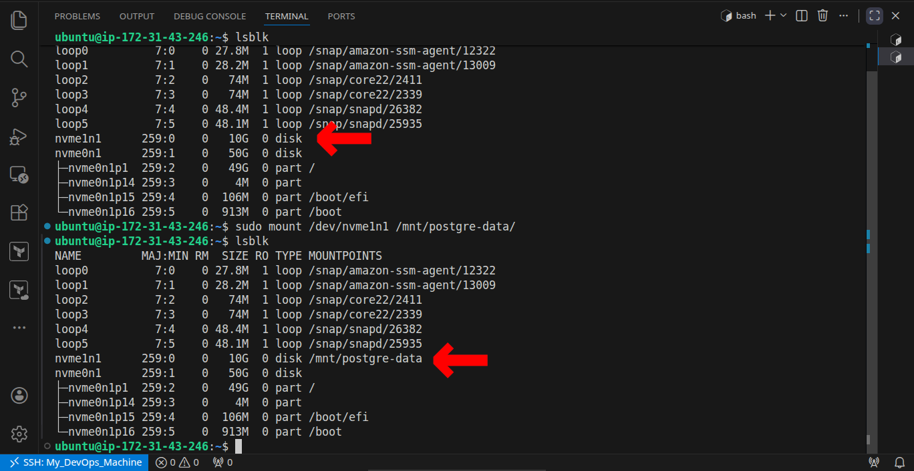

3. ***`Dynamodb`** for carts service with:*

    ```bash
    table: Item   |  index: idx_global_cutomerId
        id: id     |    key: customerId
    ```

    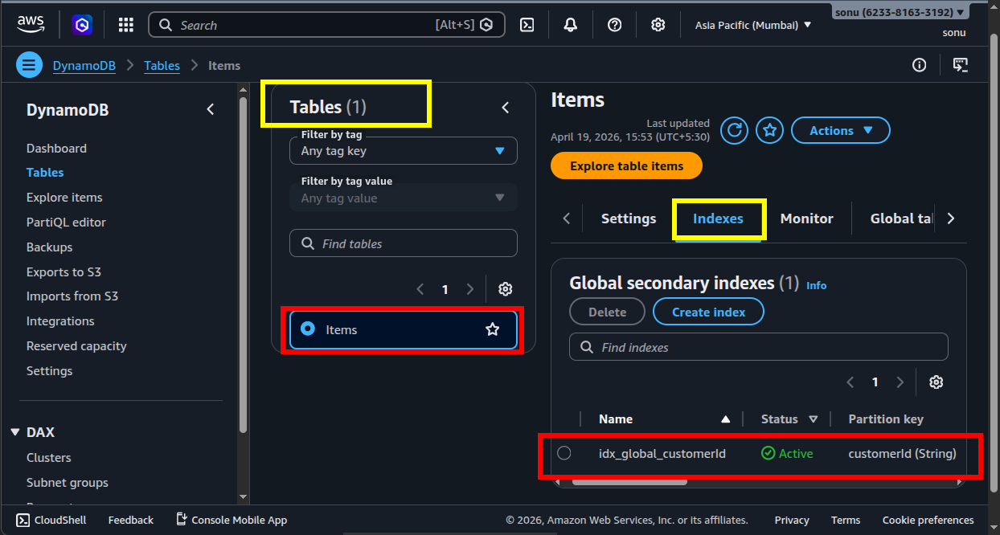

4. ***`AWS Sercrets Manager`** with secrets configured:*

    

5. ***`IAM role for EC2`** with permissions:*

    

    - dynamodb read and write access
    - secrets manager read access

6. ***`Metadata response hop limit`** for EC2 set to: `5`*

    

**Tools:**

1. Docker installed and running
2. kubectl
3. helm
4. Kind

**Steps:**

1. Clone the repo and get into `helmfile-deploy`

    ```bash
    git clone https://github.com/sonuparit/retail-store-reverse-engineered.git

    cd /retail-store-reverse-engineered/my-work/kubernetes/helmfile-deploy/
    ```

    

2. Create KinD Cluster with these configs

    ```bash
    kind create cluster --name retail --config kind-config.yml
    ```

    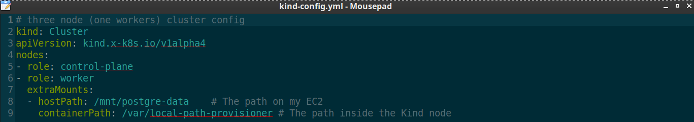

3. Install ArgoCD with configs:

    - cd into kind-cluster:

      ```bash
      cd retail-store-reverse-engineered/my-work/kubernetes/argocd-deploy/kind-cluster
      ```

    - Add ArgoCD repo to helm:

      ```bash
      helm repo add argo https://argoproj.github.io/argo-helm
      helm repo update
      ```

    - Install ArgoCD:

      ```bash
      helm install argocd argo/argo-cd -n argocd -f argocd-install-values.yaml --create-namespace
      ```

      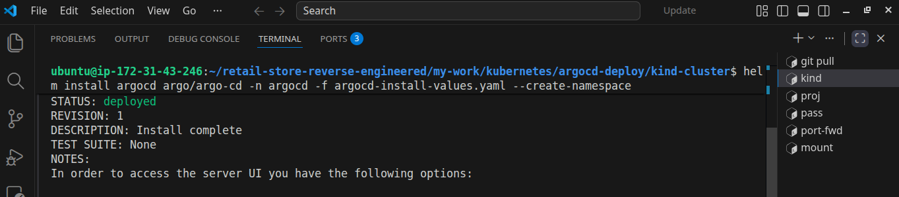

    - Check ArgoCD status:

      ```bash
      kubectl get all -n argocd
      ```

4. Fetch ArgoCD Password and Login:

    - Open a port for ArgoCD:

       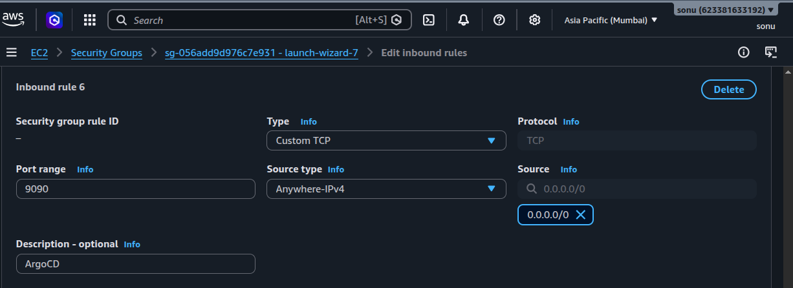

    - Fetch ArgoCD password:

      ```bash
      kubectl -n argocd get secret argocd-initial-admin-secret -o jsonpath="{.data.password}" | base64 -d
      ```

    - Open ArgoCD in browser

      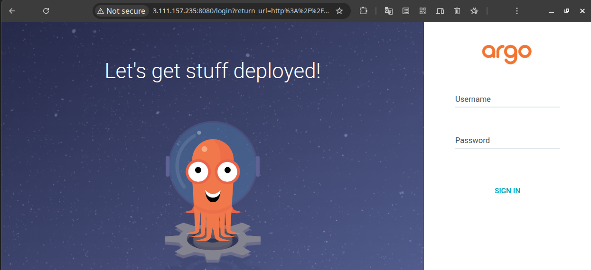

5. Install/Create project then platform:

    - Apply project

      ```bash
      kubectl apply -f argocd-project.yml -n argocd
      ```

    - Apply platform to install ESO and create ClusterSecetStore

      ```bash
      kubectl apply -f platform.yml -n argocd
      ```

      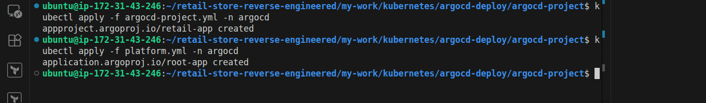

6. Deploy the apps

    - cd into apps:

      ```bash
      cd retail-store-reverse-engineered/my-work/kubernetes/argocd-deploy/apps
      ```

    - Deploy the apps:

      ```bash
      kubectl apply -f application-set.yml -n argocd
      ```

      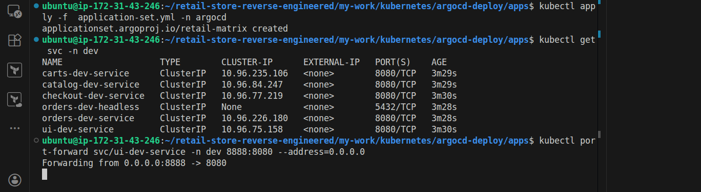

7. Verify Deployment Status:

    - Check on terminal:

      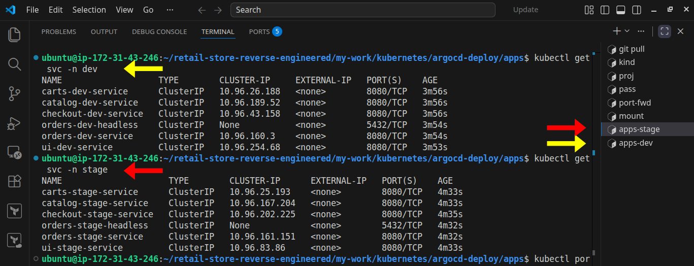

    - Check on ArgoCD UI:

      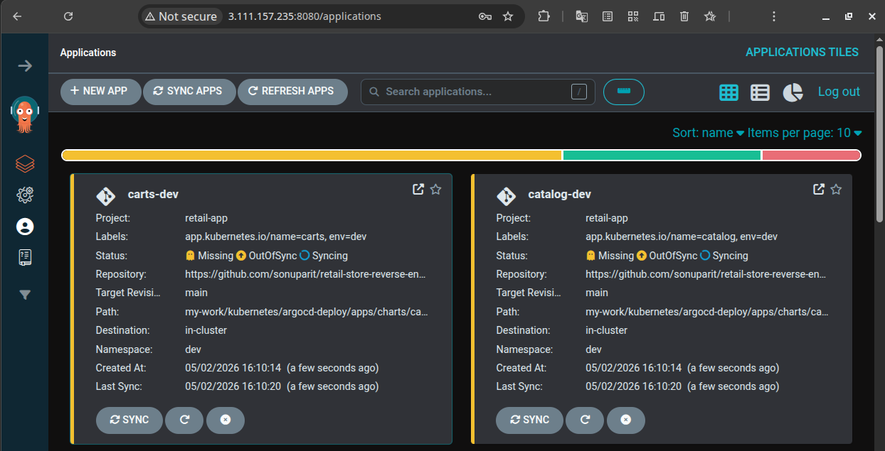

    - Check for Secrets:

      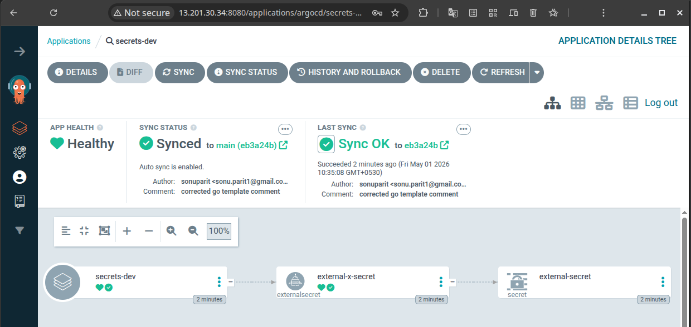

      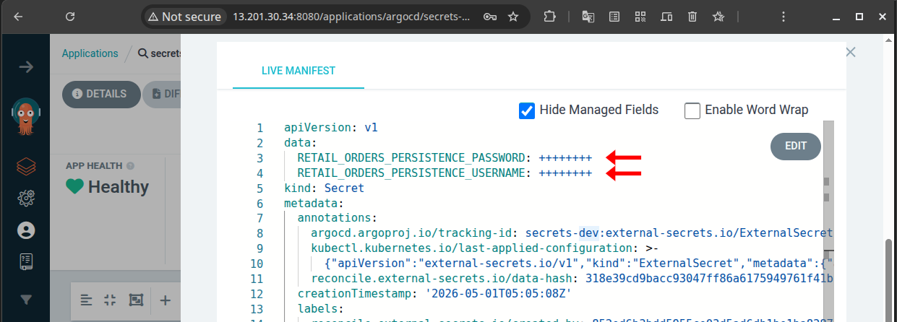

    - Wait for Kubernetes Reconciliation:

      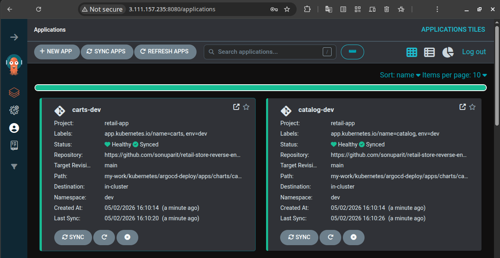

    - confirm multi-env deployment

      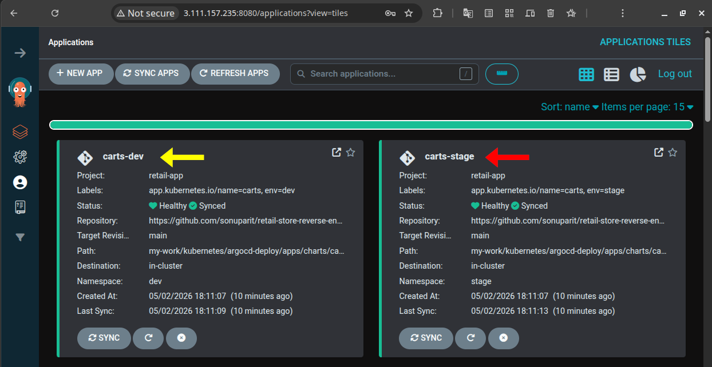

8. Access the application:

    - Open port for each env:

      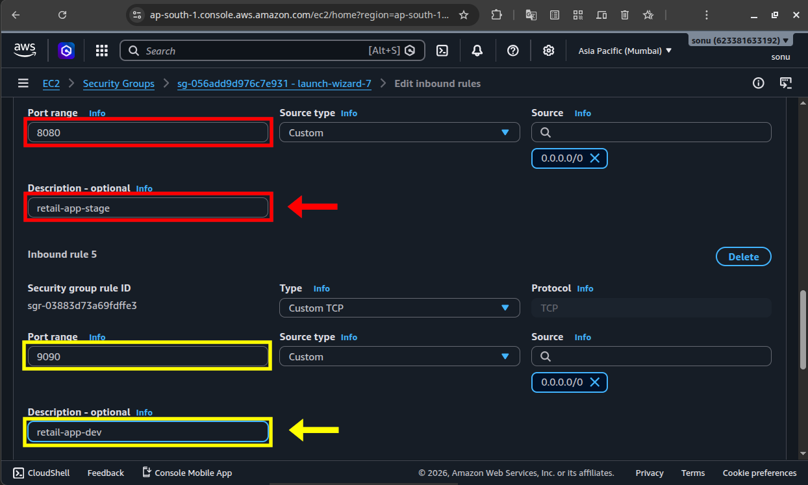

    - Run port-forward commands for each env

      ```bash
      kubectl port-forward svc/ui-dev-service -n argocd 8080:80 --address=0.0.0.0
      ```

      ```bash
      kubectl port-forward svc/ui-stage-service -n argocd 8080:80 --address=0.0.0.0
      ```

    - Access the application:

      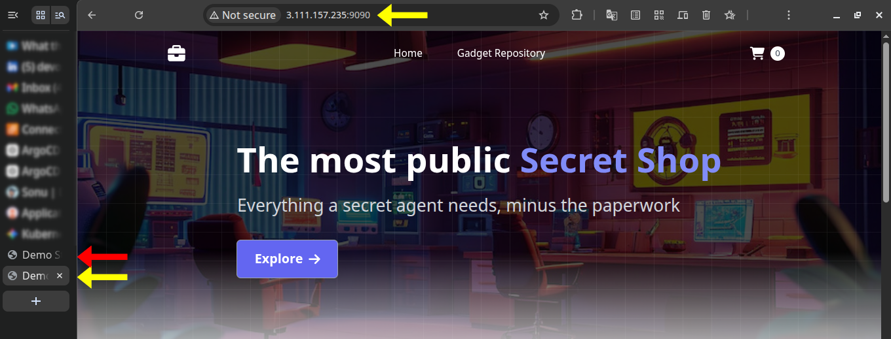

    - Validate Application Functionality by completing buying process:

      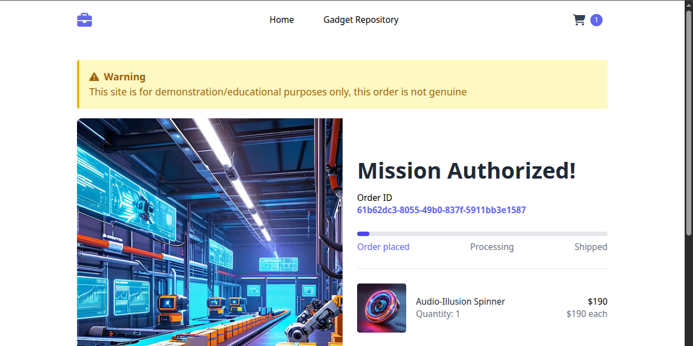

9. Validate multi-env persistent storage on external EBS volume:

    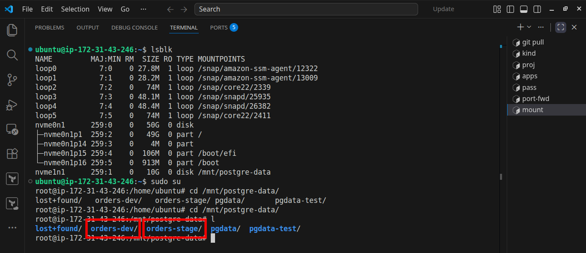

**Result:**

Successfully deployed and validated a multi-environment Kubernetes application stack using ArgoCD on a kind cluster with persistent EBS-backed storage.

## 🔭 What’s Next

Moving forward, this setup will be transitioned to:

1. *Implement **`CI/CD`** pipeline*
2. *Add **`email notification`** system*
3. *IaC using **`Terraform`***
4. *Add monitoring (**`Prometheus + Grafana`**)*
5. *Full Automation from **`terraform apply` to `Application deployment`***

## 💭 Final Thoughts

This project started as a simple ArgoCD deployment setup, but eventually became a **deep dive** into how Kubernetes platforms actually behave in real environments.

The biggest value came from **debugging failures**, handling **race conditions**, managing **persistence**, and understanding **reconciliation** instead of only focusing on successful deployments.

Building everything **manually** on a kind cluster helped me understand many **low-level Kubernetes** and **GitOps** concepts that are often abstracted away in managed cloud environments.

Overall, this project gave me practical experience with:

- **GitOps workflows**
- **Kubernetes orchestration**
- **Helm templating**
- **Secret management**
- **Stateful workloads**
- **Multi-environment architecture**
- **Deployment troubleshooting**

and helped me think more like a platform engineer instead of just a deployment user.
