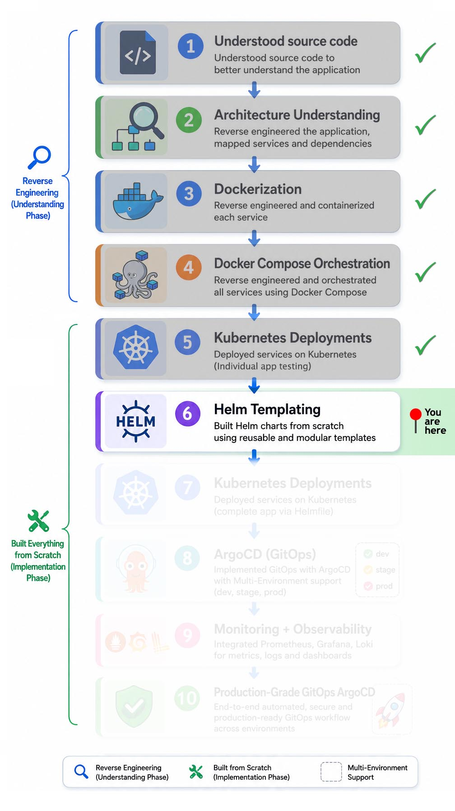

# 🚀 Helm Chart Templating from scratch

Production-oriented Helm templating implementation for a reverse-engineered retail microservices application, built with reusable Kubernetes packaging, modular chart architecture, and deployment practices.

## 📑 Table of Contents

**🧭 Navigation:**

- [Implementation Roadmap](#️-implementation-roadmap)
- [Project Navigation](#-project-navigation)

**📘 Project Documentation:**

- [Overview](#-overview)
- [Project Structure](#️-project-structure)
- [What This Project Demonstrates](#-what-this-project-demonstrates)
- [Core Implementation](#️-core-implementation)
- [Challenges & Solutions](#️-challenges--solutions)
- [Operational Outcomes](#-operational-outcomes)
- [Key Learnings](#-key-learnings)
- [Next Phase](#-next-phase)

## 🗺️ Implementation Roadmap

<p align="left">
  
</p>

## 🔗 Project Navigation

- [Root Directory](https://github.com/sonuparit/retail-store-reverse-engineered)

### 📖 Understanding Phase

- [Source Code Understanding](https://github.com/sonuparit/retail-store-reverse-engineered/tree/main/src-code)
- [Architecture Understanding](https://github.com/sonuparit/retail-store-reverse-engineered/tree/main/my-work/04-applications/architecture)
- [Containerization (Docker)](https://github.com/sonuparit/retail-store-reverse-engineered/tree/main/my-work/04-applications/docker)
- [Docker Compose Orchestration](https://github.com/sonuparit/retail-store-reverse-engineered/tree/main/my-work/04-applications/docker-compose)

### ☸️ Kubernetes Implementation Phase

- [Individual Service Testing](https://github.com/sonuparit/retail-store-reverse-engineered/tree/main/my-work/04-applications/kubernetes/ind-svc-test)
  - [Carts](https://github.com/sonuparit/retail-store-reverse-engineered/tree/main/my-work/04-applications/kubernetes/ind-svc-test/cart-dynamodb-test)
  - [Catalog](https://github.com/sonuparit/retail-store-reverse-engineered/tree/main/my-work/04-applications/kubernetes/ind-svc-test/catalog-test)
  - [Checkout](https://github.com/sonuparit/retail-store-reverse-engineered/tree/main/my-work/04-applications/kubernetes/ind-svc-test/checkout-test)
  - [Orders](https://github.com/sonuparit/retail-store-reverse-engineered/tree/main/my-work/04-applications/kubernetes/ind-svc-test/orders-postgreSQL-test)
  - [UI](https://github.com/sonuparit/retail-store-reverse-engineered/tree/main/my-work/04-applications/kubernetes/ind-svc-test/ui-test)
- [Helm Templating](https://github.com/sonuparit/retail-store-reverse-engineered/tree/main/my-work/04-applications/kubernetes/helm-template) ← (📍 You are here )
- [Full App Deployment via Helmfile](https://github.com/sonuparit/retail-store-reverse-engineered/tree/main/my-work/04-applications/kubernetes/helmfile-deploy)
- [Multi-Environment GitOps via ArgoCD](https://github.com/sonuparit/retail-store-reverse-engineered/tree/main/my-work/04-applications/kubernetes/argocd-deploy)

### 📊 Production & Observability

- [Monitoring & Observability](https://github.com/sonuparit/retail-store-reverse-engineered/tree/main/my-work/03-observability)
- [Production-Grade GitOps Workflow](https://github.com/sonuparit/retail-store-reverse-engineered/tree/main/my-work)

## 📖 Overview

*This project demonstrates building a complete Kubernetes deployment system using Helm templating from **scratch** for a retail microservices application.*

*The goal was to move away from repetitive raw Kubernetes manifests and build a more modular, reusable, scalable, and production-oriented deployment architecture.*

## 🏗️ Project Structure

> [!NOTE]
> Keeping identical versions of the same files across multiple directories introduced unnecessary duplication.
>
> The repository structure moved into helfile-deploy directory. → [(here)](../helmfile-deploy/)

```bash
charts
├── carts
|   ├── templates
│   ├── Chart.yaml
│   └── values.yaml
├── catalog
|   ├── templates
│   ├── Chart.yaml
│   └── values.yaml
├── checkout
|   ├── templates
│   ├── Chart.yaml
│   └── values.yaml
├── orders
|   ├── templates
│   ├── Chart.yaml
│   └── values.yaml
├── secrets-config
|   ├── templates
│   ├── Chart.yaml
│   └── values.yaml
└── ui
    ├── templates
    ├── Chart.yaml
    └── values.yaml
```

## 🧠 What This Project Demonstrates

- *Designing reusable Helm charts from scratch*
- *Converting static Kubernetes manifests into dynamic templates*
- *Parameterizing deployments using values files*
- *Building reusable helper templates*
- *Production-oriented Kubernetes packaging practices*
- *Scalable multi-service deployment architecture*
- *Preparation for GitOps workflows using ArgoCD*

## ⚙️ Core Implementation

### ⚓ Built Dedicated Helm Charts for Every Microservice

- *Created independent Helm charts for:*
  - carts
  - catalog
  - checkout
  - orders
  - ui

- *Each chart contains modular Kubernetes resources including:*
  - Deployments
  - Services
  - ConfigMaps
  - Secrets
  - Persistent Volumes
  - Persistent Volume Claims

### 🧩 Reusable Helm Templating Architecture

- *Implemented reusable Helm template structures instead of duplicating YAML files*

- *Used:*
  - `_helpers.tpl`
  - `include`
  - `define`
  - `template functions`

- *This significantly reduced duplication and improved maintainability*

### 🏷️ Standardized Naming Conventions

- *Designed consistent resource naming conventions across all charts*

Before:

```yaml
service: service
deployment: deployment
```

After:

```yaml
retail-cart-service
retail-cart-deployment
```

**Impact:**

- *Improved readability*
- *Simplified debugging*
- *Reduced confusion during troubleshooting*
- *Made cluster resources production-friendly*

### 🧪 Service-by-Service Validation

- *Validated every microservice independently before full-stack deployment*

- *Performed iterative testing for:*
  - service communication
  - environment variables
  - DNS resolution
  - persistence
  - startup dependencies

**Result:**

- *Reduced debugging complexity*
- *Improved deployment reliability*
- *Faster issue isolation*

### 📦 Persistent Storage Integration

- *Configured persistent storage for stateful workloads*

- *Implemented:*
  - PersistentVolume
  - PersistentVolumeClaim

- *Mounted external EBS-backed storage for PostgreSQL persistence*

## ⚔️ Challenges & Solutions

### 🧭 Value Tracing Complexity

- *Understanding how values flow between:*
  - values.yaml
  - templates
  - helpers
  - includes

  was overwhelming at first.

**Lesson:**

- *Learned how Helm rendering pipeline works internally*
- *Improved debugging and chart architecture skills*

## 📈 Operational Outcomes

Without Helm:

- repetitive YAML
- difficult scaling
- poor maintainability
- environment duplication
- hardcoded configurations

With Helm:

- reusable deployments
- parameterized infrastructure
- modular architecture
- scalable configuration management
- production-ready packaging

## 🎓 Key Learnings

### Helm Beyond Basics

- *Building reusable production-grade Helm charts*
- *Understanding Helm rendering flow deeply*
- *Using helper templates effectively*

### Kubernetes Packaging Principles

- *Applications should be packaged as reusable deployment units instead of static YAML collections*

### Real-World Deployment Thinking

- *Production deployments require:*
  - consistency
  - naming discipline
  - parameterization
  - modularity
  - isolation

### Debugging Distributed Systems

- *Learned systematic debugging across:*
  - services
  - configs
  - storage
  - networking
  - runtime dependencies

## 🔭 Next Phase

*Full app deployment via helmfile [(read here)](../helmfile-deploy/)*
