# 🚀 Helmfile-Based Deployment on Kubernetes

Production-oriented multi-service Kubernetes deployment architecture using Helm and Helmfile, featuring reusable chart templating, environment-aware configurations, secure secrets management, and scalable orchestration workflows.

## 📑 Table of Contents

**🧭 Navigation:**

- [Implementation Roadmap](#️-implementation-roadmap)
- [Project Navigation](#-project-navigation)

**📘 Project Documentation:**

- [Overview](#-overview)
- [Repository Structure](#-repository-structure)
- [Deployment Guide](#-deployment-guide)
- [What this Project Demonstrates](#-what-this-project-demonstrates)
- [Core Implementation](#️-core-implementation)
- [Challenges & Solutions](#️-challenges--solutions)
- [Operational Outcomes](#-operational-outcomes)
- [Limitations of helmfile](#️-limitations-of-helmfile)
- [Key Learnings](#-key-learnings)
- [Next Phase](#-next-phase)

## 🗺️ Implementation Roadmap

<p align="left">
  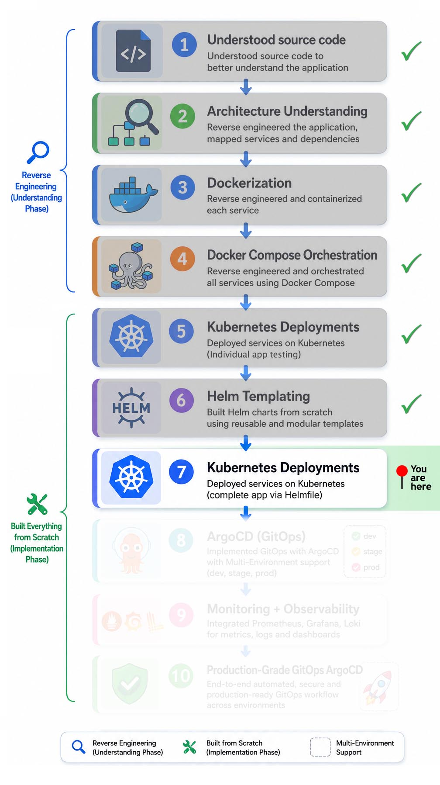
</p>

## 🔗 Project Navigation

- [Root Directory](https://github.com/sonuparit/retail-store-reverse-engineered)

### 📖 Understanding Phase

- [Source Code Understanding](https://github.com/sonuparit/retail-store-reverse-engineered/tree/main/src-code)
- [Architecture Understanding](https://github.com/sonuparit/retail-store-reverse-engineered/tree/main/my-work/04-applications/architecture)
- [Containerization (Docker)](https://github.com/sonuparit/retail-store-reverse-engineered/tree/main/my-work/04-applications/docker)
- [Docker Compose Orchestration](https://github.com/sonuparit/retail-store-reverse-engineered/tree/main/my-work/04-applications/docker-compose)

### ☸️ Kubernetes Implementation Phase

- [Individual Service Testing](https://github.com/sonuparit/retail-store-reverse-engineered/tree/main/my-work/04-applications/kubernetes/ind-svc-test)
  - [Carts](https://github.com/sonuparit/retail-store-reverse-engineered/tree/main/my-work/04-applications/kubernetes/ind-svc-test/cart-dynamodb-test)
  - [Catalog](https://github.com/sonuparit/retail-store-reverse-engineered/tree/main/my-work/04-applications/kubernetes/ind-svc-test/catalog-test)
  - [Checkout](https://github.com/sonuparit/retail-store-reverse-engineered/tree/main/my-work/04-applications/kubernetes/ind-svc-test/checkout-test)
  - [Orders](https://github.com/sonuparit/retail-store-reverse-engineered/tree/main/my-work/04-applications/kubernetes/ind-svc-test/orders-postgreSQL-test)
  - [UI](https://github.com/sonuparit/retail-store-reverse-engineered/tree/main/my-work/04-applications/kubernetes/ind-svc-test/ui-test)
- [Helm Templating](https://github.com/sonuparit/retail-store-reverse-engineered/tree/main/my-work/04-applications/kubernetes/helm-template)
- [Full App Deployment via Helmfile](https://github.com/sonuparit/retail-store-reverse-engineered/tree/main/my-work/04-applications/kubernetes/helmfile-deploy) ← (📍 You are here )
- [Multi-Environment GitOps via ArgoCD](https://github.com/sonuparit/retail-store-reverse-engineered/tree/main/my-work/04-applications/kubernetes/argocd-deploy)

### 📊 Production & Observability

- [Monitoring & Observability](https://github.com/sonuparit/retail-store-reverse-engineered/tree/main/my-work/03-observability)
- [Production-Grade GitOps Workflow](https://github.com/sonuparit/retail-store-reverse-engineered/tree/main/my-work)

## 📖 Overview

*This project demonstrates deploying a retail microservices application on Kubernetes using Helm and Helmfile.*

*The project simulates real-world DevOps workflows by integrating Kubernetes packaging standards, AWS-native security mechanisms, externalized secret management, and scalable multi-service deployment strategies.*

## 📂 Repository Structure

- *External Secrets Operator-CRD `eso-crd.yaml`*
- *Centralized `helmfile.yaml` to orchestrate deployments*
- *kind config for `KinD cluster`*
- *Individual `Helm charts` for each microservice*
- *Environment specific deployment with `values`*

```bash
repo-structure
├── eso-crd.yaml
├── helmfile.yaml.gotmpl
├── kind-config.yml
├── charts
│   ├── carts
│   ├── catalog
│   ├── checkout
│   ├── orders
│   ├── secret-configs
│   └── ui
└── values
    ├── eks-prod.yml
    └── kind-ec2.yml
```

## 📦 Deployment Guide

### Prerequisites

**Infra**

1. ***`EC2 instance`** (recommended flex.large)*

    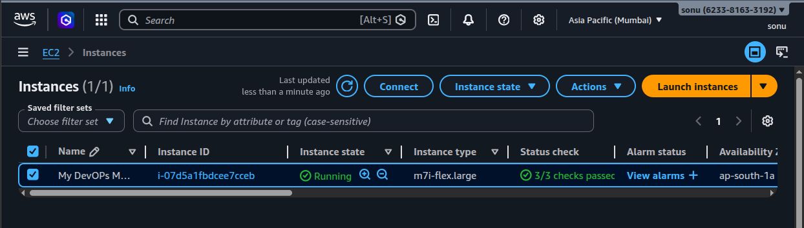

2. ***`EBS volume`** attached to EC2 and mounted for orders service*

    

3. ***`Dynamodb`** for carts service with:*

    ```
    table: Item   |  index: idx_global_cutomerId
       id: id     |    key: customerId
    ```

    

4. ***`AWS Sercrets Manager`** with secrets configured:*

    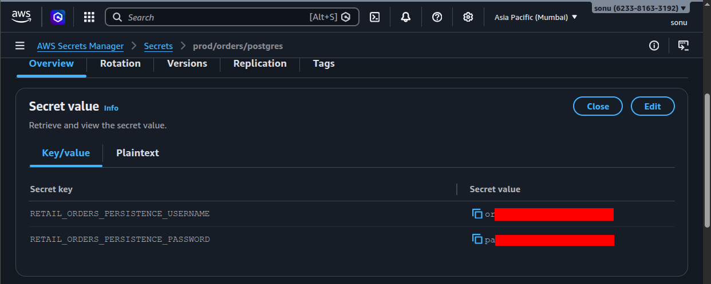

5. ***`IAM role for EC2`** with permissions:*

    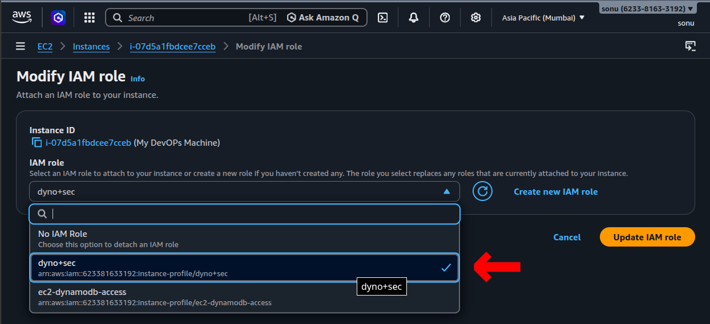

    - dynamodb read and write access
    - secrets manager read access

6. ***`Metadata response hop limit`** for EC2 set to: `3`*

    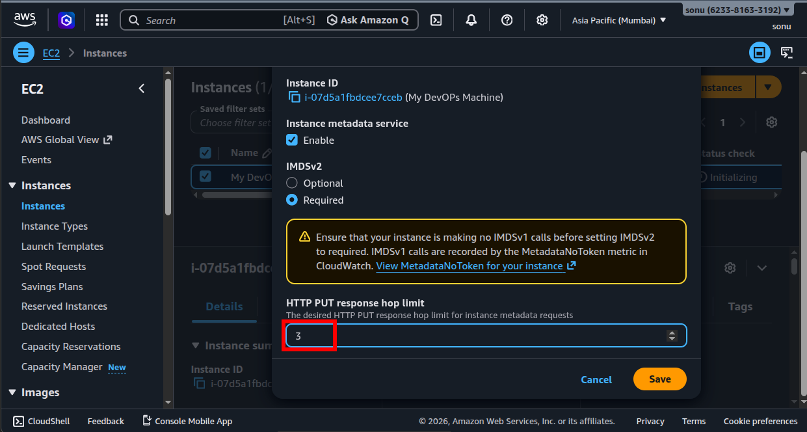

**Tools**

1. Docker installed and running
2. kubectl
3. helm
4. helmfile
5. Kind

**Steps**

1. Clone the repo and get into `helmfile-deploy`

    ```
    git clone https://github.com/sonuparit/retail-store-reverse-engineered.git

    cd /retail-store-reverse-engineered/my-work/kubernetes/helmfile-deploy/
    ```

    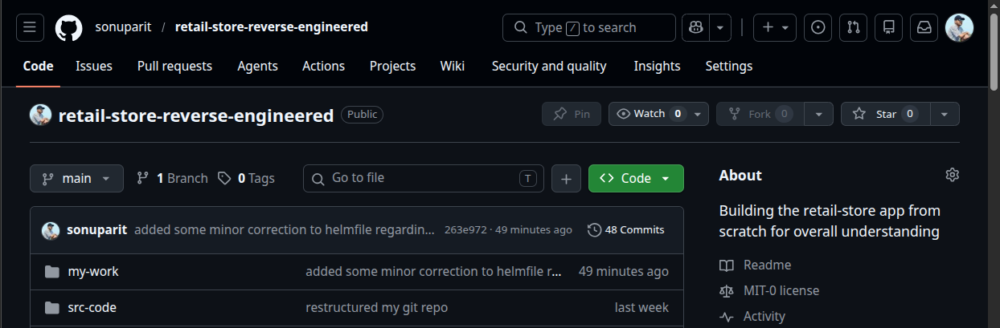

2. Create KinD Cluster with these configs

    ```bash
    kind create cluster --name retail --config kind-config.yml
    ```

    

3. Create CRD eso-crd.yaml

    ```bash
    kubectl create -f eso-crd.yaml
    ```

    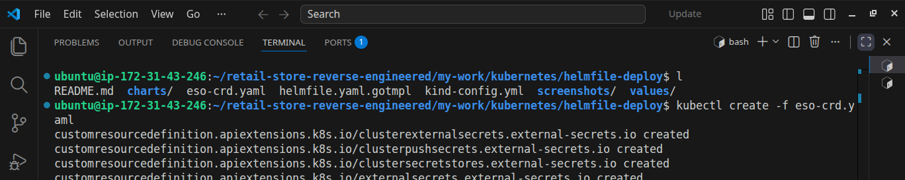

4. Run helmfile with `kind environment`

    ```
    helmfile -e kind apply
    ```

    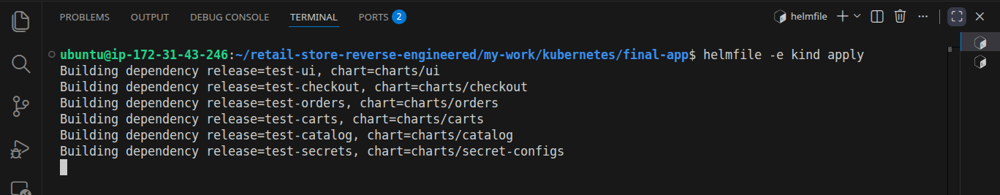

    - ***`wait for 2-3 mins`** to create all the releases*

    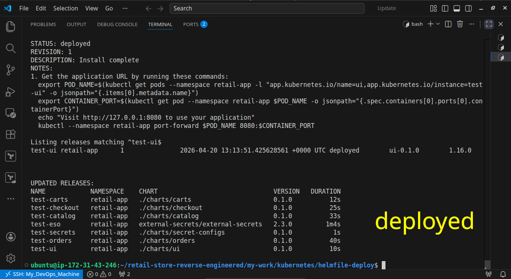

5. Get the name of ui-service and forward it's port

    ```
    kubectl get svc -n retail-app
    ```

    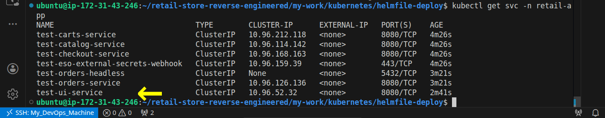

    ```
    kubectl port-forward svc/test-ui-service -n retail-app 8080:8080 --address=0.0.0.0
    ```

    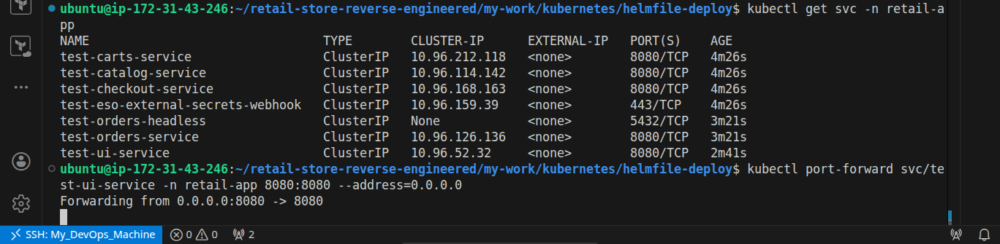

6. Open the port 8080 on EC2 instance

    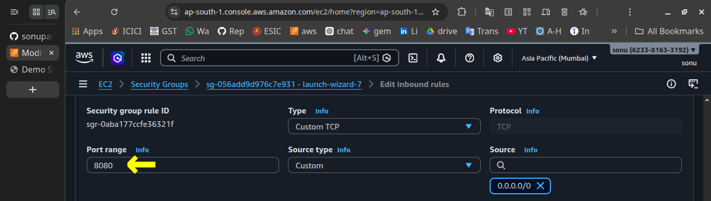

7. View the app

    ```
    <ec2-public-ip>:8080
    ```

    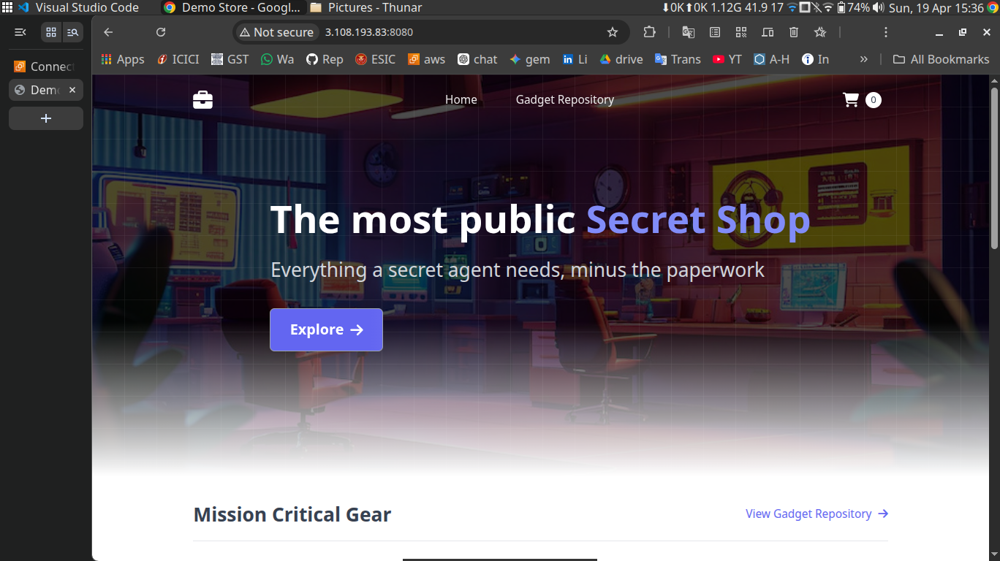

8. Check the serviceability of all micro-services in "/topology"

    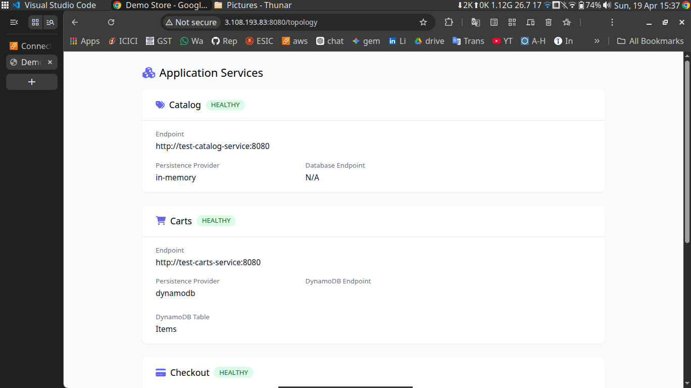

9. Complete a buying process to confirm operational validation

    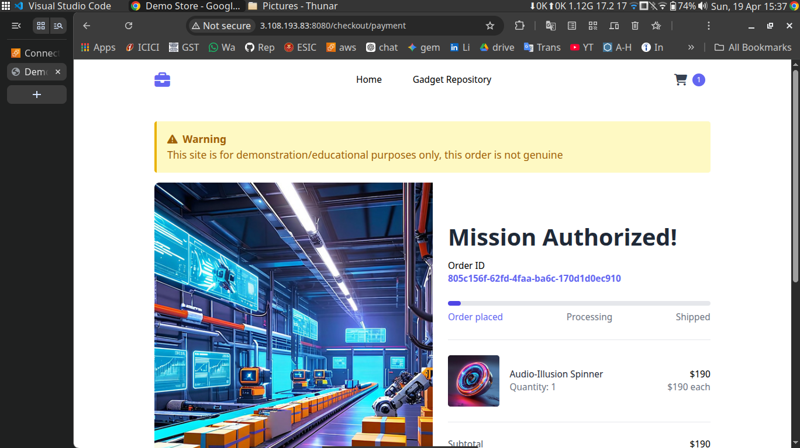

10. Add item to cart, and check at DynamoDB AWS console for persistence of items

    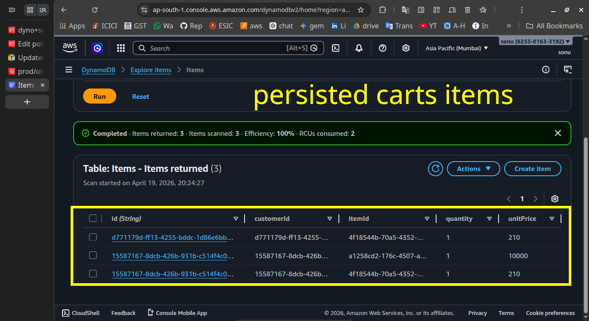

11. Check the PostgeSQL data on external EBS volume

    

## 🧠 What This Project Demonstrates

- Transition from raw YAML → `Helm-based deployments`
- Multi-service orchestration using Helmfile
- Dependency-aware deployments
- Secure secret management using AWS Secrets Manager + IMDSv2 on Kubernetes
- Real-world DevOps workflow simulation

## ⚙️ Core Implementation

### ⚓ Helm Chart Design for Each Service

- *Designed and created dedicated Helm charts for each microservice (carts, catalog, checkout, orders, UI).*

    

- *Implemented consistent and meaningful naming conventions*

    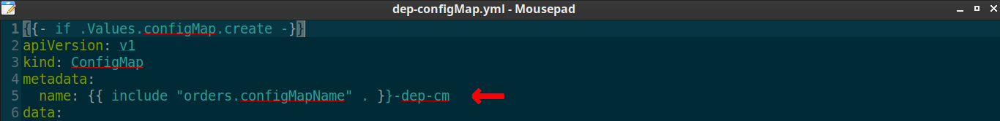

- ***`Developed a custom secret-configs Helm chart from scratch`** to manage centralized secret definitions*

    

### 🛡️ AWS IMDSv2 for DynamoDB access

*To provide the Carts Service with secure, credential-less access to DynamoDB, I leveraged AWS Instance Metadata Service v2 `(IMDSv2)`. This approach eliminates the need for hardcoded `AWS_ACCESS_KEY_ID` or long-lived secrets, significantly reducing the attack surface.*

- **Identity-Based Access:**\
    *The EC2 Node is assigned an IAM Role with a scoped policy allowing dynamodb:GetItem and dynamodb:Query on the Items table.*

    

- **The Challenge:**\
    *By default, IMDSv2 responses have a Time-to-Live (TTL/Hop Limit) of 2. In a containerized environment, the packet must travel from the Node to the Docker Bridge and finally to the Pod.*

- **The Solution:**\
    *I tuned the http-put-response-hop-limit to 3. This ensures the metadata response can successfully traverse the virtual bridge to reach the application container while maintaining the security boundary.*

    

**Impact:**

1. *`Zero-Secret Management:` No AWS keys are stored in the codebase or K8s Secrets.*

2. *`Production Readiness:` Adheres to AWS security best practices by enforcing IMDSv2-only access.*

### 🔐 Secure Secrets Integration

- *`Integrated AWS Secrets Manager` for external secret storage*

    

- *`Used External Secrets Operator (ESO)` to sync secrets into Kubernetes*

    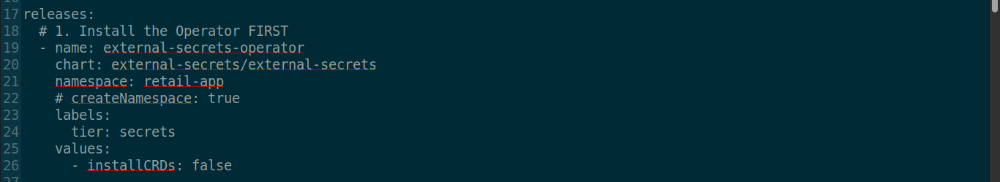

- *Ensured secrets were dynamically injected into pods without hardcoding*

    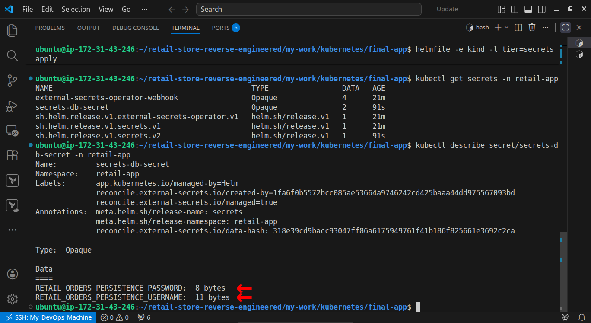

### 🧪 Incremental Validation Strategy

- *`Followed a tiered testing approach` to ensure each component was functional and stable independently*

    

- *`Performed isolated, service-by-service validation` of each Helm chart before full system deployment*

    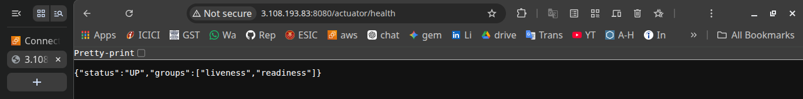

- *This helped in:*
  - Identifying and debugging issues at the service level
  - Avoiding compounded errors`** during full-stack deployment
  - Improving deployment confidence and reliability
  
### 🌍 Multi-Environment Values Architecture

- *Separated environment-specific configurations using values files*

  Examples:

  ```bash
  values/
  ├── kind-values.yml
  └── eks-values.yml
  ```

- *This allowed deploying the same application across different infrastructures without modifying templates*

**Benefits:**

- *Cleaner deployments*
- *Better scalability*
- *Environment portability*
- *Production-readiness*

### ✅ Result

- Eliminated risk of secret exposure in codebase and moving to identity-based and externalized secret management.

- Built a production-grade deployment workflow with modular Helm charts and isolated validation, improving reliability and debugging efficiency.

- Achieved secure, scalable architecture by integrating AWS-native services (IMDSv2, Secrets Manager) with Kubernetes best practices.

- Improved system maintainability through consistent naming, reusable configurations, and centralized secret handling.

## ⚔️ Challenges & Solutions

### 🏷️ Resource Naming Confusion

- *helm chart used identical names across Services, Deployments, and ConfigMaps, which caused ambiguity and debugging difficulty*

    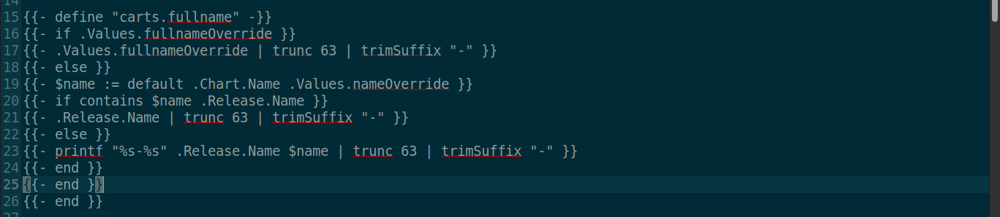

- *Faced issues identifying correct service endpoints, especially for database connectivity*

    

- *Refactored all resource names using meaningful, context-aware conventions*

    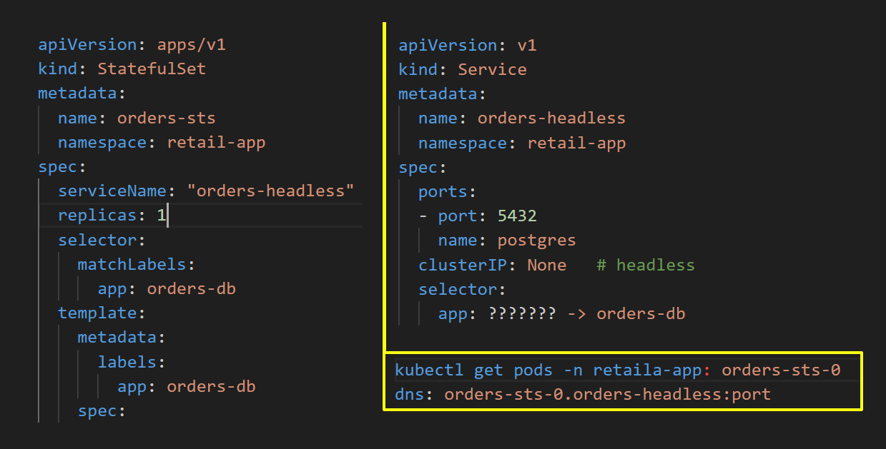

**✅ Result:**

- *Improved clarity across the system*
- *Faster debugging and easier traceability*

### 🧭 Chart Navigation Complexity

- *Navigating between values.yaml → templates → configs → _helpers.tpl across multiple charts became difficult*

    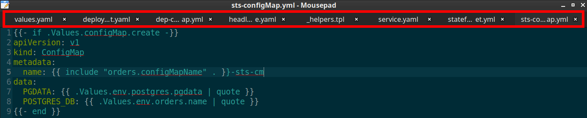

- *Understanding value flow and template rendering required careful tracing*

**✅ Insight:**

- *Learned how Helm templating layers interact*
- *Improved ability to debug and reason about chart structure*

### ⚠️ "kubectl apply" vs "kubectl create" (CRD Issue)

- Initially used kubectl apply for installing ESO-CRDs, which caused inconsistent and failed deployments

    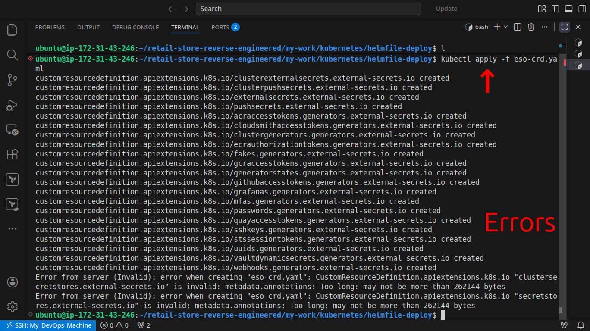

**👉 Why it failed:**

- *apply expects an existing resource state to patch/update*
- *CRDs (especially from operators) often require clean, first-time creation*
- *CRDs are huge and K8s, kubectl apply stores the entire configuration in an annotation, and CRDs often exceed the 262KB limit for annotations, hence they fail*

**✅ Fix:**

- *Switched to kubectl create for CRD installation before deploying dependent resources*

    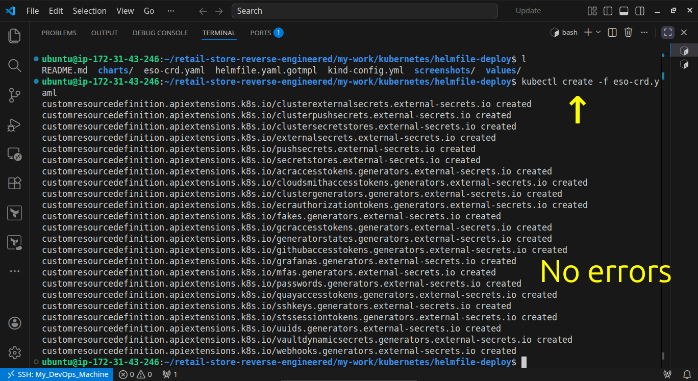

**👉 Why create worked:**

- *kubectl create or kubectl apply --server-side bypasses limit of 262KB limit for annotations*
- *kubectl create ensures a fresh, atomic creation of CRDs*
- *CRDs are meant to be installed once and managed by the operator afterward*

### 🚧 Init Container Blocking Orders Service

- Orders service failed to start due to init container never completing

    

- Root cause: used application service port instead of database service port in readiness check

    

**✅ Fix:**

- *Corrected the target service endpoint for database connectivity*

**💡 Lesson:**

- *Small configuration mistakes in dependencies can block entire service startup*

### 🧬 Go Template Whitespace Issue

- *Misuse of **"`-`"** (whitespace trimming) in Helm templates caused invalid YAML rendering*

    

- *This resulted in deployment failures*

**👉 Example problem:**

- **{{`-` ... }}** *removes spaces, which can break YAML structure*

    

**✅ Fix:**

- *Avoided aggressive whitespace trimming except where necessary (e.g., _helpers.tpl)*

**💡 Lesson:**

- ***`YAML`** is highly sensitive to formatting — template control must be used carefully*

### 🛡️ DynamoDB Fine-Grained Permissions (PoLP)

- *Implementing the Principle of Least Privilege (PoLP), initially granting broad access which compromised security best practices*

- *Faced repeated **`"AccessDeniedException"`** errors despite having Query and Scan permissions enabled*

    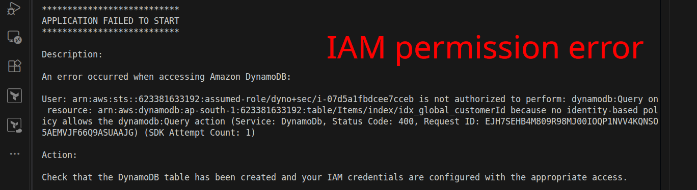

- *Discovered that DynamoDB Global Secondary Indexes (GSIs) are treated as distinct resources and **`require explicit ARN definitions`***

    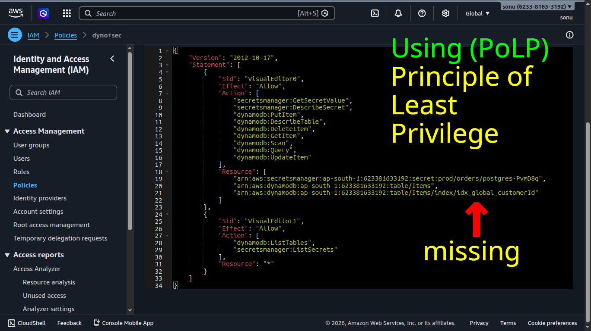

**✅ Fix:**

- *Refined the IAM policy to target specific Table and Index ARNs rather than using wildcards on all resources*

## 📈 Operational Outcomes

- Reduced deployment duplication through reusable Helm templating
- Improved deployment maintainability with modular chart architecture
- Enabled environment portability across KinD and AWS-based infrastructure
- Eliminated hardcoded cloud credentials using identity-based access patterns
- Improved debugging efficiency through isolated service validation workflows
- Standardized Kubernetes resource naming for operational clarity
- Established a scalable foundation for GitOps-based continuous delivery

## ⚠️ Limitations of Helmfile

**No Continuous Reconciliation:**

- *Helmfile is not a true GitOps tool — it does not continuously monitor and enforce cluster state*
- *Requires manual execution (`helmfile sync`) to apply changes*

**Limited Drift Detection:**

- *Cannot automatically detect or correct configurati---on drift in the cluster*
- *Changes made outside Helmfile (manual edits) can go unnoticed*

**Operational, Not Declarative:**

- *Focuses on executing deployments rather than maintaining a desired state*
- *Lacks self-healing capabilities compared to GitOps tools like Argo CD*

**Dependency Handling is Deployment-Time Only:**

- *`needs` manages ordering during deployment*
- *Does not handle runtime service dependencies or failures*

**Scalability Challenges in Larger Systems:**

- *Managing multiple environments and complex configurations can become difficult*
- *Requires additional structure and discipline to stay maintainable*

**No Native UI or Observability:**

- *No built-in dashboard to visualize application state or deployment status*
- *Debugging relies heavily on CLI and logs*

### 💡 Key Takeaway

- *Helmfile is powerful for structured multi-service deployments (same as **docker-compose**), but for production-grade, continuously reconciled systems, a GitOps approach (e.g., Argo CD) is more suitable.*

## 🎓 Key Learnings

**Helm beyond basics:**

- *designing reusable charts, managing naming conventions, and understanding template flow across values.yaml, templates, and _helpers.tpl*

**Deployment vs runtime dependencies:**

- Helmfile handles ordering, but service communication issues must be solved at runtime

**Incremental validation mindset:**

- testing services in isolation significantly reduces debugging complexity in distributed systems

**Cloud Security & Container Networking:**

- Leveraging IMDSv2 with IAM Roles, I learned that in containerized environments like KinD, tuning network hop limits is critical to ensuring metadata can successfully traverse the virtual bridge to reach the Pod.

**Secrets management in production:**

- integrating AWS Secrets Manager with ESO eliminates hardcoded secrets and improves security posture

**Principle of Least Privilege (PoLP) in action:**

- PoLP is iterative — it often requires debugging specific resource paths that aren't immediately obvious, like sub-resource ARNs for indexes

**Kubernetes debugging skills:**

- identifying issues across services, init containers, and configurations through systematic troubleshooting

**CRD lifecycle awareness:**

- knowing when to use kubectl create vs apply for reliable operator-based resource installation

**Attention to detail matters:**

- small mistakes (ports, naming, whitespace in templates) can break entire deployments

## 🔭 Next Phase

*Multi-env GitOps via ArgoCD [(read here)](../argocd-deploy/)*
