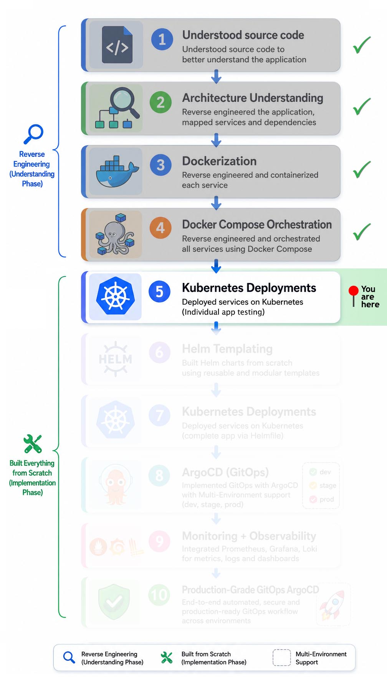

# 🚀 Individual Service Testing

I independently tested all five microservices and implemented production-grade improvements including PostgreSQL persistence, AWS DynamoDB integration, IAM-based access control, Kubernetes Secrets management, and service-level runtime validation.

## 📑 Table of Contents

**🧭 Navigation:**

- [Implementation Roadmap](#️-implementation-roadmap)
- [Project Navigation](#-project-navigation)

**📘 Project Documentation:**

- [Overview](#-overview)
- [Service Validation Navigation](#-service-validation-navigation)

## 🗺️ Implementation Roadmap

  

## 🔗 Project Navigation

- [Root Directory](https://github.com/sonuparit/retail-store-reverse-engineered)

### 📖 Understanding Phase

- [Source Code Understanding](https://github.com/sonuparit/retail-store-reverse-engineered/tree/main/src-code)
- [Architecture Understanding](https://github.com/sonuparit/retail-store-reverse-engineered/tree/main/my-work/04-applications/architecture)
- [Containerization (Docker)](https://github.com/sonuparit/retail-store-reverse-engineered/tree/main/my-work/04-applications/docker)
- [Docker Compose Orchestration](https://github.com/sonuparit/retail-store-reverse-engineered/tree/main/my-work/04-applications/docker-compose)

### ☸️ Kubernetes Implementation Phase

- [Individual Service Testing](https://github.com/sonuparit/retail-store-reverse-engineered/tree/main/my-work/04-applications/kubernetes/ind-svc-test) ← (📍 You are here )
  - [Carts](https://github.com/sonuparit/retail-store-reverse-engineered/tree/main/my-work/04-applications/kubernetes/ind-svc-test/cart-dynamodb-test)
  - [Catalog](https://github.com/sonuparit/retail-store-reverse-engineered/tree/main/my-work/04-applications/kubernetes/ind-svc-test/catalog-test)
  - [Checkout](https://github.com/sonuparit/retail-store-reverse-engineered/tree/main/my-work/04-applications/kubernetes/ind-svc-test/checkout-test)
  - [Orders](https://github.com/sonuparit/retail-store-reverse-engineered/tree/main/my-work/04-applications/kubernetes/ind-svc-test/orders-postgreSQL-test)
  - [UI](https://github.com/sonuparit/retail-store-reverse-engineered/tree/main/my-work/04-applications/kubernetes/ind-svc-test/ui-test)
- [Helm Templating](https://github.com/sonuparit/retail-store-reverse-engineered/tree/main/my-work/04-applications/kubernetes/helm-template)
- [Full App Deployment via Helmfile](https://github.com/sonuparit/retail-store-reverse-engineered/tree/main/my-work/04-applications/kubernetes/helmfile-deploy)
- [Multi-Environment GitOps via ArgoCD](https://github.com/sonuparit/retail-store-reverse-engineered/tree/main/my-work/04-applications/kubernetes/argocd-deploy)

### 📊 Production & Observability

- [Monitoring & Observability](https://github.com/sonuparit/retail-store-reverse-engineered/tree/main/my-work/03-observability)
- [Production-Grade GitOps Workflow](https://github.com/sonuparit/retail-store-reverse-engineered/tree/main/my-work)

## 📖 Overview

This directory contains isolated Kubernetes-based testing and validation performed for each individual microservice before full platform deployment.

The purpose of this phase was to independently validate:

- Kubernetes deployment behavior
- Service exposure and networking
- Database connectivity
- Environment variable configuration
- Persistent storage integration
- Pod lifecycle behavior
- Health validation
- Internal application runtime behavior

before integrating the services into a complete multi-service Kubernetes environment.

## 🔗 Service Validation Navigation

| Service | Purpose | Documentation |
|---------|---------|---------------|
| Catalog | Product APIs | [Open](./catalog-test) |
| Cart | Shopping cart APIs | [Open](./cart-dynamodb-test) |
| Checkout | Checkout orchestration | [Open](./checkout-test) |
| Orders | Order persistence | [Open](./orders-postgreSQL-test) |
| UI | Frontend integration | [Open](./ui-test) |
