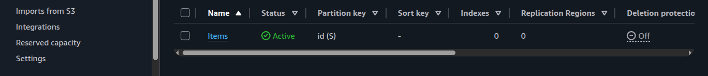
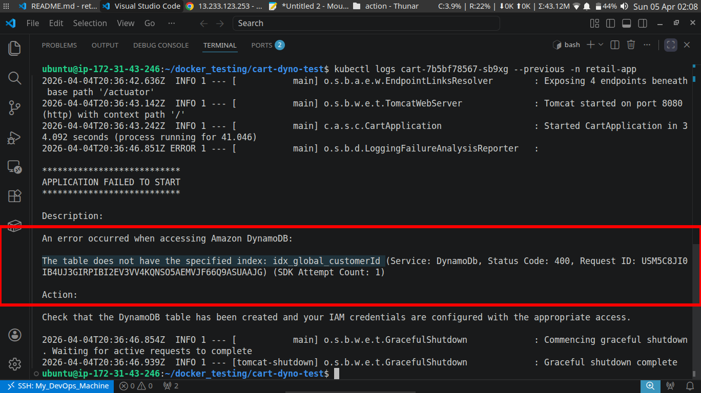
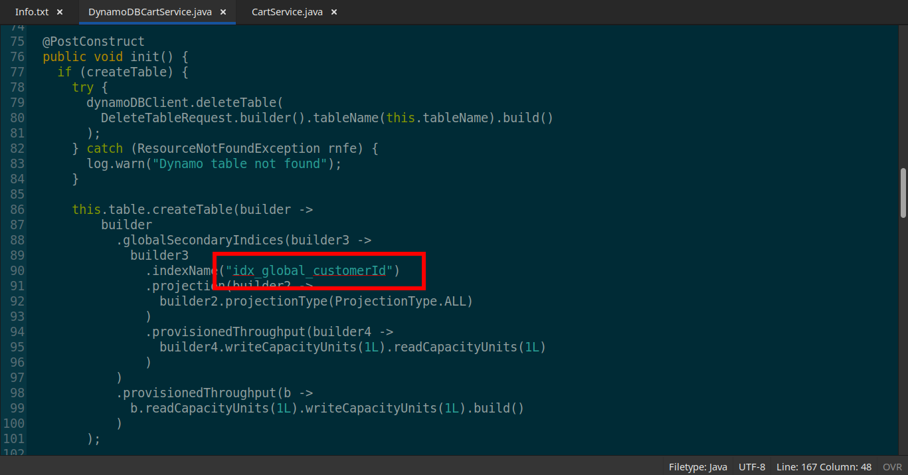
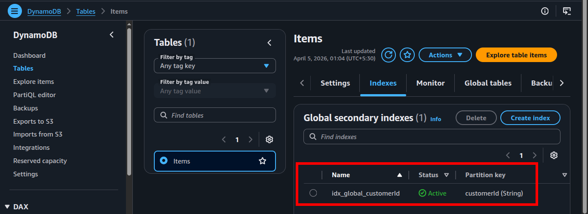
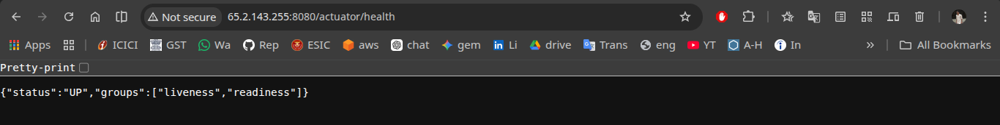
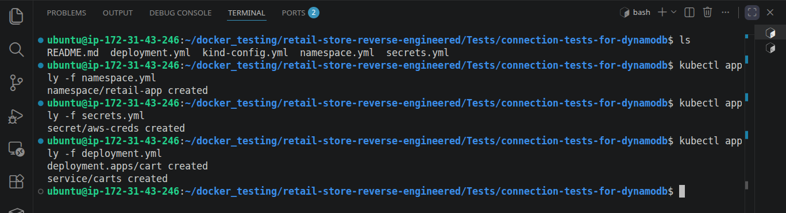

# 🚀 Production-Oriented DynamoDB integration for Carts Service

A production-oriented Kubernetes implementation focused on validating real cloud persistence behavior, distributed runtime considerations, and operationally safe microservice integration with AWS DynamoDB.

## 📑 Table of Contents

- [Implementation Roadmap](#️-implementation-roadmap)
- [Project Navigation](#-project-navigation)
- [Overview](#-overview)
- [Source Code Analysis](#️️-source-code-analysis)
- [Architectural Decision](#️-architectural-decision)
- [Key Implementations](#-key-implementations)
- [Challenges & Solutions](#️-challenges--solutions)
- [Outcome](#-outcome)
- [Key Learnings](#-key-learnings)
- [Tech Stack](#-tech-stack)
- [Next Phase](#-next-phase)
- [Extra Screenshots](#-extra-screenshots)

## 🗺️ Implementation Roadmap

  

## 🔗 Project Navigation

- [Root Directory](https://github.com/sonuparit/retail-store-reverse-engineered)

### 📖 Understanding Phase

- [Source Code Understanding](https://github.com/sonuparit/retail-store-reverse-engineered/tree/main/src-code)
- [Architecture Understanding](https://github.com/sonuparit/retail-store-reverse-engineered/tree/main/my-work/04-applications/architecture)
- [Containerization (Docker)](https://github.com/sonuparit/retail-store-reverse-engineered/tree/main/my-work/04-applications/docker)
- [Docker Compose Orchestration](https://github.com/sonuparit/retail-store-reverse-engineered/tree/main/my-work/04-applications/docker-compose)

### ☸️ Kubernetes Implementation Phase

- [Individual Service Testing](https://github.com/sonuparit/retail-store-reverse-engineered/tree/main/my-work/04-applications/kubernetes/ind-svc-test)
  - [Carts](https://github.com/sonuparit/retail-store-reverse-engineered/tree/main/my-work/04-applications/kubernetes/ind-svc-test/cart-dynamodb-test) ← (📍 You are here )
  - [Catalog](https://github.com/sonuparit/retail-store-reverse-engineered/tree/main/my-work/04-applications/kubernetes/ind-svc-test/catalog-test)
  - [Checkout](https://github.com/sonuparit/retail-store-reverse-engineered/tree/main/my-work/04-applications/kubernetes/ind-svc-test/checkout-test)
  - [Orders](https://github.com/sonuparit/retail-store-reverse-engineered/tree/main/my-work/04-applications/kubernetes/ind-svc-test/orders-postgreSQL-test)
  - [UI](https://github.com/sonuparit/retail-store-reverse-engineered/tree/main/my-work/04-applications/kubernetes/ind-svc-test/ui-test)
- [Helm Templating](https://github.com/sonuparit/retail-store-reverse-engineered/tree/main/my-work/04-applications/kubernetes/helm-template)
- [Full App Deployment via Helmfile](https://github.com/sonuparit/retail-store-reverse-engineered/tree/main/my-work/04-applications/kubernetes/helmfile-deploy)
- [Multi-Environment GitOps via ArgoCD](https://github.com/sonuparit/retail-store-reverse-engineered/tree/main/my-work/04-applications/kubernetes/argocd-deploy)

### 📊 Production & Observability

- [Monitoring & Observability](https://github.com/sonuparit/retail-store-reverse-engineered/tree/main/my-work/03-observability)
- [Production-Grade GitOps Workflow](https://github.com/sonuparit/retail-store-reverse-engineered/tree/main/my-work)

## 📌 Overview

*This implementation focuses on transitioning the cart service from simulated in-memory storage to a production-oriented AWS DynamoDB backend within a microservices architecture.*

*The objective was not only functional integration, but also understanding the architectural implications of persistence management, infrastructure ownership, distributed runtime behavior, and production-safe cloud integration patterns.*

## 🕵️‍♂️ Source Code Analysis

**The problem:**

The original application architecture was designed primarily for:

1. *In-memory DynamoDB simulation*
2. *Local DynamoDB container usage*

Direct integration with managed AWS DynamoDB required additional architectural analysis and runtime adjustments.

- ***Env variable's critical role***

    

  - *If value is set to **`true`:***\
    **The application by itself creates/deletes the table**

    

  - *If value is set to **`false`:***\
    **The application expects the table with right indexing value already exist.**

## 🏛️ Architectural Decision

### If `CREATE_TABLE` == `true`

**Advantages**:

1. *It's great for local development and testing.*

**Disadvantages**:

1. ***`Race Condition`:** Scaling to multiple replicas in K8s would trigger a "race" where one pod might delete the table while another is trying to create/write to it.*

2. ***`Data Loss`**: The delete table call ensures that data is ephemeral. For a retail app, cart persistence is critical for conversion.*

3. ***`Violation of the Principle of Least Privilege (PoLP)`**: For the app to run this, the IAM Role needs DeleteTable and CreateTable permissions. In production, an app should only have Read/Write access.*

4. ***`Infrastructure Drift`**: By creating the table inside the app, Terraform loses the "Source of Truth." The infrastructure becomes "invisible" to management tools.*

### If `CREATE_TABLE` == `false`

**Advantages**:
*All disadvantages from above becomes advantage.*

1. ***`No Infrastructure Drift`**: By creating the table through Terraform, We maintain the "Single Source of Truth.*

2. ***`No Race Condition`:** Scalling the app will not trigger creation/deletion of table. It just needs the table to be present.*

3. ***`No Data Loss`**: Table never deletes upon scalling or creation of pod. So, no data loss.*

4. ***`No Violation of PoLP`**: App does not need create or delete table permission, It needs only read and write access.*

**Disadvantages**:

1. *It requires the table to be present. So, either have to create the table manually or provisioned it through terraform, before app even starts*

### Final Architectural Decision

*I intentionally kept `CREATE_TABLE=false` to align the system with production-oriented infrastructure practices, where infrastructure provisioning is separated from application runtime responsibilities.*

## 🔧 Key Implementations

- *Analyzed service dependencies and database requirements (**`application.yml`**)*

    

- *Replaced in-memory storage with **`AWS DynamoDB`***

    

- *Configured **`IAM user`** with appropriate DynamoDB permissions (**`temporary full access for tests`**)*

    

- *Implemented secure access using **`AWS Access Keys`** (lab setup using **`K8s secret`**)*

## ⚠️ Challenges & Solutions

**Issue:**

*The application failed initially due to a **`missing DynamoDB index`** required by the cart service.*

**Solution:**

- *Investigated service logic and query patterns*

    

- *Investigated DynamoDB query requirements and partition key expectations*

    

- *Identified the required index structure by verifying it from source code*

    
    But this source code created a concern for my project goal [read here](#️️-source-code-analysis)

- *Designed and created the missing index*

    

## ✅ Outcome

- *Successfully integrated AWS DynamoDB with the cart microservice*

    

- *Validated production-oriented persistence behavior using managed cloud infrastructure*
- *Eliminated dependency on mock/in-memory storage*
- *Improved architectural realism and operational reliability*
- *Established a stronger foundation for GitOps and infrastructure-as-code workflows*

## 💡 Key Learnings

This implementation reinforced several core DevOps principles:

**1. Bridging the gap between development and production reality**

- *Moving from in-memory mocks to real cloud services exposed hidden architectural assumptions and forced alignment with real-world constraints.*

**2. Infrastructure must be treated as a first-class concern**

- *Delegating resource creation to application code leads to **infrastructure drift**, **lack of visibility**, and **poor control** — reinforcing the importance of tools like **`Terraform`** as the single source of truth is invaluable.*

**3. Designing for distributed systems requires careful state management**

- *Decisions like table creation inside services can introduce **`race conditions`**, especially in horizontally scaled Kubernetes environments.*

**4. Security is an architectural decision, not an afterthought**

- *Implementing DynamoDB access highlighted the importance of **Principle of Least Privilege** **`(PoLP)`** and avoiding over-permissioned IAM roles.*

**5. Understanding service internals is critical for effective integration**

- *Debugging the missing index required deep analysis of source code and query patterns — not just configuration changes.*

**6. Production readiness is about predictability, not convenience**

- *Choosing pre-provisioned infrastructure over auto-creation ensured **`stability, persistence, and reliability.`***

## 🛠 Tech Stack

- **AWS DynamoDB**
- **IAM (Access Management)**
- **Microservices Architecture**
- **Docker / Containerized Services**

## 🔭 Next Phase

*Catalog Service testing and deployment [(read here)](../catalog-test/)*

## 📸 Extra Screenshots

- *Creation of KinD Cluster for local development*

    

- *Creation of all K8s resources*

    

- *Local port-forwarding*

    
