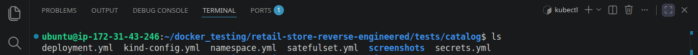
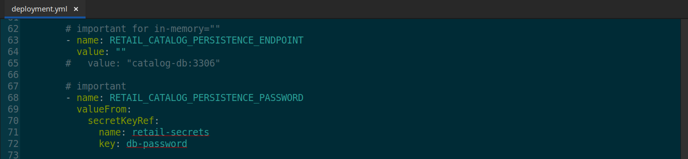
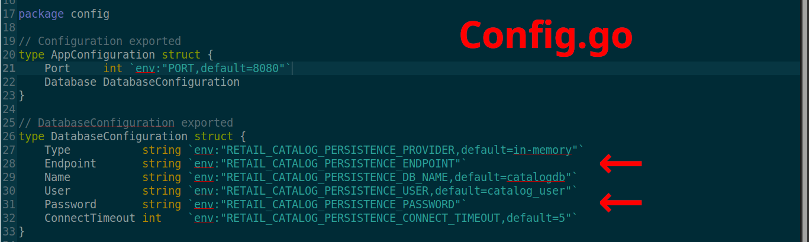
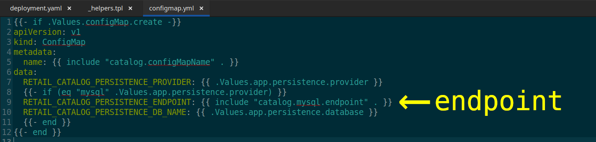
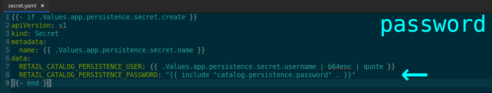
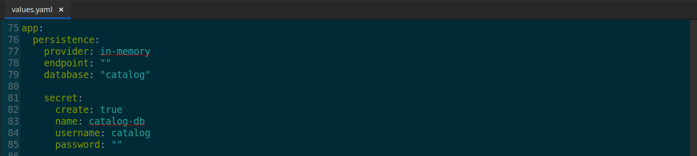
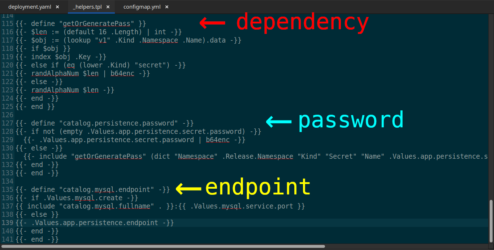
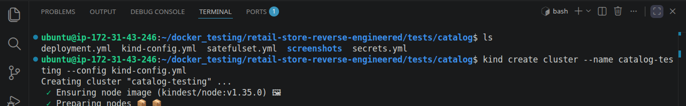
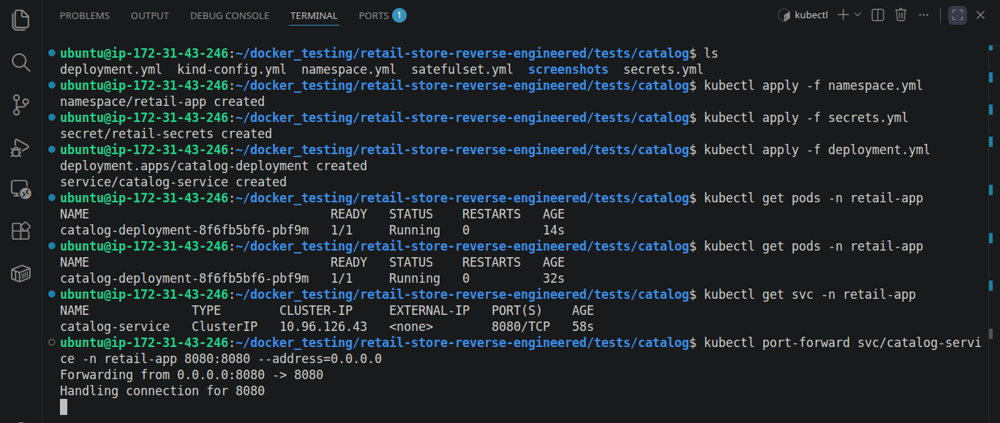

# 🚀 Production-Oriented Validation of the Catalog Service

*A production-oriented Kubernetes implementation focused on validating service behavior, reducing unnecessary infrastructure complexity, and making intentional architectural trade-offs within a microservices environment.*

## 📑 Table of Contents

**🧭 Navigation:**

- [Implementation Roadmap](#️-implementation-roadmap)
- [Project Navigation](#-project-navigation)

**📘 Project Documentation:**

- [Overview](#-overview)
- [Core Implementation](#️-core-implementation)
- [Architectural Decisions](#️-architectural-decisions)
- [Challenges & Solutions](#️-challenges--solutions)
- [Operational Outcomes](#-operational-outcomes)
- [Key Learnings](#-key-learnings)
- [Next Phase](#-next-phase)
- [Screenshots](#-screenshots)

## 🗺️ Implementation Roadmap

  

## 🔗 Project Navigation

- [Root Directory](https://github.com/sonuparit/retail-store-reverse-engineered)

### 📖 Understanding Phase

- [Source Code Understanding](https://github.com/sonuparit/retail-store-reverse-engineered/tree/main/src-code)
- [Architecture Understanding](https://github.com/sonuparit/retail-store-reverse-engineered/tree/main/my-work/04-applications/architecture)
- [Containerization (Docker)](https://github.com/sonuparit/retail-store-reverse-engineered/tree/main/my-work/04-applications/docker)
- [Docker Compose Orchestration](https://github.com/sonuparit/retail-store-reverse-engineered/tree/main/my-work/04-applications/docker-compose)

### ☸️ Kubernetes Implementation Phase

- [Individual Service Testing](https://github.com/sonuparit/retail-store-reverse-engineered/tree/main/my-work/04-applications/kubernetes/ind-svc-test)
  - [Carts](https://github.com/sonuparit/retail-store-reverse-engineered/tree/main/my-work/04-applications/kubernetes/ind-svc-test/cart-dynamodb-test)
  - [Catalog](https://github.com/sonuparit/retail-store-reverse-engineered/tree/main/my-work/04-applications/kubernetes/ind-svc-test/catalog-test) ← (📍 You are here )
  - [Checkout](https://github.com/sonuparit/retail-store-reverse-engineered/tree/main/my-work/04-applications/kubernetes/ind-svc-test/checkout-test)
  - [Orders](https://github.com/sonuparit/retail-store-reverse-engineered/tree/main/my-work/04-applications/kubernetes/ind-svc-test/orders-postgreSQL-test)
  - [UI](https://github.com/sonuparit/retail-store-reverse-engineered/tree/main/my-work/04-applications/kubernetes/ind-svc-test/ui-test)
- [Helm Templating](https://github.com/sonuparit/retail-store-reverse-engineered/tree/main/my-work/04-applications/kubernetes/helm-template)
- [Full App Deployment via Helmfile](https://github.com/sonuparit/retail-store-reverse-engineered/tree/main/my-work/04-applications/kubernetes/helmfile-deploy)
- [Multi-Environment GitOps via ArgoCD](https://github.com/sonuparit/retail-store-reverse-engineered/tree/main/my-work/04-applications/kubernetes/argocd-deploy)

### 📊 Production & Observability

- [Monitoring & Observability](https://github.com/sonuparit/retail-store-reverse-engineered/tree/main/my-work/03-observability)
- [Production-Grade GitOps Workflow](https://github.com/sonuparit/retail-store-reverse-engineered/tree/main/my-work)

## 📌 Overview

*While reverse engineering this retail microservices app, I focused on understanding service interactions, persistence strategies, and deployment across Docker and Kubernetes.*

*Instead of replicating everything blindly, I made selective architectural decisions — keeping implementations that added real learning value (**`DynamoDB for Cart, PostgreSQL for Orders`**) and removing redundant ones.*

*This approach helped me stay focused on orchestration, system behavior, and production-relevant trade-offs rather than repeating similar integrations.*

## ⚙️ Core Implementation

*Analyzed application configuration and environment dependencies to fully decouple persistence requirements from service runtime behavior.*

- *Created and validated all required Kubernetes deployment resources*

    

- *Implemented only the minimum runtime configuration required for stable in-memory execution*

    

## 🏛️ Architectural Decisions

***Context:***

*The Catalog service originally relied on MariaDB for item storage. However, the project scope did not involve dynamic catalog management, and Persistence-related architectural patterns had already been validated through DynamoDB and PostgreSQL integrations implemented in other services.*

***Rationale:***

- *No requirement to actively manage or mutate catalog data*
- *Persistence patterns already implemented using DynamoDB (Cart) and PostgreSQL (Orders)*
- *Avoided duplicating the same database integration pattern*
- *Reduced unnecessary operational overhead*
- *Kept focus on Kubernetes orchestration and infrastructure automation*

### Final Architectural Decision

*MariaDB integration was intentionally excluded from this service implementation to reduce unnecessary operational complexity and maintain focus on orchestration, infrastructure behavior, and Kubernetes validation workflows.*

## ⚔️ Challenges & Solutions

*The service initially contained tightly coupled persistence assumptions, requiring careful validation of runtime behavior to isolate and safely remove unnecessary database dependencies.*

***My approach:***

- *Analyzed requirement from source code (**`config.go`**)*

    

- *Confirmed everywhere for **requirements for** **`in-memory storage`** implementation*

    

    

- ***`Simulated the output`** to see the requirements*

  - *password (**`never blank`**). Although it looks blank*

    

  - *endpoint (**`must be ""`**) for in-memory storage*

    

- *Implemented only **`which is required`**.*

    

------------------------------------------------------------------------

## 📈 Operational Outcomes

***`Simplified the architecture while preserving learning depth where it mattered`**. This allowed faster iteration and better focus on system design, service interaction, and deployment strategies.*

*App working as intended:*

## 🎓 Key Learnings

- *Learned to **`validate systems incrementally`** — testing services in isolation before full orchestration improved reliability and debugging clarity*

- *Gained **`hands-on experience in reverse engineering systems`** — an invaluable skill for translating legacy applications into scalable microservices architectures.*

- *Built practical experience in **`choosing the right persistence layer based on use case`**, instead of applying everything to everywhere*

- *Realized the **`importance of intentional architecture decisions`** — removing components that add complexity without adding learning or value.*

- *Strengthened my ability to **`think in terms of system design trade-offs`**, not just implementation*

## 🔭 Next Phase

*Checkout Service testing and deployment [(read here)](../checkout-test/)*

## 📸 Screenshots

- *Creation of KinD Cluster for local development*

    

- *Created all K8s resources and validated them*

    

- Result:

    
