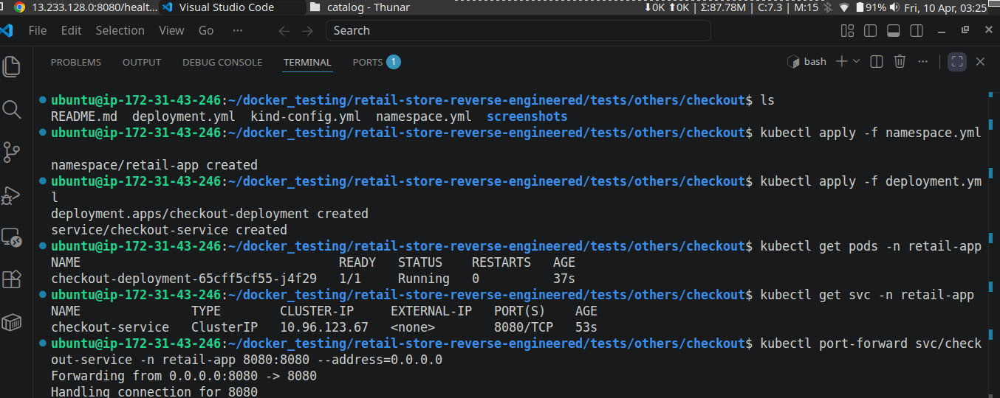
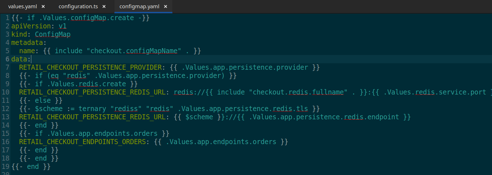
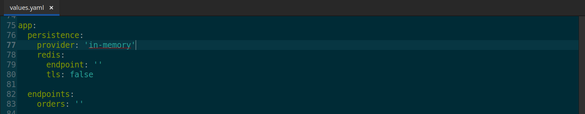
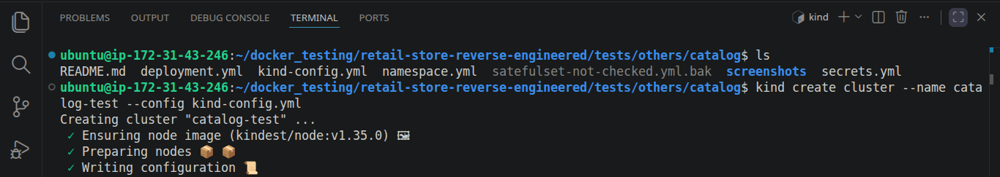

# 🚀 Production-Oriented Validation of the Checkout Service

*A production-oriented Kubernetes implementation focused on validating stateless service behavior, simplifying unnecessary infrastructure dependencies, and making intentional persistence-related architectural decisions within a microservices environment.*

## 📑 Table of Contents

- [Implementation Roadmap](#️-implementation-roadmap)
- [Project Navigation](#-project-navigation)
- [Overview](#-overview)
- [Architectural Decision](#️-architectural-decision)
- [Key Implementations](#-key-implementations)
- [Challenges & Solutions](#️-challenges--solutions)
- [Outcome](#-outcome)
- [Key Learnings](#-key-learnings)
- [Next Phase](#-next-phase)
- [Extra Screenshots](#-extra-screenshots)

## 🗺️ Implementation Roadmap

  

## 🔗 Project Navigation

- [Root Directory](https://github.com/sonuparit/retail-store-reverse-engineered)

### 📖 Understanding Phase

- [Source Code Understanding](https://github.com/sonuparit/retail-store-reverse-engineered/tree/main/src-code)
- [Architecture Understanding](https://github.com/sonuparit/retail-store-reverse-engineered/tree/main/my-work/04-applications/architecture)
- [Containerization (Docker)](https://github.com/sonuparit/retail-store-reverse-engineered/tree/main/my-work/04-applications/docker)
- [Docker Compose Orchestration](https://github.com/sonuparit/retail-store-reverse-engineered/tree/main/my-work/04-applications/docker-compose)

### ☸️ Kubernetes Implementation Phase

- [Individual Service Testing](https://github.com/sonuparit/retail-store-reverse-engineered/tree/main/my-work/04-applications/kubernetes/ind-svc-test)
  - [Carts](https://github.com/sonuparit/retail-store-reverse-engineered/tree/main/my-work/04-applications/kubernetes/ind-svc-test/cart-dynamodb-test)
  - [Catalog](https://github.com/sonuparit/retail-store-reverse-engineered/tree/main/my-work/04-applications/kubernetes/ind-svc-test/catalog-test)
  - [Checkout](https://github.com/sonuparit/retail-store-reverse-engineered/tree/main/my-work/04-applications/kubernetes/ind-svc-test/checkout-test) ← (📍 You are here )
  - [Orders](https://github.com/sonuparit/retail-store-reverse-engineered/tree/main/my-work/04-applications/kubernetes/ind-svc-test/orders-postgreSQL-test)
  - [UI](https://github.com/sonuparit/retail-store-reverse-engineered/tree/main/my-work/04-applications/kubernetes/ind-svc-test/ui-test)
- [Helm Templating](https://github.com/sonuparit/retail-store-reverse-engineered/tree/main/my-work/04-applications/kubernetes/helm-template)
- [Full App Deployment via Helmfile](https://github.com/sonuparit/retail-store-reverse-engineered/tree/main/my-work/04-applications/kubernetes/helmfile-deploy)
- [Multi-Environment GitOps via ArgoCD](https://github.com/sonuparit/retail-store-reverse-engineered/tree/main/my-work/04-applications/kubernetes/argocd-deploy)

### 📊 Production & Observability

- [Monitoring & Observability](https://github.com/sonuparit/retail-store-reverse-engineered/tree/main/my-work/03-observability)
- [Production-Grade GitOps Workflow](https://github.com/sonuparit/retail-store-reverse-engineered/tree/main/my-work)

## 📌 Overview

*This implementation focused on validating the Checkout microservice within Kubernetes while intentionally minimizing unnecessary persistence complexity.*

*The primary objective was to understand how stateless service workflows behave under container orchestration without introducing infrastructure components that provided limited architectural or operational value.*

## 🏛️ Architectural Decision

***Context:***

*For this checkout service, the workflow does not require durable or shared state across instances. The checkout process can be deterministically **`reconstructed from the cart`** at any time. Given this, Redis looked like an over-engineered solution, adding infrastructure and maintenance complexity without clear benefit.*

***Rationale:***

- **`No requirement for persisted intermediate orchestration data.`**
- *Persistence patterns already implemented using DynamoDB (Cart) and PostgreSQL (Orders).*
- *Avoided unnecessary database integration.*
- *Reduced unnecessary operational overhead.*
- **`Kept focus on Kubernetes orchestration and infrastructure automation.`**

### Final Architectural Decision

*Redis integration was intentionally excluded to preserve a stateless workflow model and reduce unnecessary infrastructure overhead during Kubernetes service validation.*

## 🔧 Key Implementations

*Analyzed runtime configuration and service dependencies to safely remove unnecessary Redis-related integration requirements.*

- *Created and validated all required Kubernetes deployment resources*

    

- *Simplified runtime configuration by removing persistence-related environment variables not required for stateless execution*

    

## ⚠️ Challenges & Solutions

The service initially contained persistence-oriented configuration assumptions that required careful validation to determine whether Redis integration was operationally necessary.

***My approach:***

- *Analyzed requirement from source code (**`configuration.ts`**)*

    

- *Confirmed everywhere for **requirements for** in-memory storage implementation*

    

    

- Removed persistence-specific environment variables not required for stateless runtime behavior

    

## ✅ Outcome

*The Checkout service was successfully validated in Kubernetes using a simplified stateless architecture model.*

*This approach reduced operational complexity while preserving focus on orchestration behavior, service interaction patterns, and infrastructure-level learning objectives.*

## 💡 Key Learnings

- *Learned to **`validate systems incrementally`** — testing services in isolation before full orchestration improved reliability and debugging clarity.*

- *Gained **`hands-on experience in reverse engineering systems`** — an invaluable skill for translating legacy applications into scalable microservices architectures.*

- *Built practical experience in **`choosing the right persistence layer based on use case`**, instead of applying everything to everywhere.*

- ***`Realized the importance of intentional architecture decisions`** — removing components that add complexity without adding learning or value.*

- *Strengthened my ability to **`think in terms of system design trade-offs`**, not just implementation*

------------------------------------------------------------------------

## 🔭 Next Phase

*Orders Service testing and deployment [(read here)](../orders-postgreSQL-test/)*

## 📸 Extra Screenshots

- *Creation of KinD Cluster for local development*

    

- *Created all K8s resources and validated them*

    

- Result:

    
