# 🚀 PV and PVC for PostgreSQL (From Mock to Production)

## 📑 Table of Contents

- **[Overview](#-overview)**
- **[Architectural Decision Record (ADR)](#️-architectural-decision-record--adr)**
- **[Key Implementations](#-key-implementations)**
- **[Challenges & Solutions](#️-challenges--solutions)**
- **[Outcome](#-outcome)**
- **[Key Learnings](#-key-learnings)**
- **[Next Steps](#-next-steps)**
- **[Extra Screenshots](#-extra-screenshots)**

## 📌 Overview

*This section of project demonstrates the **`transition from in-memory mock storage to a real persistent PostgreSQL Database`** within a microservices-based retail application.*

*The **`goal is to move closer to a production-ready architecture`** by replacing simulated components with actual cloud services, however I **`got several errors`** in the process, but finally I **`fixed them all`**.*

------------------------------------------------------------------------

## 🏛️ Architectural Decision Record 📝 (ADR)

### Rabbitmq:

- *From the very start of this project. My focus was to achieve deep proficiency in **`Docker`**, **`IaC (Terraform)`**, **`Kubernetes orchestration`**, **`CI/CD pipeline`**, **`Monitoring`** and **`Automation`**. By removing the message broker, I reduced unnecessary stateful complexity, allowing me to focus entirely on my initial goal*.

### The Decision:

- *I chose to keep the application logic synchronous to my **`GOAL`** to ensure the **`"one click - full automation"`** remains the star of the show.*

### PostgreSQL (PV & PVC):

- *Order data requires persistence, instead of losing records when the cluster is destroyed, I **`implemented PV and PVC backed by external EBS`** for durable storage.*

### The Decision:

- *Adopted **`persistent PostgreSQL`** storage for the orders service.*

------------------------------------------------------------------------

## 🔧 Key Implementations

-   *Created all resources for **`Orders`** service*

    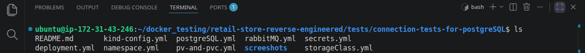

-   *Replaced in-memory / local postgreSQL image storage with **`persistent PostgreSQL database storage`***

    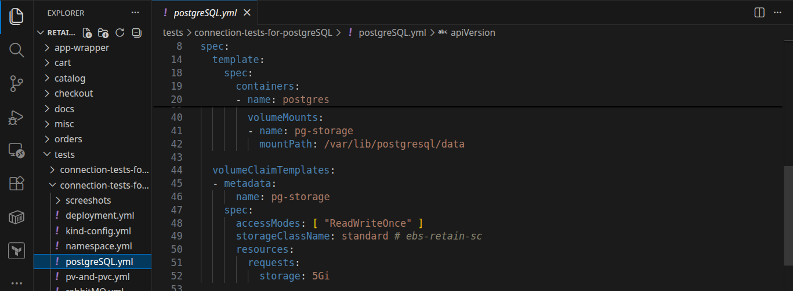

-   *Attached EBS volume to **`persist the data after cluster dispose`** using **`PV and PVC`***

    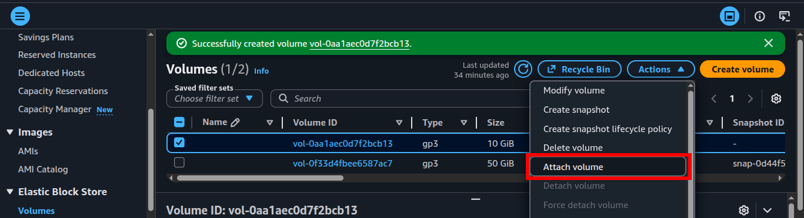

    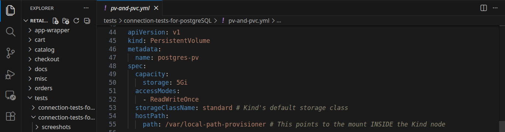

    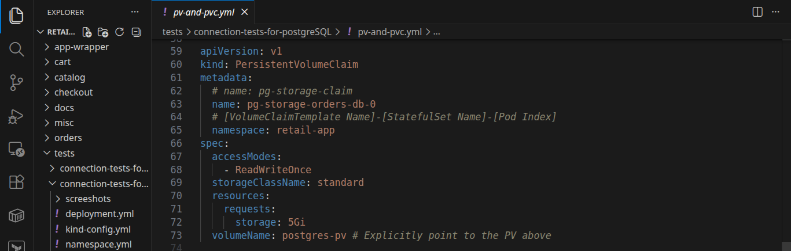

-   *Implemented correct **`fsgroup`** permission for **`PostgreSQL container`** to have read / write access to EBS volume*

    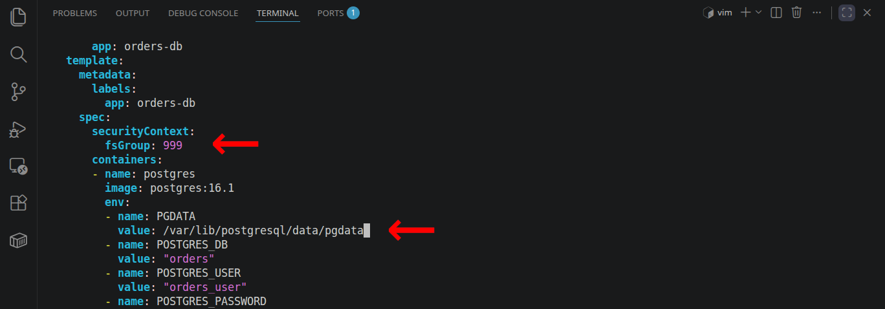

-   *Implemented **`PGDATA`** env variable variable to mitigate **`drive not empty`**) error*

------------------------------------------------------------------------

## ⚠️ Challenges & Solutions

### Problem:

***PostgreSQL Initialization Failure on EBS Volumes:***\
*While implementing persistent storage for the orders-db service using AWS EBS volumes, the PostgreSQL container failed to initialize with the following error:*

```
initdb: error: directory "/var/lib/postgresql/data" exists but is not empty (lost+found found)
```

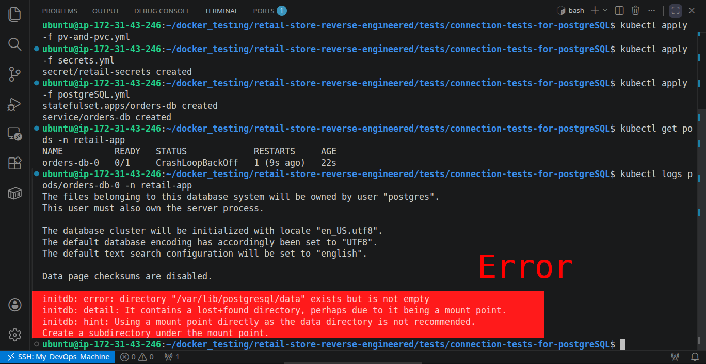

- ***Technical Root Cause:***\
*Block Storage Metadata: AWS EBS volumes (ext4/xfs) automatically include a lost+found directory at the mount point root.*

- ***PostgreSQL Pickiness:***\
*The initdb utility requires a completely empty directory to initialize a new database cluster to prevent accidental data overwrites.*

- ***Permission Mismatch:***\
*By default, EBS volumes are mounted with root ownership, preventing the postgres user (UID 999) from creating sub-directories.*

### The Engineered Solution:

***I resolved this by implementing a two-tier configuration strategy in the Kubernetes `StatefulSet`:***

1. ***Decoupling Storage Root from Data Root (`PGDATA`):***\
*Instead of using the volume mount point root as the data directory, I utilized the PGDATA environment variable to point PostgreSQL to a **`sub-directory:`***

    - ***Mount Path**: **`/var/lib/postgresql/data`** (Points to the EBS hardware)*

        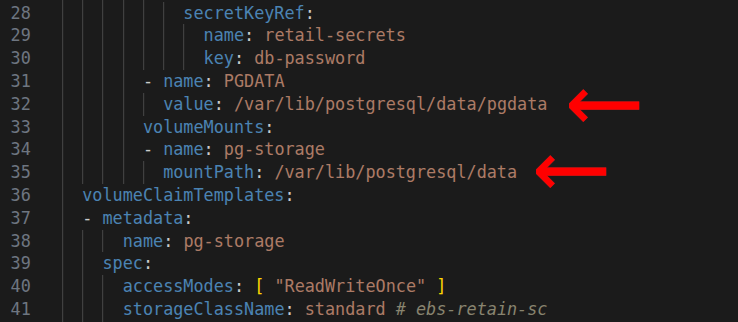

    - ***PGDATA Path**: **`/var/lib/postgresql/data/pgdata`** (A clean sub-folder managed by Postgres)*

    ***This bypasses the lost+found folder conflict while ensuring all data still persists on the EBS volume.***

    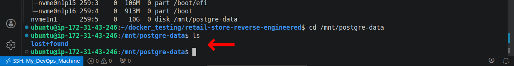

2. ***Automated Volume Ownership (`fsGroup`):***\
*To handle the permission handshake between the AWS infrastructure and the Linux container, I configured a **`Pod-level Security Context`**:*

    ```yml
    securityContext:
        fsGroup: 999
    ```

    

    *This instructs Kubernetes to recursively change the ownership of the EBS volume to the postgres group ID upon attachment, ensuring the database process has the necessary read/write privileges without manual intervention.*

------------------------------------------------------------------------

## ✅ Outcome

***`Zero-Touch Persistence`**:*\
*Successfully **`integrated AWS EBS`** with a StatefulSet, ensuring database records survive Pod restarts or node failures without manual data recovery.*

***`Resolved Storage Collisions`**:*\
*Automated the bypass of the lost+found block storage error by reconfiguring the **`PGDATA path`**, allowing for seamless automated database initialization.*

***`Infrastructure-as-Code Security`**:*\
*Implemented Pod-level Security Contexts (fsGroup), enforcing the **`Principle of Least Privilege`** by ensuring the container only accesses necessary storage volumes without requiring root permissions.*

***`Production-Ready Stability`**:*\
*Achieved a stable "Ready" state for the retail-app data tier, handling the complex handshake between AWS infrastructure and Kubernetes storage primitives.*

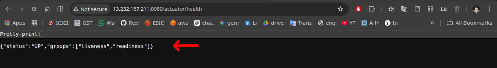

------------------------------------------------------------------------

## 💡 Key Learnings

*Moving from a stateless mock environment to a persistent production-grade architecture taught me that the **`"devil is in the details"`** of the infrastructure handshake. Here are my core takeaways:*

**1. Decoupling Storage from Logic**
- *I learned that managing state in Kubernetes isn't just about attaching a disk.Iit’s about managing the lifecycle of data. **`Implementing PVs and PVCs`** taught me how to abstract physical storage (AWS EBS) from the application pods, ensuring data outlives the compute.*

**2. Navigating the "Impedance Mismatch" of Cloud Storage:**
- *The **`lost+found error`** was a masterclass in how Linux filesystems and database engines interact. I learned that production-ready configurations require a deep understanding of how tools like **`initdb`** behave, leading me to use **`PGDATA`** sub-directories as a standard practice for clean initializations.*

**3. Security-First Infrastructure:**
- *My experience with fsGroup reinforced the importance of the **`Principle of Least Privilege`**. I realized that solving **"Permission Denied"** errors by using **chmod 777** is a debt-heavy shortcut. Instead, I focused on using Kubernetes Security Contexts to handle volume ownership gracefully and securely.*

**4. StatefulSet Nuances**
- *Working with PostgreSQL in K8s highlighted **`why StatefulSets are preferred over Deployments for databases`**. I gained a better grasp of stable network identifiers and the necessity of ordered, graceful deployments when dealing with persistent data.*

**6. Production-Oriented Thinking over Local Success**
- *Transitioned from **“it work`**s locally”** to **`“it survives restarts, failures, and redeployments,”`** focusing on durability, reproducibility, and zero-touch recovery.*

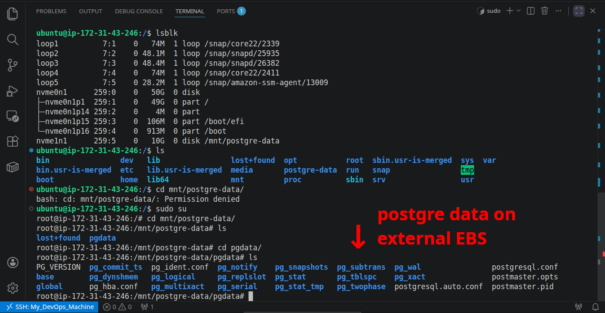

------------------------------------------------------------------------

## 🚀 Next Steps

1. *Full app deployment on **`Kubernetes`** [(know here)](../../)*
2. *IaC Provisioning via **`Terraform`***
3. *Implement **`CI/CD`** pipeline*
4. *Add **`email notification`** system*
5. *Add monitoring (**`Prometheus + Grafana`**)*
6. *Full Automation via one command **`terraform apply`** on **`AWS EKS`***


## 📸 Extra Screenshots

- *Setting up the EBS File system*

    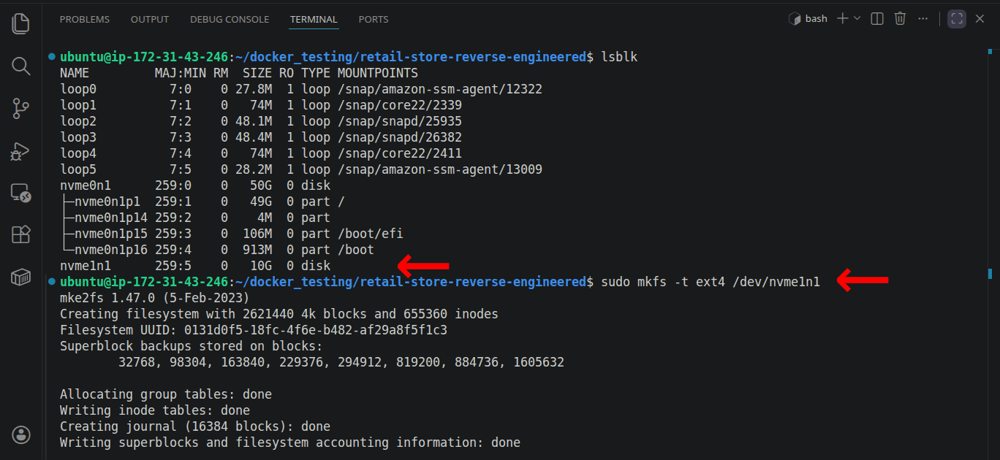

- *Kind Config to mount storage to EC2*

    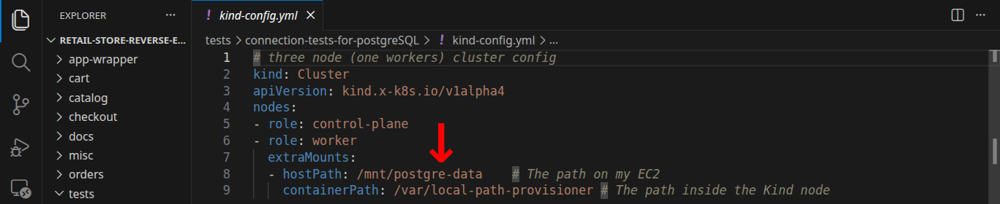

- *Mounting EBS to EC2*

    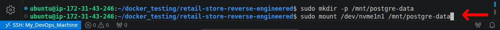

- *Creating KinD cluster*

    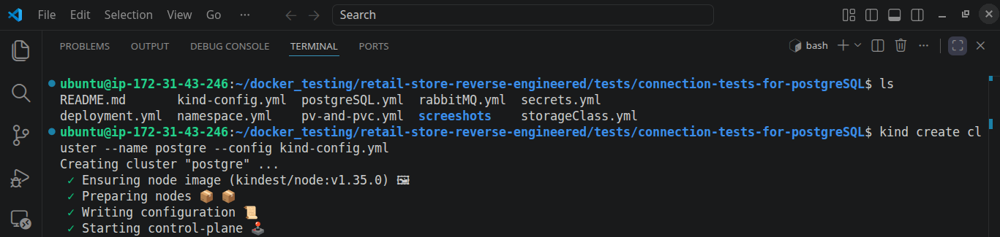

- *Running orders service on K8s*

    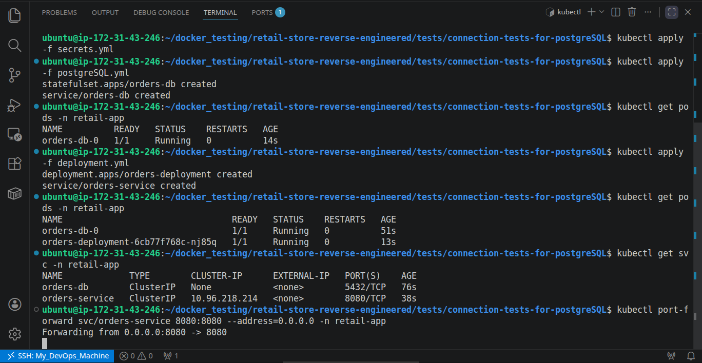

- *Successful implementation of orders service*

    

- *Persisted PostgreSQL data on EBS*

    

- *Wrapping up the session*

    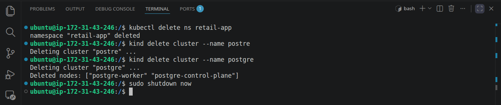