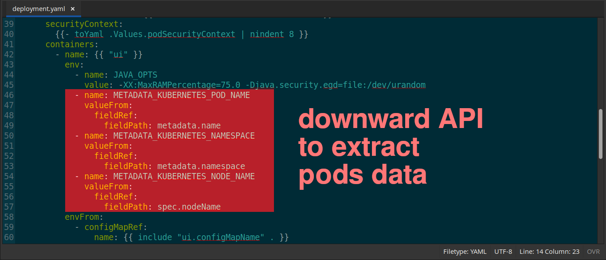
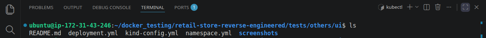
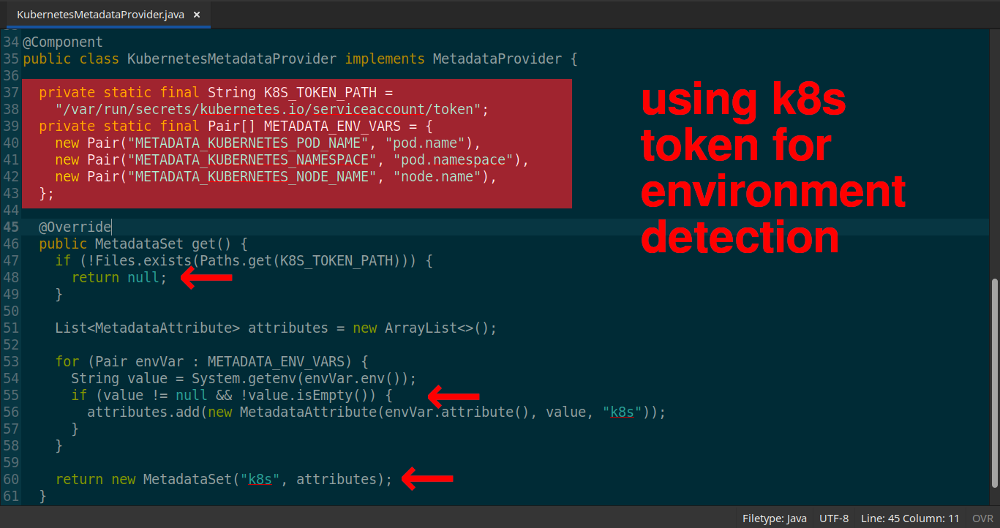
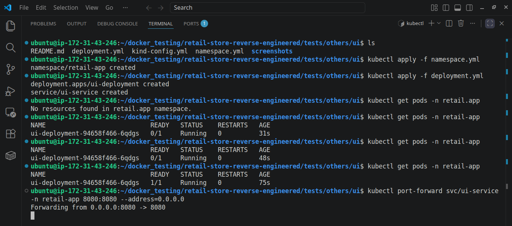
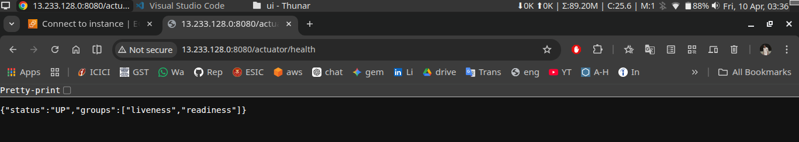

# 🚀 UI Service Solo Testing
*Removed **`Kubernetes-specific environment flags`** to keep the application agnostic of its runtime environment*

## 📑 Table of Contents

- **[Overview](#-overview)**
- **[Architectural Decision Record (ADR)](#️-architectural-decision-record--adr)**
- **[Key Implementations](#-key-implementations)**
- **[Challenges & Solutions](#️-challenges--solutions)**
- **[Outcome](#-outcome)**
- **[Key Learnings](#-key-learnings)**
- **[Next Steps](#-next-steps)**
- **[Extra Screenshots](#-extra-screenshots)**

## 📌 Overview

*While reverse engineering this retail microservices app, I focused on understanding **`service interactions, persistence strategies, and deployment`** across Docker and Kubernetes.*

*Instead of replicating everything blindly, I made **`selective architectural decisions`**—keeping implementations that added real learning value (**`DynamoDB for Cart, PostgreSQL for Orders`**) and removing redundant ones.*

*This approach helped me stay **`focused on orchestration, system behavior, and production-relevant trade-offs`**.*

------------------------------------------------------------------------

## 🏛️ Architectural Decision Record 📝 (ADR)

***Context:***

*The UI service relied on environment-based auto-detection using runtime variables to identify its execution environment. While functional, **`this mixed observability concerns with the application code`**, which I prefer to keep separate*

***Rationale:***

- *Application should not be **`aware of its execution environment`***
- *Mixing application logic with observability increases unnecessary complexity and state management.*
- ***`Results in mixed logs that don’t directly relate to each other`**.*
- *Better to use tools like **`Prometheus`** to maintain separation of concerns*
- *Can be good for local development.*

### The Decision:
*Removed the internal metadata provider to later implement **`Prometheus-based service discovery`**, offloading observability to the infrastructure layer where it belongs.*

------------------------------------------------------------------------

## 🔧 Key Implementations

*Analyzed from top to bottom for dependencies to check their behaviour in K8s environment*

-   ***`Removed all env variables`** to make application agnostic of its runtime environment*

    

-   *Created all deployment resources.*

    

------------------------------------------------------------------------

## ⚠️ Challenges & Solutions

*The main challenge was to understand the application from its root, so I could analyze the behavior of the code and the actions it performs. Initially, I was unaware of the code’s underlying abstraction layers, which was performing an auto scan to identify the environment it was running in.*

***My approach:***

-   *Analyzed source code, to better understand the code behavior (**`KuernetesMetadataProvider.java`**)*

    

-   ***`Removed all env variables`** that were responsible for environment extraction*

------------------------------------------------------------------------

## ✅ Outcome

*As a result, I developed a clear understanding of the **`system’s architecture, execution flow, and underlying abstractions`**, enabling me to make informed design decisions.*

------------------------------------------------------------------------

## 💡 Key Learnings

- *Learned to enforce **`clear separation of concerns`** by decoupling observability from application logic, improving system clarity and maintainability.*

- *Recognized that applications should remain **`environment-agnostic`**, avoiding implicit dependencies on runtime context.*

- *Learned to **`validate systems incrementally`** — testing services in isolation before full orchestration improved reliability and debugging clarity.*

- *Gianed **`hands-on experience in reverse engineering systems`** — an invaluable skill for translating legacy applications into scalable microservices architectures.*

------------------------------------------------------------------------

## 🚀 Next Steps

1. *Full app deployment on **`Kubernetes`** [(know here)](../../)*
2. *IaC Provisioning via **`Terraform`***
3. *Implement **`CI/CD`** pipeline*
4. *Add **`email notification`** system*
5. *Add monitoring (**`Prometheus + Grafana`**)*
6. *Full Automation via one command **`terraform apply`** on **`EKS`***

## 📸 Extra Screenshots

- *Created all K8s resources and validated them*

    

- *Deployed single service to validate it's operational*

    

-   Result:

    