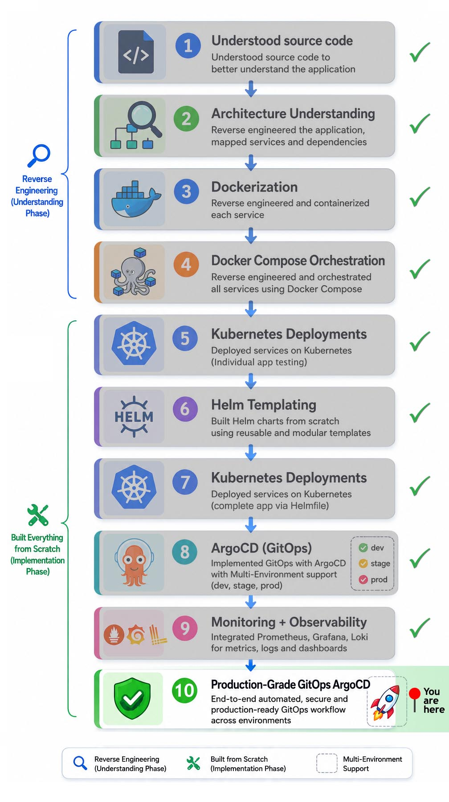

# 🚀 Production-Oriented GitOps Platform on Kubernetes

> [!NOTE]
> Beyond this implementation, the Application layer of the project was deployed on AWS EKS Auto Mode, Terraform-provisioned infrastructure, and full ArgoCD-driven GitOps CI/CD workflows. [(View Implementation)](https://github.com/sonuparit/terraform-gitops-pipeline)

This project implements a production-oriented Kubernetes platform focused on GitOps-driven deployments, layered infrastructure separation, multi-environment orchestration, persistent workloads, and operational scalability.

## 📑 Table of Contents

**🧭 Navigation:**

- [Implementation Roadmap](#️-implementation-roadmap)
- [Project Navigation](#-project-navigation)

**📘 Project Documentation:**

- [Overview](#-overview)
- [Architecture](#️-architecture)
- [Repository Structure](#-repository-structure)
- [Tech Stack](#️-tech-stack)
- [Deployment Guide](#-deployment-guide)
- [Features](#-features)
- [Core Implementation](#️-core-implementation)
- [Architectural Decisions](#️-architectural-decisions)
- [Challenges & Solutions](#️-challenges--solutions)
- [Operational Outcomes](#-operational-outcomes)
- [Key Learnings](#-key-learnings)
- [Future Improvements](#-future-improvements)
- [Acknowledgments](#-acknowledgments)

## 🗺️ Implementation Roadmap

<p align="left">
  
</p>

## 🔗 Project Navigation

- [Root Directory](https://github.com/sonuparit/retail-store-reverse-engineered)

### 📖 Understanding Phase

- [Source Code Understanding](https://github.com/sonuparit/retail-store-reverse-engineered/tree/main/src-code)
- [Architecture Understanding](https://github.com/sonuparit/retail-store-reverse-engineered/tree/main/my-work/04-applications/architecture)
- [Containerization (Docker)](https://github.com/sonuparit/retail-store-reverse-engineered/tree/main/my-work/04-applications/docker)
- [Docker Compose Orchestration](https://github.com/sonuparit/retail-store-reverse-engineered/tree/main/my-work/04-applications/docker-compose)

### ☸️ Kubernetes Implementation Phase

- [Individual Service Testing](https://github.com/sonuparit/retail-store-reverse-engineered/tree/main/my-work/04-applications/kubernetes/ind-svc-test)
  - [Carts](https://github.com/sonuparit/retail-store-reverse-engineered/tree/main/my-work/04-applications/kubernetes/ind-svc-test/cart-dynamodb-test)
  - [Catalog](https://github.com/sonuparit/retail-store-reverse-engineered/tree/main/my-work/04-applications/kubernetes/ind-svc-test/catalog-test)
  - [Checkout](https://github.com/sonuparit/retail-store-reverse-engineered/tree/main/my-work/04-applications/kubernetes/ind-svc-test/checkout-test)
  - [Orders](https://github.com/sonuparit/retail-store-reverse-engineered/tree/main/my-work/04-applications/kubernetes/ind-svc-test/orders-postgreSQL-test)
  - [UI](https://github.com/sonuparit/retail-store-reverse-engineered/tree/main/my-work/04-applications/kubernetes/ind-svc-test/ui-test)
- [Helm Templating](https://github.com/sonuparit/retail-store-reverse-engineered/tree/main/my-work/04-applications/kubernetes/helm-template)
- [Full App Deployment via Helmfile](https://github.com/sonuparit/retail-store-reverse-engineered/tree/main/my-work/04-applications/kubernetes/helmfile-deploy)
- [Multi-Environment GitOps via ArgoCD](https://github.com/sonuparit/retail-store-reverse-engineered/tree/main/my-work/04-applications/kubernetes/argocd-deploy)

### 📊 Production & Observability

- [Monitoring & Observability](https://github.com/sonuparit/retail-store-reverse-engineered/tree/main/my-work/03-observability)
- [Production-Grade GitOps Workflow](https://github.com/sonuparit/retail-store-reverse-engineered/tree/main/my-work) ← (📍 You are here )

## 📖 Overview

This platform simulates a production-grade Kubernetes and GitOps environment, designed for multi-environment application delivery, operational observability, and scalable platform engineering.

**What was built:**

- GitOps-first deployment model with ArgoCD as the single reconciliation controller
- Multi-environment Kubernetes (dev / stage / prod) on a single Kind cluster running on EC2
- Layered platform architecture separating infrastructure, platform services, application workloads, and observability
- Dependency-aware deployment orchestration using ArgoCD Sync Waves and custom Lua health checks
- Centralized monitoring (Prometheus + Grafana), logging (Loki + Promtail), and alerting (Alertmanager + Slack)
- Stateful workload persistence via EBS-backed PostgreSQL and managed DynamoDB

**Scale:** 5-service microservice retail application — UI, Catalog, Cart, Checkout, Orders

## 🏗️ Architecture


## 📂 Repository Structure

The repository is organized into layered operational domains to improve scalability, maintainability, deployment separation, and platform ownership boundaries.

| Layer              | Responsibility                                                               |
| ------------------ | ---------------------------------------------------------------------------- |
| bootstrap/         | Platform bootstrap scripts and deployment initialization                     |
| 01-infrastructure/ | Persistent storage, infrastructure dependencies, and provisioning components |
| 02-platform/       | Shared Kubernetes platform services and cluster-level dependencies           |
| 03-observability/  | Monitoring, logging, telemetry and operational visibility                    |
| 04-applications/   | Multi-environment application workloads and deployment manifests             |
| screenshots/       | Deployment validation and operational workflow screenshots                   |

## 🛠️ Tech Stack

- ### ☸️ Container Orchestration

  - Docker
  - Kubernetes
  - Kind (Kubernetes in Docker)

- ### 🚀 GitOps & Deployment

  - ArgoCD
  - Helm
  - Helm Charts

- ### 📦 Infrastructure & Platform

  - AWS
  - External Secrets Operator (ESO)

- ### 📊 Monitoring & Metrics

  - Prometheus
  - Prometheus Operator
  - kube-prometheus-stack
  - Grafana
  - postgres-exporter
  - kube-state-metrics

- ### 📜 Logging & Observability

  - Loki
  - Promtail
  - Grafana Explore

- ### 🚨 Alerting

  - Alertmanager
  - Slack Webhooks
  - Email Notifications

- ### 🗄️ Stateful Infrastructure

  - PostgreSQL
  - Persistent Volumes
  - EBS-backed storage
  - Managed DynamoDB service

- ### 🔐 Security & Access Control

  - RBAC
  - ArgoCD Projects
  - Principle of Least Privilege (PoLP)
  - AWS Secrets Manager
  - IMDSv2
  - IAM Policy

- ### 🌐 Networking & Service Discovery

  - Kubernetes Services
  - Headless Services
  - ServiceMonitors
  - CoreDNS

- ### ⚙️ Automation & Scripting

  - Bash scripting
  - Lua (ArgoCD Health Checks)

## 📦 Deployment Guide

This section walks through deploying the full multi-environment GitOps setup on a kind Kubernetes cluster running on EC2.

> [!NOTE]
> Kind was used for cost-efficient local Kubernetes simulation and rapid environment iteration. For Terraform provisioned EKS and FULL CI/CD of the application [(see here)](https://github.com/sonuparit/terraform-gitops-pipeline)

### Prerequisites

**Infra:**

1. **EC2 instance** (recommended flex.large for multi env)

2. **EBS volume** attached to EC2 and mounted for persistence services

3. **Dynamodb** for carts service with:

    ```bash
    table: Item   |  index: idx_global_cutomerId
        id: id    |    key: customerId
    ```

    

4. **AWS Sercrets Manager** with secrets configured:

5. **IAM role for EC2** with permissions:

    - dynamodb read and write access
    - secrets manager read access

6. **Metadata response hop limit** for EC2 set to: `5`

Tools:

1. Docker installed and running
2. kubectl
3. helm
4. Kind

Steps:

1. Clone the repo and get into `bootstrap`

    ```bash
    git clone https://github.com/sonuparit/retail-store-reverse-engineered.git

    cd /retail-store-reverse-engineered/my-work/bootstrap/
    ```

2. Run the script and follow instructions:

    ```bash
    chmod 700 bootstrap.sh
    bash bootstrap.sh
    ```

3. Once ArgoCD shows all apps green in UI, run second script and follow instructions:

    ```bash
    chmod 700 port-forward.sh
    bash port-forward.sh
    ```

4. Validate:

    - ArgoCD synchronization

    - Multi-environment isolation

        

    - Kubernetes reconciliation
    - Metrics collection

      

      

    - Centralized logging

      

    - End-to-end Application operational validation

      

## 🎯 Features

- GitOps-driven continuous delivery workflows using ArgoCD
- Multi-environment Kubernetes deployments (dev, stage, prod)
- ApplicationSet-based environment orchestration and scalable GitOps management
- Layered platform and application infrastructure separation
- Dependency-aware deployment orchestration using sync ordering and Lua health checks
- Principle of Least Privilege (PoLP)-oriented platform segmentation design
- ServiceMonitors for ArgoCD monitoring

## ⚙️ Core Implementation

- ### 1. GitOps Architecture Refactor

  Refactored an imperative Bash-based deployment workflow into a declarative GitOps-driven platform using ArgoCD as the centralized deployment controller.

  This enabled:

  - Continuous reconciliation
  - Declarative infrastructure management
  - Scalable multi-environment deployments
  - Cleaner operational workflows

- ### 2. Layered Repository & Platform Segmentation

  Re-architected the repository into dedicated operational layers:

  - Infrastructure
  - Platform
  - Observability
  - Applications

  Implemented scoped ArgoCD Projects and deployment boundaries to support:

  - Principle of Least Privilege (PoLP)
  - RBAC-aware segmentation
  - Clear separation of concerns
  - Safer GitOps operations
  - Improved dependency management

- ### 3. Dependency-Aware Deployment Orchestration

  Implemented deployment sequencing using:

  - ArgoCD Sync Waves
  - Custom Lua Health Checks
  - Reconciliation-aware synchronization

  This solved deployment ordering instability and enabled:

  - Deterministic layered deployments
  - Reliable health validation
  - Safer progressive rollouts
  - Stable dependency-aware orchestration

- ### 4. Automated ArgoCD Health Configuration Reloading

  Enhanced ArgoCD installation automation to automatically restart:

  - ArgoCD Repo Server
  - ArgoCD Server

  after configuration and health-check updates.

  This enabled:

  - Reliable Lua health-check enforcement
  - Automated configuration propagation
  - Consistent deployment synchronization behavior

- ### 5. Dependency-Aware Observability Deployment

  Resolved Prometheus target discovery failures caused by premature `ServiceMonitor` deployment before CRD availability.

  Reorganized observability resources into a dedicated deployment layer with proper sequencing.

  This enabled:

  - Reliable ServiceMonitor discovery
  - Stable metrics collection
  - Proper CRD-aware deployment orchestration
  - Cleaner observability architecture

- ### 6. Production-Oriented Operational Engineering

  Solved multiple platform-level operational challenges involving:

  - Kubernetes reconciliation behavior
  - CRD dependency timing
  - ArgoCD synchronization logic
  - Health validation workflows
  - RBAC and permission scoping
  - Deployment dependency management

  This significantly improved platform reliability, operational scalability, and production-oriented GitOps design understanding.

## 🏛️ Architectural Decisions

- ### 1. GitOps-First Deployment Model

  Adopted ArgoCD as the primary deployment controller.

  Why

  - Continuous reconciliation
  - Drift detection
  - Declarative deployments
  - Environment scalability

- ### 2. Layered Repository Architecture

  Separated the platform into:

  - Infrastructure Layer
  - Platform Layer
  - Application Layer
  - Observability Layer

  Why

  - Clear operational boundaries
  - Easier dependency management
  - Reduced coupling
  - Better maintainability

- ### 3. Dependency-Aware Deployment Sequencing

  Implemented layered deployment synchronization using:

  - ArgoCD Sync Waves
  - Custom Lua Health Checks

  Why

  - Prevent race conditions
  - Ensure foundational services become healthy before dependent deployments
  - Improve deployment reliability

- ### 4. Stateful Workload Persistence

  Implemented persistent PostgreSQL workloads using EBS-backed storage.

  Why

  - Durable application state
  - Environment-level isolation
  - Persistent cluster recreation workflows

- ### 5. Principle of Least Privilege (PoLP)

  Implemented scoped ArgoCD Projects and resource separation.

  Why

  - Reduced blast radius
  - Safer GitOps operations
  - Better production-grade security posture

- ### 6. Kubernetes-Native Operational Design

  Relied heavily on Kubernetes-native controllers, reconciliation, and CRDs.

  Why

  - Better ecosystem integration
  - Reduced orchestration complexity
  - Improved operational consistency

## ⚔️ Challenges & Solutions

- ### 1. Architectural Refactor for GitOps Adoption

  - **⚔️ Challenge:**\
    Initial infrastructure provisioning relied on sequential Bash scripts for ArgoCD, applications, monitoring, and logging deployments. While functional during iterative development, the approach was not aligned with GitOps workflows.

  - **🔍 Analysis:**\
    To implement GitOps properly, ArgoCD needed to become the single deployment controller responsible for continuous reconciliation and application lifecycle management.

  - **🧠 Root Cause:**\
    The repository structure was originally optimized for imperative script-based deployments rather than declarative GitOps operations.

  - **✅ Solution:**\
    Refactored the repository architecture to support GitOps-driven deployments through ArgoCD.

    **This enabled:**
    - Declarative infrastructure and application management
    - Cleaner deployment workflows
    - Easier environment scalability
    - Centralized synchronization via ArgoCD

  - **📚 Lesson Learned:**\
    Design repositories around the target operational model from the beginning. Retrofitting architecture later becomes significantly more expensive.

- ### 2. ArgoCD Project Permission Segmentation

  - **⚔️ Challenge:**\
    All deployments were initially running under ArgoCD's default project with broad cluster-wide permissions. I wanted to implement stricter project isolation and resource scoping.

  - **🔍 Analysis:**\
    Production-grade GitOps requires separation between cluster-scoped and namespace-scoped resources to enforce security boundaries and reduce blast radius.

  - **🧠 Root Cause:**\
    The repository lacked architectural separation between infrastructure, platform, observability, and application layers, making Principle of Least Privilege (PoLP) implementation difficult.

  - **✅ Solution:**\
    Re-architected the repository into dedicated deployment layers:
    - **Infrastructure Layer** → Kind, Terraform
    - **Platform Layer** → ESO and shared platform services
    - **Observability Layer** → Prometheus stack, exporters, logging
    - **Application Layer** → Business applications and services

      

    Implemented ArgoCD Projects with scoped permissions and controlled deployment boundaries.

    **This enabled:**
    - Principle of Least Privilege (PoLP)
    - Clear separation of concerns
    - Safer RBAC implementation
    - Better dependency management between layers
    - Production-grade GitOps organization

  - **📚 Lesson Learned:**\
    Strong architecture simplifies security, scalability, and operational control.

- ### 3. Layered Deployment Synchronization Failure

  - **⚔️ Challenge:**\
    ArgoCD was deploying all layers simultaneously despite sync wave configuration. Applications eventually recovered through Kubernetes reconciliation, but deployment ordering was unreliable.

  - **🔍 Analysis:**\
    Sync waves alone were insufficient because ArgoCD could not accurately determine application health states during deployment.

  - **🧠 Root Cause:**\
    Custom applications lacked health checks, preventing ArgoCD from validating readiness before progressing to dependent layers.

  - **✅ Solution:**\
    Implemented custom Lua health checks for ArgoCD to enforce proper health validation and layered deployment sequencing.

    **This enabled:**
    - Deterministic deployment ordering
    - Safer progressive rollouts
    - Reduced deployment instability
    - Reliable dependency-aware synchronization

  - **📚 Lesson Learned:**\
    Deployment orchestration is only as reliable as the health signals provided to the controller.

- ### 4. Lua Health Checks Not Taking Effect

  - **⚔️ Challenge:**\
    After implementing Lua health checks, ArgoCD still continued deploying layers in parallel.

  - **🔍 Analysis:**\
    The Lua scripts were valid, but ArgoCD was not applying the updated health configurations.

  - **🧠 Root Cause:**\
    ArgoCD Repo Server and ArgoCD Server required restarts to reload the newly applied project configurations and Lua health scripts.

  - **✅ Solution:**\
    Updated the ArgoCD installation automation to automatically restart:
    - ArgoCD Repo Server
    - ArgoCD Server

    after project and health configuration changes.

    **This enabled:**
    - Reliable health check enforcement
    - Consistent layered deployments
    - Fully automated configuration propagation

  - **📚 Lesson Learned:**\
    Configuration changes are ineffective unless the consuming services reload them correctly.

- ### 5. ArgoCD ServiceMonitors Missing in Prometheus

  - **⚔️ Challenge:**\
    ArgoCD ServiceMonitors existed in Kubernetes but were not visible in Prometheus, resulting in missing metrics collection.

  - **🔍 Analysis:**\
    No immediate errors were visible. After reapplying configurations post-monitoring stack deployment, the ServiceMonitors appeared and metrics collection resumed.

  - **🧠 Root Cause:**\
    ArgoCD attempted to create ServiceMonitor resources before the Prometheus Operator CRDs were installed. Since the CRDs did not yet exist, Kubernetes silently ignored the resources.

  - **✅ Solution:**\
    Removed ServiceMonitor creation from the ArgoCD Helm values configuration and moved monitoring resources into the dedicated Observability layer. Deployment sequencing ensured ServiceMonitors were only applied after Prometheus Operator CRDs became available.

    **This enabled:**
    - Reliable Prometheus target discovery
    - Stable metrics collection
    - Proper dependency-aware resource deployment
    - Cleaner observability architecture

  - **📚 Lesson Learned:**\
    CRD-dependent resources must only be deployed after their controllers and CRDs are fully available.

## 📈 Operational Outcomes

- Successfully implemented a production-oriented GitOps platform using Kubernetes and ArgoCD
- Validated simultaneous multi-environment deployments on a single cluster
- Established separation between infrastructure, platform, application, and observability layers
- Improved deployment reliability through dependency-aware synchronization
- Implemented persistent storage workflows for stateful workloads
- Integrated centralized monitoring, logging, and alerting pipelines
- Reduced orchestration complexity by leveraging Kubernetes reconciliation behavior
- Improved operational visibility across workloads and environments
- Established scalable repository organization aligned with platform-engineering practices

## 🧠 Key Learnings

- GitOps manages desired state — not runtime readiness
- Kubernetes reconciliation can eliminate unnecessary orchestration complexity
- Deployment order and runtime readiness are separate concerns
- Multi-environment deployments require strict operational separation
- Stateful workloads require infrastructure-aware persistence design
- Platform scalability depends heavily on repository architecture and operational boundaries
- Observability becomes critical as deployment complexity increases
- Kubernetes troubleshooting often requires validating infrastructure, orchestration, and runtime layers independently

## 🤖 Future Improvements

- EKS migration
- Terraform-based provisioning
- Full GitOps CI/CD
- Different Deployment strategies
- Automated Rollback
- Disaster Recovery
- Terraform Remote State + Locking
- Fully automate infrastructure and application delivery processes

## 🙏 Acknowledgments

- **AWS Containers Team** for the original sample application
- **ArgoCD Community** for the excellent GitOps tooling
