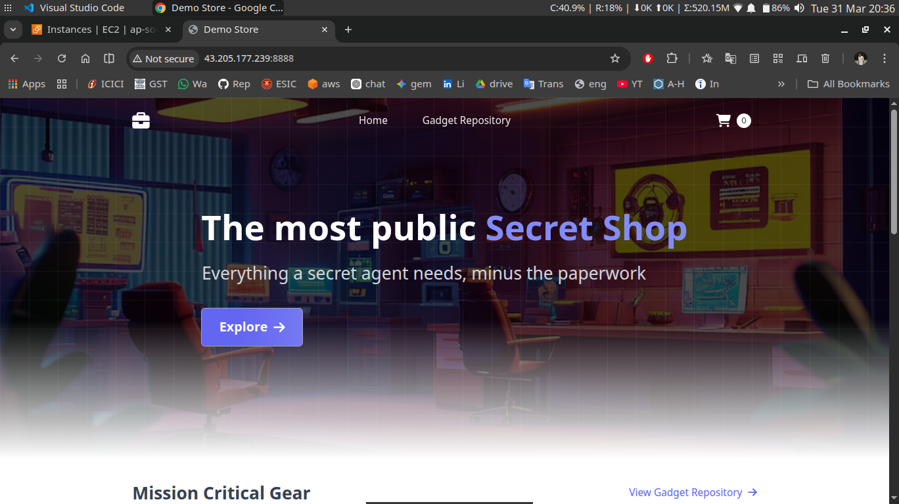

# 🚀 Retail Store Microservices — Containerization Deep Dive

## 📑 Table of Contents

1. **[Overview](#-overview)**
2. **[What this Project Demonstrates](#-what-this-project-demonstrates)**
3. **[Key Contribution](#-key-contributions)**
4. **[How to Run](#️-how-to-run)**
5. **[Tech Stack](#️-tech-stack)**
6. **[What I Learned](#-what-i-learned)**
7. **[What's Next](#-whats-next)**
8. **[Final thoughts](#-final-thoughts)**

## 📌 Overview

*This project demonstrates a **structured and analytical approach to containerizing** a multi-service retail application using Docker Compose. Instead of building from scratch, the focus was on reverse engineering and deeply understanding an existing production-like setup.*

*The application consists of **5 microservices**, each independently containerized and orchestrated using Docker Compose.*

---

## 🧠 What This Project Demonstrates

**This work reflects my strong understanding of:**

- *Microservices-based architecture*
- *Container orchestration using Docker Compose*
- *Service-to-service communication*
- *Environment configuration and dependency mapping*
- *Debugging and runtime validation*

---

## 🔍 Key Contributions

### 1. Compose File Analysis  
**Thoroughly analyzed all **`docker-compose`** configurations across services and understood:**
- *Service definitions*
- *Security enforcement*
- *Env mappings*
- *Dependency chains*
- *DB connections*

### 2. Configuration Understanding  
**Decoded the intent behind each directive:**
- *Why specific ports are exposed*
- *How services communicate internally*
- *The role of restart policies and build contexts*
- *Health checks implementation based on container env*
- *Strict security handling*

### 3. Environment Variable Discovery  
*Identified required environment variables by:*
- *Tracing source code*  
- *Mapping configuration usage across services*  
- *Ensuring correct runtime injection*  

### 4. Created a unified setup to run the entire system
- *Implemented a modular Compose setup via **`include`**, and defined a shared **`bridge network (main-app-net)`** to ensure unified networking across services.*

## ▶️ How to Run 

- Clone the repo:

```yml
https://github.com/sonuparit/retail-store-reverse-engineered.git
```

- Move into app-wrapper

```yml
cd retail-store-reverse-engineered/my-work/docker-compose/app-wrapper/
```
- Run the command

```yml
docker compose up -d
```

This enabled seamless startup of all services with proper configuration.


- Run `docker ps` command to get the port of UI
```yml
docker ps
```


- After health check, access the app at port `8888`

    - for local development access at `localhost:8888`

    - for EC2 development access at `<EC2 public IP>:8888`



### 5. Runtime Validation  
**Verified:**
- Service health and communication 

    

- Application functionality through end-to-end testing  

    

- Stability of containerized environment  

    

---

## ⚙️ Tech Stack

- **Docker**
- **Docker Compose**
- **Microservices Architecture**

---

## 🚀 What I learned

**1. Deep understanding of containerized microservices behavior**
- *Gained clarity on how independently deployed services **interact, communicate, and maintain stability** within a shared runtime environment.*

**2. Practical orchestration with Docker Compose**
- *Moved beyond basic usage by analyzing **multi-service orchestration patterns**, including **dependency management and startup sequencing.**

**3. Configuration-driven architecture**
- *Developed the ability to **trace and validate environment variables across services**, ensuring consistent and reliable runtime behavior.*

**4. Service communication and networking**
- *Understood **internal networking**, service discovery, and how containers communicate securely within an isolated network.*

**5. Production-aware debugging mindset**
- *Learned to diagnose issues by inspecting **logs, container states, health checks, and service dependencies** rather than relying on trial-and-error fixes.*

**6. Reading and understanding real-world setups**
- *Strengthened the ability to **reverse-engineer existing systems** — a critical skill for working with legacy or production codebases in real teams.*

---

## 🔭 What’s Next

Moving forward, this setup will be transitioned to Kubernetes:

1. *Add **`Kubernetes deployment`** [(read here)](../kubernetes/)*
2. *IaC Provisioning via **`Terraform`***
3. *Implement **`CI/CD`** pipeline*
4. *Add **`email notification`** system*
5. *Add monitoring (**`Prometheus + Grafana`**)*
6. *Full Automation via one command **`terraform apply`***

---

## 📌 Final Thoughts

This project was not just about running containers — it was about breaking down a system, understanding every moving part, and rebuilding confidence in orchestrating complex applications.


