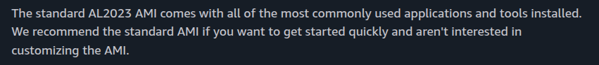

# 🚀 Retail Store Containerization

A hands-on reverse-engineered microservices project to better understand containerization using Docker.

## 📑 Table of Contents

1. **[Overview](#-overview)**
2. **[What I Learned](#-what-i-learned)**
3. **[Architecture](#️-architecture)**
4. **[Dockerfile Breakdown](#-dockerfile-breakdown-key-insights)**
5. **[What I choose](#-what-i-chose-for-my-project)**
6. **[My Contribution](#-my-contribution)**
7. **[Why This Project Matters](#-why-this-project-matters)**
8. **[Next Improvements](#-next-improvements)**
9. **[Screenshots](#-screenshots)**
10. **[Let's Connect](#-lets-connect)**

## 📌 Overview

**This project represents a retail store application composed of multiple microservices. I used existing Dockerfile as a starting point and reverse-engineered the system to gain a deep understanding of:**

-   *Microservices architecture*
-   *Containerization workflow*
-   *Base image selection criteria*

**This project focuses on understanding real-world trade-offs in containerization rather than just building from scratch.**

## 🧠 What I Learned

-   *How independent microservices are structured so they can be containerized*
-   *A deep understanding of how Dockerfiles work and the reasoning behind their design*
-   *How to make informed decisions when choosing base images*
-   *Debugging container-related issues*

## 🏗️ Architecture

**The application consists of 5 microservices:**

-   *Service 1 -- `UI` (**main Interface**)*
-   *Service 2 -- `Catalog` (**Content**)*
-   *Service 3 -- `Cart` (**Manages user session state**)*
-   *Service 4 -- `Checkout` (**Handles order processing workflow**)*
-   *Service 5 -- `Orders` (**Stores finalized transactions**)*

**Each service runs in its own container and communicates over a Docker network.**

## 🔍 Dockerfile Breakdown (Key Insights)

**Instead of just running the service, I analyzed the Dockerfile to understand the design decisions behind it and identified key insights:**

### 🧱 Base Image Strategy

**While analyzing the Dockerfile, I initially assumed the base image was unnecessarily large, which led me to explore smaller alternatives. During my analysis, I found:**

1. *The Dockerfile relies on the **`dnf`** package manager, whereas Alpine-based images use a different ecosystem (typically **`apk`**).*

2. *The current image is based on **`glibc`**, while Alpine uses **`musl libc`**, which can introduce compatibility issues with certain binaries and dependencies.*

3. *Based on these constraints, I focused on finding a smaller image that still supports the dnf package manager.*

4. *I tested with **`Amazon Linux 2023 (AL2023-minimal)`**, which uses the **`microdnf`** package manager. The build was successful, resulting in a significant reduction in the final image size.*

    - ***`190MB`** reduction in total file size:*
    

5. *This raised an important question:*

    ***Why use a larger base image when a smaller one works?***

    ```
    After further research, I found that the original choice prioritizes stability and compatibility over image size. Using a customized or minimal base image can introduce unexpected issues, especially in public projects, leading to numerous environment-related errors that are unrelated to the actual application logic.
    ```

    **Amazon docs:**
    
    

- **👉 Insight:**
*The current base image choice prioritizes compatibility and stability over minimal size, which is often a practical decision in real-world production systems.*


### 🔐 Security Considerations

**The application inside the container does not run with root privileges.**

- **👉 Insight:**
*Running the application as a non-root user is a best practice to improve container security and align with production standards.*

### 💡 Overall Takeaway

```
This Dockerfile reflects practical, production-oriented decisions where compatibility, stability, and security are prioritized over aggressive size optimization. While lightweight alternatives were explored, system-level constraints (package manager behavior and libc differences) justify the current approach, demonstrating the importance of balancing optimization with real-world reliability.
```

## 🧪 What I Chose for My Project:

- *I chose a **`minimal base image`** to intentionally explore its limitations and identify potential compatibility issues, even though the original image works reliably.*

## 🔍 My Contribution

-   *Reverse engineered an existing Dockerfile.*
-   *Analyzed and documented the design decisions behind the Dockerfile.*
-   *Implemented a smaller image (**`AL2023-minimal`**), reducing size by up to 190MB.*
-   *Improved my real-world Docker Image understanding.*

## 💡 Why This Project Matters

**This project demonstrates my ability to:**

-   *Learn from existing systems*
-   *Break down complex architectures*
-   *Take initiative and independently develop a deep understanding of complex systems*

## 📈 Next Improvements

1. *Refactor setup for production-ready **`Docker Compose usage`** → [(read here)](../docker-compose/)*
2. *Add **`Kubernetes deployment`***
3. *IaC Provisioning via **`Terraform`***
4. *Implement **`CI/CD`** pipeline*
5. *Add **`email notification`** system*
6. *Add monitoring (**`Prometheus + Grafana`**)*
7. *Full Automation via one command - **`terraform apply`***

------------------------------------------------------------------------

## 📸 Screenshots

**Building Images:**


**LF CRLF Issue:**


**Correction:**


**Multi image push via script:**


------------------------------------------------------------------------

## 🤝 Let's Connect

If you're interested in DevOps, microservices, or cloud-native
development, feel free to connect with me!

------------------------------------------------------------------------

⭐ If you found this interesting, consider giving it a star!