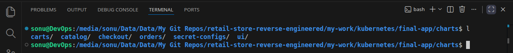
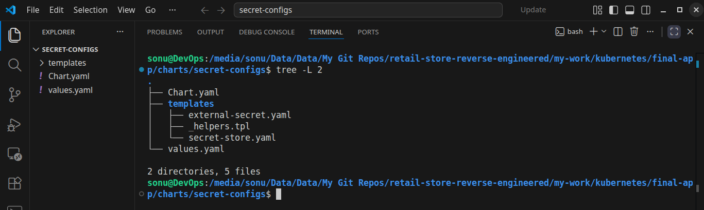
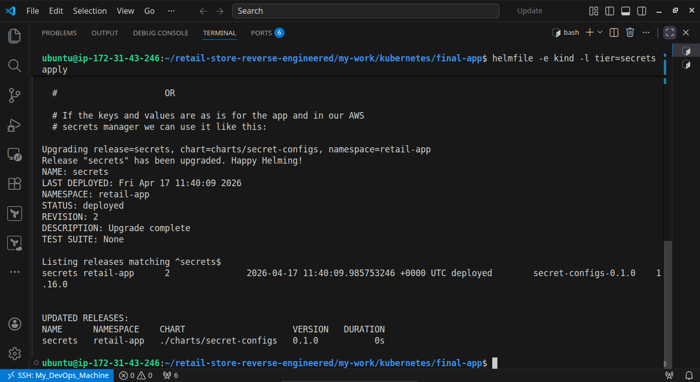
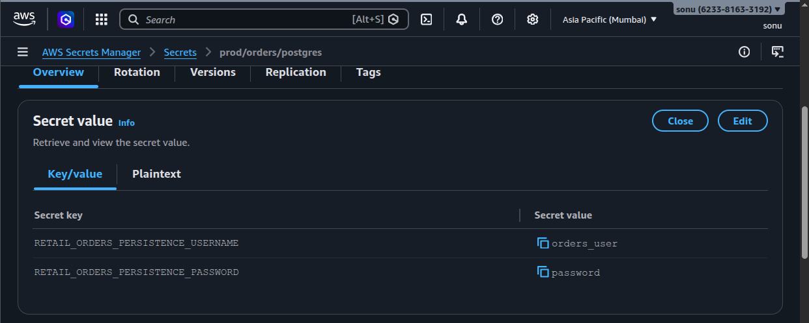
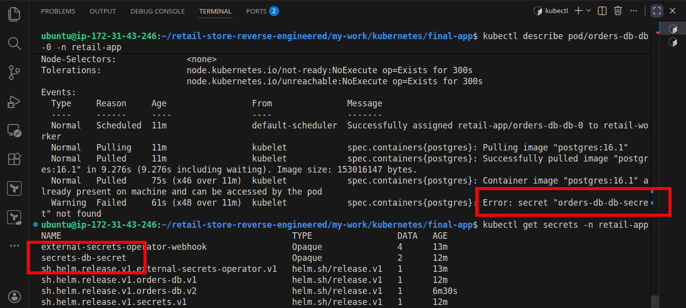
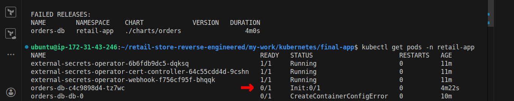
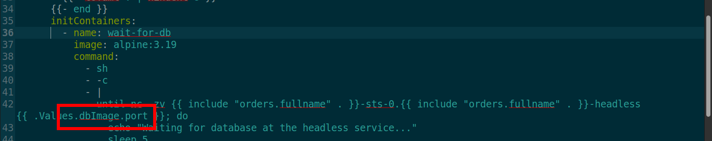
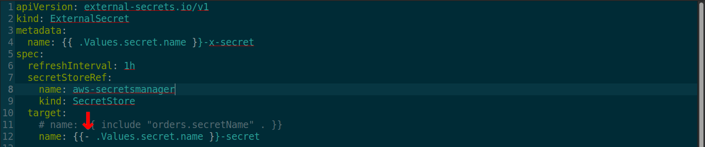
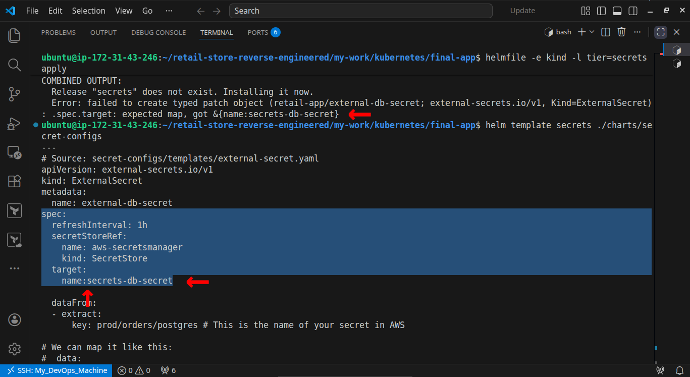

# 🚀 Helmfile-Based Deployment on K8s

## 📑 Table of Contents

1. **[Overview](#-overview)**
2. **[Project Structure with Helmfile](#️-project-structure-with-helmfile)**
3. **[What this Project Demonstrates](#-what-this-project-demonstrates)**
4. **[My Implementations](#️-my-implementations)**
5. **[Challenges & Debugging](#-challenges--debugging)**
6. **[What I Learned](#-what-i-learned)**
7. **[Limitations of helmfile](#️-limitations-of-helmfile)**
8. **[How to Run](#️-how-to-run)**
9. **[What's Next](#-whats-next)**
10. **[Final thoughts](#-final-thoughts)**

## 📖 Overview

*This project demonstrates **`deploying a reverse-engineered retail microservices application on Kubernetes using Helm and Helmfile`**.*

*The goal was to move from raw Kubernetes manifests to a more **`structured,
scalable, and production-like deployment approach`**.*

------------------------------------------------------------------------

## 🏗️ Project Structure with Helmfile

- *External Secrets Operator-CRD **`ESO-CRD`***
- *Centralized **`helmfile.yaml`** to orchestrate deployments*
- *kind config for **`KinD cluster`***
- *Individual **`Helm charts`** for each microservice*
- *Environment specific deployment with **`values`***
```
repo*
├── eso-crd.yaml
├── helmfile.yaml.gotmpl
├── kind-config.yml
├── charts
│   ├── carts
│   ├── catalog
│   ├── checkout
│   ├── orders
│   ├── secret-configs
│   └── ui
└── values
    ├── eks-prod.yml
    └── kind-ec2.yml
```

------------------------------------------------------------------------

## 🎯 What This Project Demonstrates

-   *Transition from raw YAML → **`Helm-based deployments`***
-   *Multi-service orchestration using Helmfile*
-   ***`Dependency-aware deployments`***
-   ***`Secure secret management using AWS Secrets Manager + Kubernetes`***
-   *Real-world DevOps workflow simulation*

------------------------------------------------------------------------

## ⚙️ My Implementations

### ⚓ Helm Chart Design for Each Service:

- *Designed and created dedicated Helm charts for each microservice (carts, catalog, checkout, orders, UI).*

    

- *Implemented consistent and meaningful naming conventions*

    

- ***`Built a smart auto-generated password mechanism`** for the catalog service to avoid hardcoded credentials.*

    

- ***`Developed a custom secret-configs Helm chart from scratch`** to manage centralized secret definitions*

    

### 🧪 Incremental Validation Strategy

- ***`Performed isolated, service-by-service validation`** of each Helm chart before full system deployment*

- ***`Followed a tiered testing approach`** to ensure each component was functional and stable independently*

    

- *This helped in:*
    - **`Identifying and debugging issues at the service level`**
    - ***`Avoiding compounded errors`** during full-stack deployment*
    - ***`Improving deployment confidence and reliability`***

### 🔐 Secure Secrets Integration

- ***`Integrated AWS Secrets Manager`** for external secret storage*

    

- ***`Used External Secrets Operator (ESO)`** to sync secrets into Kubernetes*

    

- *Ensured secrets were dynamically injected into pods without hardcoding*

    

### ✅ Result:

- ***`Eliminated risk of secret exposure in codebase`**.*
- ***`Improved security and maintainability`**.*

------------------------------------------------------------------------

## 🧩 Challenges & Debugging

### 🏷️ Resource Naming Confusion

- *helm chart used identical names across Services, Deployments, and ConfigMaps, which caused ambiguity and debugging difficulty*

    

- ***`Faced issues identifying correct service endpoints, especially for database connectivity`***

    

- ***`Refactored all resource names using meaningful, context-aware conventions`***

    

**✅ Result:**

- *Improved clarity across the system
Faster debugging and easier traceability*
- ***`Deployed apps easily`***

### 🧭 Chart Navigation Complexity

- *Navigating between values.yaml → templates → configs → _helpers.tpl across multiple charts became difficult*

    

- *Understanding value flow and template rendering required careful tracing*

**✅ Insight:**

- *Learned how Helm templating layers interact*
- *Improved ability to debug and reason about chart structure*

### ⚠️ `kubectl apply` vs `kubectl create` (CRD Issue)

- Initially used kubectl apply for installing ESO-CRDs, which caused inconsistent and failed deployments

**👉 Why it failed:**

- *apply expects an existing resource state to patch/update*
- *CRDs (especially from operators) often require clean, first-time creation*
- *Applying CRDs multiple times can lead to schema conflicts or partial updates*

**✅ Fix:**

- ***`Switched to kubectl create for CRD installation`** before deploying dependent resources*

**👉 Why create worked:**

- *kubectl create ensures a fresh, atomic creation of CRDs*
- *CRDs are meant to be installed once and managed by the operator afterward*


### 🚧 Init Container Blocking Orders Service
- Orders service failed to start due to init container never completing

    

- Root cause: used application service port instead of database service port in readiness check

    


**✅ Fix:**

- *Corrected the target service endpoint for database connectivity*

**💡 Lesson:**

- *Small configuration mistakes in dependencies can block entire service startup*

### 🧬 Go Template Whitespace Issue
- *Misuse of **"`-`"** (whitespace trimming) in Helm templates caused invalid YAML rendering*

    

- *This resulted in deployment failures*

    

**👉 Example problem:**

- **{{`-` ... }}** *removes spaces, which can break YAML structure*

**✅ Fix:**

- *Avoided aggressive whitespace trimming except where necessary (e.g., _helpers.tpl)*

**💡 Lesson:**

- *`YAML` is highly sensitive to formatting — template control must be used carefully*

------------------------------------------------------------------------

## 📚 What I Learned

**Helm beyond basics:**
- *designing reusable charts, managing naming conventions, and understanding template flow across values.yaml, templates, and _helpers.tpl*

**Deployment vs runtime dependencies:**
- Helmfile handles ordering, but service communication issues must be solved at runtime

**Incremental validation mindset:**
- testing services in isolation significantly reduces debugging complexity in distributed systems

**Secrets management in production:**
- integrating AWS Secrets Manager with ESO eliminates hardcoded secrets and improves security posture

**Kubernetes debugging skills:**
- identifying issues across services, init containers, and configurations through systematic troubleshooting

**CRD lifecycle awareness:**
- knowing when to use kubectl create vs apply for reliable operator-based resource installation

**Attention to detail matters:**
- small mistakes (ports, naming, whitespace in templates) can break entire deployments

------------------------------------------------------------------------

## ⚠️ Limitations of Helmfile

**No Continuous Reconciliation**
- *Helmfile is not a true GitOps tool — **`it does not continuously monitor and enforce cluster state`***
- ***`Requires manual execution`** (`helmfile sync`) to apply changes*

**Limited Drift Detection**
- *Cannot automatically detect or correct configuration drift in the cluster*
- *Changes made outside Helmfile (manual edits) can go unnoticed*

**Operational, Not Declarative**
- *Focuses on executing deployments rather than maintaining a desired state*
- *Lacks self-healing capabilities compared to GitOps tools like Argo CD*

**Dependency Handling is Deployment-Time Only**
- ***`needs`** manages ordering during deployment*
- ***`Does not handle runtime service dependencies or failures`***

**Scalability Challenges in Larger Systems**
- *Managing multiple environments and complex configurations can become difficult*
- *Requires additional structure and discipline to stay maintainable*

**No Native UI or Observability**
- *No built-in dashboard to visualize application state or deployment status*
- ***`Debugging relies heavily on CLI and logs`***

### 💡 Key Takeaway

- *Helmfile is powerful for structured multi-service deployments, but for production-grade, continuously reconciled systems, a **`GitOps approach (e.g., Argo CD) is more suitable`**.*

------------------------------------------------------------------------

## ▶️ How to Run

### Prerequisites

### Steps

pending....

------------------------------------------------------------------------

## 🔭 What’s Next

Moving forward, this setup will be transitioned to ArgoCD:

1. *Add **`deployment via ArgoCD`** [(read here)](../kubernetes/)*
2. *Implement **`CI/CD`** pipeline*
3. *Add **`email notification`** system*
4. *IaC using **`Terraform`***
5. *Add monitoring (**`Prometheus + Grafana`**)*
6. *Full Automation via one command **`terraform apply`***

------------------------------------------------------------------------

## 💭 Final Thoughts

***This project reflects my transition from writing standalone Kubernetes manifests to designing structured, scalable, and production-oriented deployments using Helm and Helmfile.***

*Beyond implementation, it helped me develop a deeper understanding of:*

- ***How microservices interact in real-world systems***
- ***The difference between deployment-time and runtime concerns***
- ***The importance of debugging, naming, and system clarity in distributed environments***
- ***It also highlighted the limitations of traditional deployment approaches, which led me to explore GitOps-based workflows for better reliability and maintainability.***

**This project marks a step forward in building production-grade systems with clarity, confidence, and engineering discipline.**