# 🔍 Source Code Analysis

Analyzed the complete application source codebase to understand service architecture, inter-service communication patterns, runtime dependencies, configuration flow, and operational requirements necessary for successfully deploying and managing the platform in a Kubernetes environment.

## 📑 Table of Contents

**🧭 Navigation:**

- [Implementation Roadmap](#️-implementation-roadmap)
- [Project Navigation](#-project-navigation)

**📘 Project Documentation:**

- [Overview](#-overview)
- [Repository Structure](#-repository-structure)
- [Tech Stack](#️-tech-stack)
- [Features](#-features)
- [Core Understanding](#-core-understanding)
- [Challenges & Solutions](#️-challenges--solutions)
- [Key Learnings](#-key-learnings)
- [Next Phase](#-next-phase)
- [Additional Source Code Insights](#-additional-source-code-insights)

## 🗺️ Implementation Roadmap

<p align="left">
  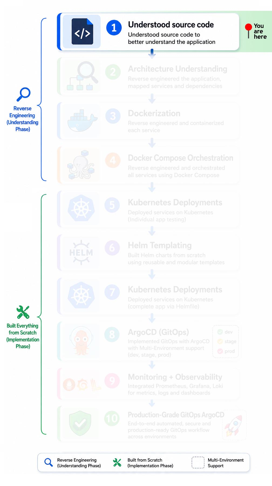
</p>

## 🔗 Project Navigation

- [Root Directory](https://github.com/sonuparit/retail-store-reverse-engineered)

### 📖 Understanding Phase

- [Source Code Understanding](https://github.com/sonuparit/retail-store-reverse-engineered/tree/main/src-code) ← (📍 You are here )
- [Architecture Understanding](https://github.com/sonuparit/retail-store-reverse-engineered/tree/main/my-work/04-applications/architecture)
- [Containerization (Docker)](https://github.com/sonuparit/retail-store-reverse-engineered/tree/main/my-work/04-applications/docker)
- [Docker Compose Orchestration](https://github.com/sonuparit/retail-store-reverse-engineered/tree/main/my-work/04-applications/docker-compose)

### ☸️ Kubernetes Implementation Phase

- [Individual Service Testing](https://github.com/sonuparit/retail-store-reverse-engineered/tree/main/my-work/04-applications/kubernetes/ind-svc-test)
  - [Carts](https://github.com/sonuparit/retail-store-reverse-engineered/tree/main/my-work/04-applications/kubernetes/ind-svc-test/cart-dynamodb-test)
  - [Catalog](https://github.com/sonuparit/retail-store-reverse-engineered/tree/main/my-work/04-applications/kubernetes/ind-svc-test/catalog-test)
  - [Checkout](https://github.com/sonuparit/retail-store-reverse-engineered/tree/main/my-work/04-applications/kubernetes/ind-svc-test/checkout-test)
  - [Orders](https://github.com/sonuparit/retail-store-reverse-engineered/tree/main/my-work/04-applications/kubernetes/ind-svc-test/orders-postgreSQL-test)
  - [UI](https://github.com/sonuparit/retail-store-reverse-engineered/tree/main/my-work/04-applications/kubernetes/ind-svc-test/ui-test)
- [Helm Templating](https://github.com/sonuparit/retail-store-reverse-engineered/tree/main/my-work/04-applications/kubernetes/helm-template)
- [Full App Deployment via Helmfile](https://github.com/sonuparit/retail-store-reverse-engineered/tree/main/my-work/04-applications/kubernetes/helmfile-deploy)
- [Multi-Environment GitOps via ArgoCD](https://github.com/sonuparit/retail-store-reverse-engineered/tree/main/my-work/04-applications/kubernetes/argocd-deploy)

### 📊 Production & Observability

- [Monitoring & Observability](https://github.com/sonuparit/retail-store-reverse-engineered/tree/main/my-work/03-observability)
- [Production-Grade GitOps Workflow](https://github.com/sonuparit/retail-store-reverse-engineered/tree/main/my-work)

## 📖 Overview

This document represents my deep source-code level analysis of a retail-based microservices application consisting of 5 independently deployed services.

Instead of only understanding the architecture diagram and deployment workflow, I went through the actual implementation of each service to understand:

- How services communicate internally
- How requests move between components
- How business logic is structured
- How different languages implement similar backend patterns
- How databases are integrated inside each service
- How APIs are exposed and consumed
- How middleware, repositories, controllers, and services are organized
- How orchestration happens during checkout flow
- How distributed microservice responsibilities are separated

The application follows a production-style microservices architecture where each service owns its own responsibility, technology stack, and database.

## 📂 Repository Structure

```bash
.
├── ui/                 # Java-based frontend service
│   ├── src/main
│   ├── Dockerfile
│   └── pom.xml
│
├── catalog/            # Golang product catalog service
│   ├── api/
│   ├── controller/
│   ├── model/
│   ├── repository/
│   ├── middleware/
│   └── test/
│
├── cart/               # Java cart management service
│   ├── src/main
│   ├── Dockerfile
│   └── pom.xml
│
├── orders/             # Java order management service
│   ├── src/main
│   ├── Dockerfile
│   └── pom.xml
│
├── checkout/           # Node.js checkout orchestration service
│   ├── src/
│   │   ├── checkout/
│   │   ├── chaos/
│   │   ├── clients/
│   │   ├── config/
│   │   └── middleware/
│   └── test/
│
└── docker-compose.yml
```

## 🛠️ Tech Stack

| Service  | Language             | Responsibility              | Database        |
| -------- | -------------------- | --------------------------- | --------------- |
| UI       | Java                 | Store frontend/UI rendering | -               |
| Catalog  | Go                   | Product catalog APIs        | MySQL / MariaDB |
| Cart     | Java                 | Shopping cart APIs          | DynamoDB        |
| Orders   | Java                 | Order management APIs       | PostgreSQL      |
| Checkout | Node.js / TypeScript | Checkout orchestration      | Redis           |

### Additional Technologies

- Docker
- Docker Compose
- REST APIs
- Gin Framework (Go)
- NestJS (Node.js)
- Maven
- Middleware-based request handling
- Repository Pattern
- Dependency Injection
- OpenAPI/Swagger style annotations
- Distributed service communication

---

## ✨ Features

- ### 1. Multi-Language Microservices

   The application intentionally uses different languages and frameworks for different services.

   This helped me understand:
  - How polyglot microservices work
  - How different ecosystems solve similar backend problems
  - Common patterns shared across languages
  - Service boundary isolation
  - Technology-independent API communication

- ### 2. Independent Database Ownership

   Each service owns its own database.

   Examples:

  - Catalog → MySQL/MariaDB
  - Cart → DynamoDB
  - Orders → PostgreSQL
  - Checkout → Redis

   This helped me understand true microservice database isolation and decentralized data ownership.

- ### 3. Checkout Orchestration Flow

   The Checkout service acts as an orchestrator.

   From the source code analysis, I understood:

  - How cart items are aggregated
  - How subtotal/tax/shipping calculations happen

      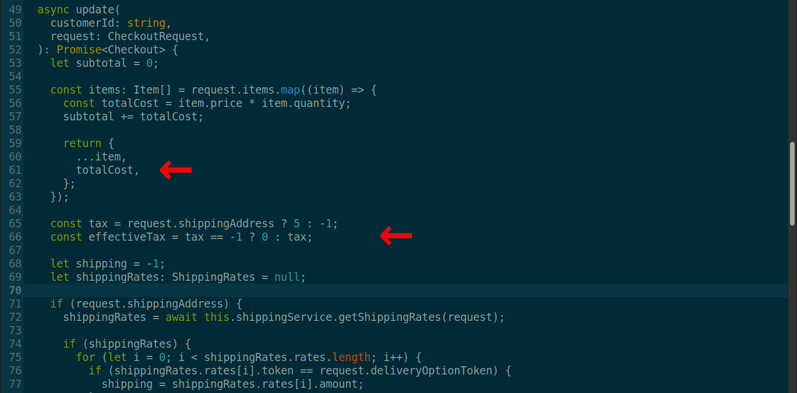

  - How checkout state is temporarily stored
  - How order creation is delegated to another service

      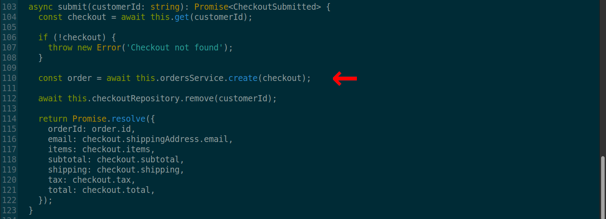

  - How services communicate internally during purchase flow

   The checkout service also demonstrated:

  - Dependency Injection

      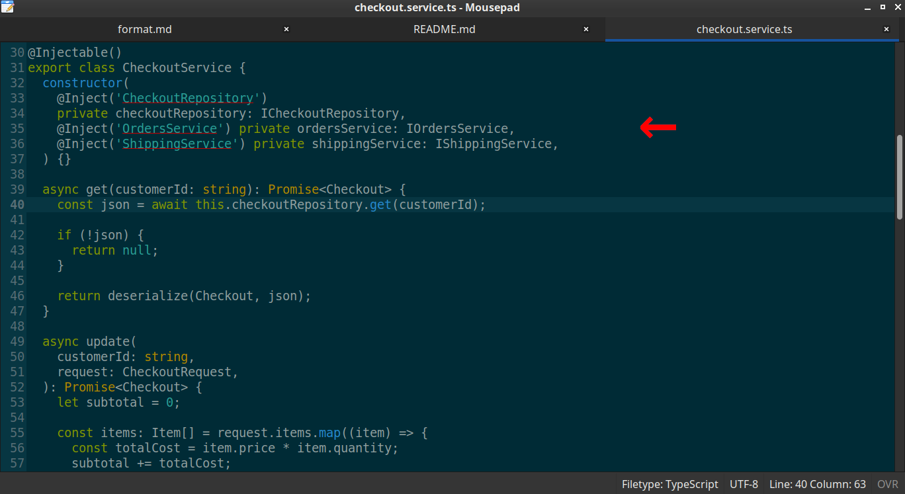

  - Service abstraction
  - Repository interfaces
  - Request serialization/deserialization
  - Distributed transaction-style workflow coordination

- ### 4. Controller-Service-Repository Pattern

   Across multiple services, I observed a layered backend architecture:

   ```text
   HTTP Request
      ↓
   Controller Layer
      ↓
   Service/API Layer
      ↓
   Repository Layer
      ↓
   Database
   ```

   The repository layer abstracts all database operations behind well-defined interfaces.

    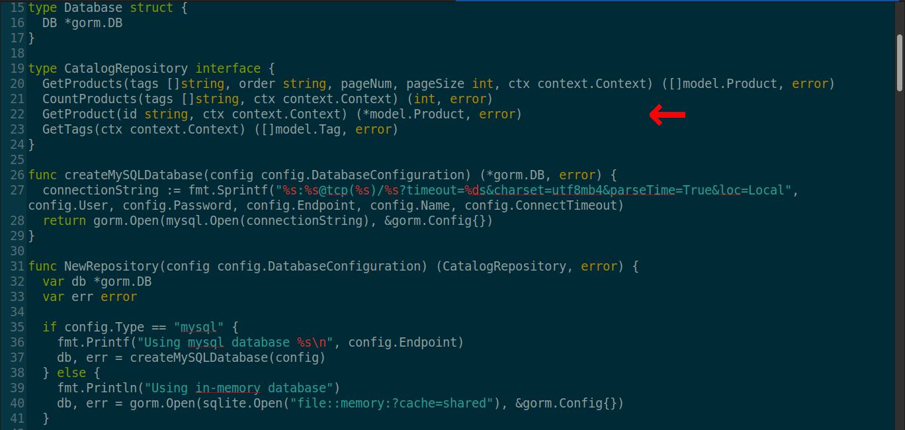

   This separation improved:

  - Maintainability
  - Testability
  - Business logic isolation
  - Database abstraction
  - Scalability

- ### 5. Middleware-Based Processing

   The codebase heavily uses middleware.

   Examples include:

  - Chaos middleware

      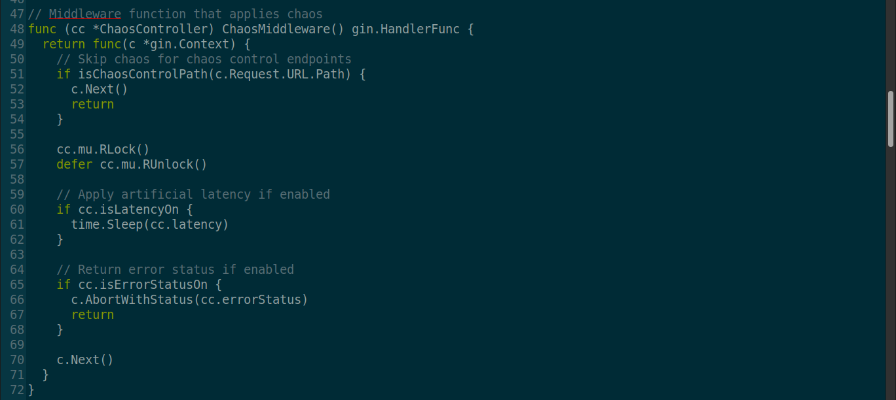

  - Logging middleware
  - Request processing middleware
  - Error handling
  - HTTP utility wrappers

   This helped me understand how production-grade services intercept and process requests before business logic execution.

## 🧠 Core Understanding

- ### 1. Catalog Service (Go)

  **The Catalog service exposed APIs for:**

  - Fetching products
  - Filtering products using tags
  - Pagination
  - Product detail retrieval
  - Catalog size calculation

      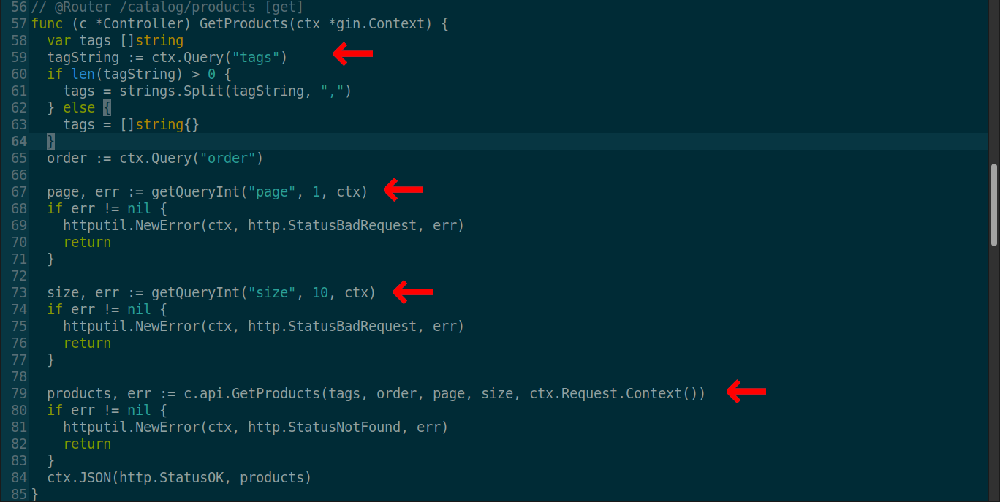

   **Key Understanding:**

   While analyzing the source code, I understood:

  - How Gin controllers handle HTTP requests
  - Query parameter extraction and validation
  - Repository-driven data access patterns
  - Context propagation using Go context.Context
  - API abstraction using service layers
  - Structured error handling
  - Swagger/OpenAPI annotations

   **Example Flow:**

   ```text
   HTTP Request
      ↓
   Gin Controller
      ↓
   Catalog API Layer
      ↓
   Repository Layer
      ↓
   MySQL/MariaDB
   ```

- ### 2. Checkout Service (Node.js / NestJS)

   The Checkout service was one of the most important learning areas.

   **It orchestrates:**

  - Cart processing
  - Shipping calculation
  - Tax calculation
  - Payment token generation
  - Order creation
  - Checkout persistence

   **Key Understanding:**

   From the source code analysis, I understood:

  - NestJS module structure
  - Dependency Injection using decorators
  - Service orchestration patterns
  - Serialization/deserialization flow
  - Interface-based abstractions
  - Distributed workflow handling
  - Temporary state management using Redis

   **Internal Checkout Flow:**

   ```text
   User Checkout Request
         ↓
   Checkout Controller
         ↓
   Checkout Service
         ↓
   Shipping Service
         ↓
   Orders Service
         ↓
   Redis Persistence
   ```

   **Important Observation:**

   The Checkout service was not directly responsible for everything.

   Instead, it coordinated multiple internal services together while keeping responsibilities separated.

   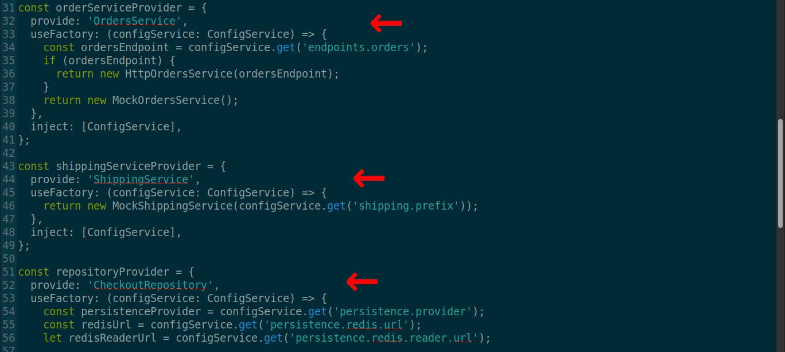

   This gave me practical understanding of orchestration-based microservice design.

- ### 3. Cart Service (Java)

   The Cart service manages shopping cart operations.

   **Key Understanding:**

   While analyzing the service structure, I understood:

  - Java Spring-style layered project structure
  - DynamoDB-based cart persistence
  - Separation between API and storage logic
  - Containerized Java application structure
  - Maven-based dependency management

- ### 4. Orders Service (Java)

   The Orders service manages finalized order records.

   **Key Understanding:**

   This service helped me understand:

  - Order persistence workflow
  - PostgreSQL integration patterns
  - Service separation from Checkout orchestration
  - Independent domain ownership in microservices
  - Database-per-service architecture

- ### 5. UI Service (Java)

   The UI service acts as the frontend layer for the retail application.

   **Key Understanding:**

  - Frontend-to-backend service interaction
  - API consumption flow
  - How UI integrates with backend microservices
  - Containerized frontend deployment structure

## ⚔️ Challenges & Solutions

- ### 1. Understanding Multiple Languages in One Project

   **Problem:**

   As a Python developer, one of the biggest challenges was understanding a codebase written in:

  - Go
  - Java
  - Node.js/TypeScript

   Each language had different:

  - Syntax
  - Folder structures
  - Dependency management systems
  - Backend conventions
  - Error handling approaches

   Initially, reading the code felt overwhelming because the same architectural concepts were implemented differently in each ecosystem.

   **Solution:**

   I solved this by:

  - Breaking services into smaller logical components
  - Understanding folder structure before reading implementation
  - Mapping equivalent concepts across languages
  - Using official documentation
  - Reading framework-specific patterns
  - Using Stack Overflow and AI-assisted explanations for unfamiliar syntax
  - Comparing controller/service/repository implementations between services

   Eventually, I realized the architectural patterns were similar even when the syntax changed.

- ### 2. Understanding Service-to-Service Communication

   **Problem:**

   Initially, it was difficult to understand:

  - Which service talks to which service
  - How orchestration works internally
  - Where business logic actually executes
  - Which service owns which responsibility

   The distributed nature of microservices made tracing the request flow harder compared to monolithic applications.

   **Solution:**

   I solved this by:

  - Tracing APIs step-by-step
  - Following controller-to-service-to-repository execution paths
  - Mapping request flows manually
  - Reading orchestration logic inside the Checkout service
  - Understanding interface-based service abstractions
  - Analyzing how order creation is delegated between services

   This improved my understanding of distributed application design.

- ### 3. Understanding Framework-Specific Patterns

   **Problem:**

   Different frameworks used different design styles:

  - Gin (Go)
  - NestJS (Node.js)
  - Java service architecture

   Understanding concepts like:

  - Dependency Injection
  - Middleware chains
  - Context propagation
  - Decorators
  - Repository abstraction

   required additional research.

  **Solution:**

   I solved this by:

  - Reading official framework documentation
  - Watching implementation examples
  - Comparing patterns across services
  - Researching unfamiliar annotations and decorators
  - Visualizing request flow through middleware and services

   This helped me build framework-independent backend understanding.

- ### 4. Understanding Production-Oriented Code Structure

  **Problem:**

   Unlike beginner projects, this application used:

  - Layered architecture
  - Interface abstractions
  - Middleware chains
  - Utility packages
  - Distributed responsibility separation
  - Repository patterns

   The code was designed for maintainability and scalability rather than simplicity.

  **Solution:**

   I solved this by:

  - Studying one layer at a time
  - Separating infrastructure logic from business logic
  - Identifying reusable patterns
  - Understanding why abstractions exist
  - Mapping how responsibilities are isolated between components

   This significantly improved my ability to read production-grade codebases.

## 🎓 Key Learnings

This analysis significantly improved my confidence in:

- Understanding unfamiliar codebases
- Learning new technologies quickly
- Reading enterprise-style backend systems
- Understanding distributed application architecture
- Navigating polyglot engineering environments
- Reverse engineering complex systems for deployment and DevOps implementation

## 🔭 Next Phase

*Architectural understanding [(read here)](../my-work/04-applications/architecture/)*

## 📸 Additional Source Code Insights

Additional implementation details explored during source code analysis:

- Cart REST API endpoint mappings

  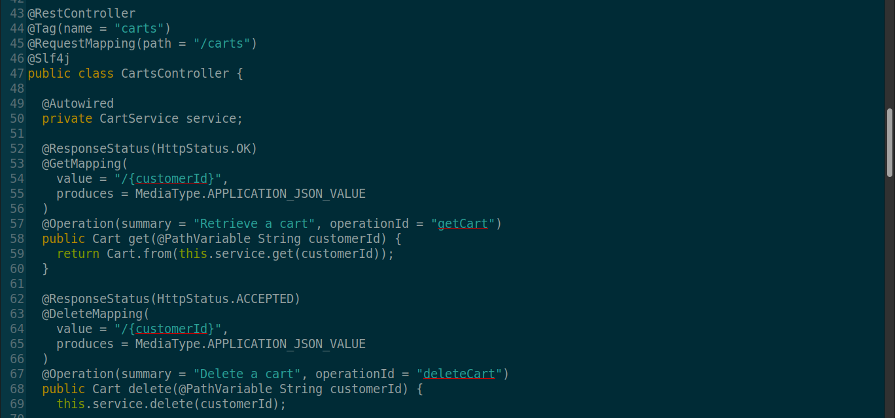

- DynamoDB table schema initialization

  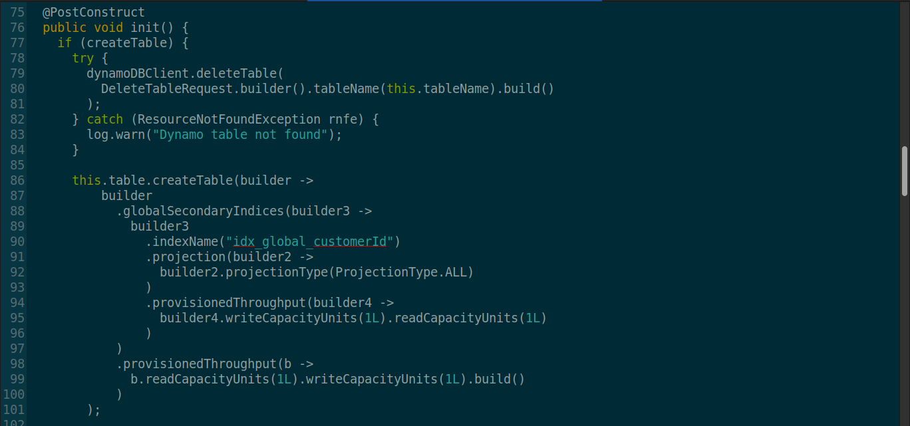

- Product filtering using SQL JOIN queries

  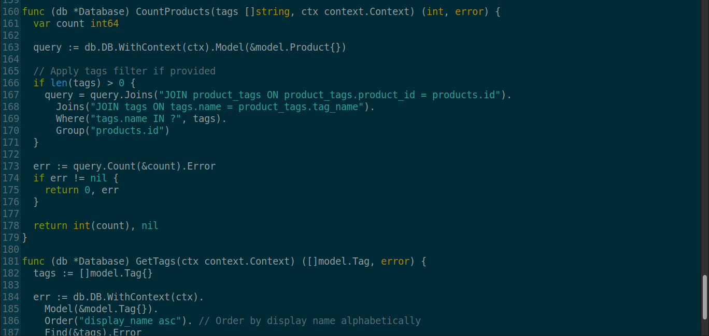

- Internal service-to-service order API communication

  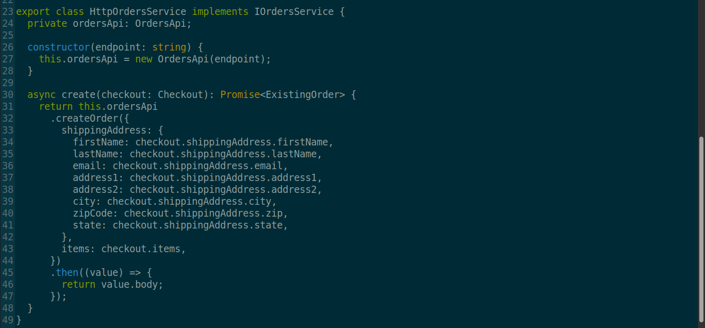
