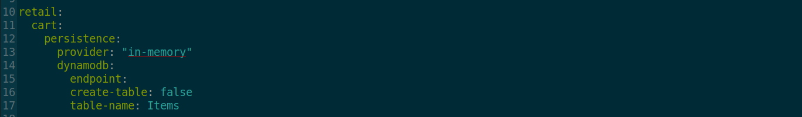
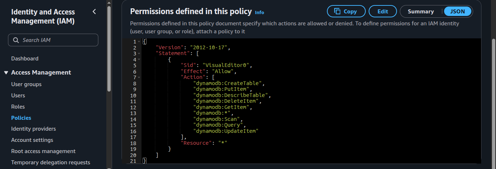
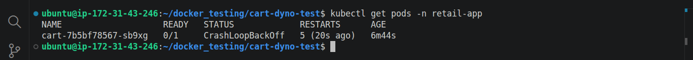
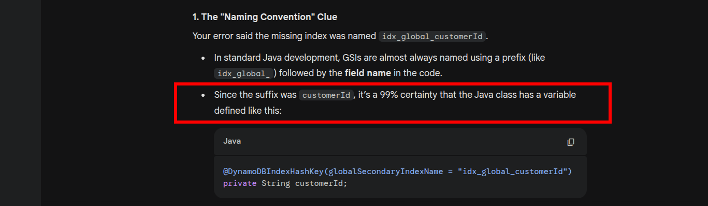
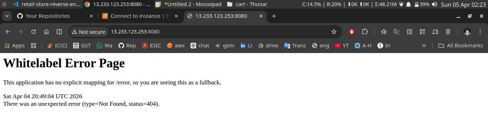
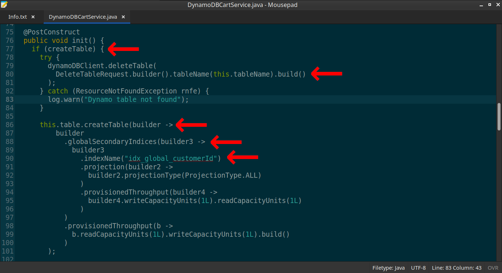
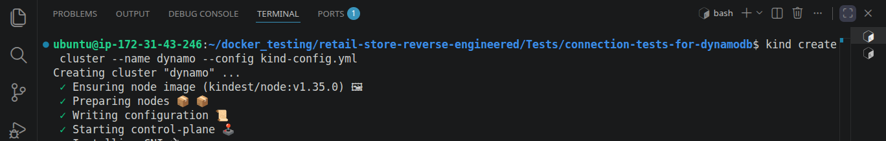
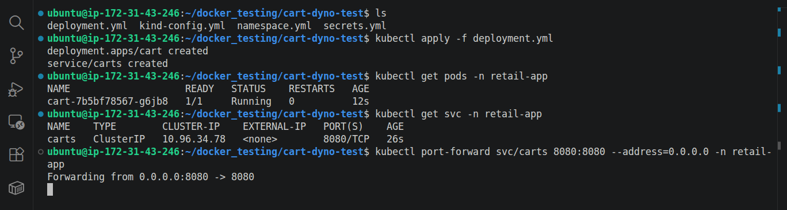

# 🚀 DynamoDB Integration in Microservices (From Mock to Production)

## 📑 Table of Contents

- **[Overview](#-overview)**
- **[Key Implementations](#-key-implementations)**
- **[Challenges & Solutions](#️-challenges--solutions)**
- **[Outcome](#-outcome)**
- **[Source Code Analysis](#️️-source-code-analysis)**
- **[Architectural Decision Record (ADR)](#️-architectural-decision-record--adr)**
- **[Key Learnings](#-key-learnings)**
- **[Tech Stack](#-tech-stack)**
- **[Next Steps](#-next-steps)**
- **[Extra Screenshots](#-extra-screenshots)**

## 📌 Overview

*This section of project demonstrates the transition from in-memory mock storage to a **`real AWS DynamoDB integration`** within a microservices-based retail application.*

*The goal is to move closer to a production-ready architecture by replacing simulated components with actual cloud services, however I got several **`errors`** in the process, but finally I was able to **`fix them all`**.*

------------------------------------------------------------------------

## 🔧 Key Implementations

-   *Analyzed service dependencies and database requirements (**`application.yml`**)*

    

-   *Replaced in-memory storage with **`AWS DynamoDB`***

    

-   *Configured **`IAM user`** with appropriate DynamoDB permissions (**`temporary full access for tests`**)*

    

-   *Implemented secure access using **`AWS Access Keys`** (lab setup using **`K8s secret`**)*

------------------------------------------------------------------------

## ⚠️ Challenges & Solutions

**Issue:**

*The application failed initially due to a **`missing DynamoDB index`** required by the cart service.*

**Solution:**
- *Investigated service logic and query patterns*

    

- Searched AI for "what can be the partition key"

    

- *Identified the required index structure by verifying it from source code*

    
    But this source code created a concern for my project goal [read here](#️️-source-code-analysis)

- *Designed and created the missing index*

    

------------------------------------------------------------------------

## ✅ Outcome

-   Successfully integrated DynamoDB with the cart service

    

-   Achieved a **fully functional, cloud-backed microservice**
-   Improved system reliability and realism for production scenarios

------------------------------------------------------------------------

## 🕵️‍♂️ Source Code Analysis

**The problem:**
- *Application is never meant to use real dynamodb from AWS, it is designed to use dynamodb in two distinct ways:*
    1. *`"Dynamodb In-memory storage"`*
    2. *`"Dynamodb local image"`*

- ***Env variable's critical role***

    

    - *If value is set to **`true`:***\
    **The application by itself creates/deletes the table**

    

    - *If value is set to **`false`:***\
    **The application expects the table with right indexing value already exist.**

------------------------------------------------------------------------

## 🏛️ Architectural Decision Record 📝 (ADR)

### If `CREATE_TABLE` == `true`:

**`Advantages`**:
1. *It's great for local development and testing.*

**`Disadvantages`**:

1. ***`Race Condition`:** Scaling to multiple replicas in K8s would trigger a "race" where one pod might delete the table while another is trying to create/write to it.*

2. ***`Data Loss`**: The delete table call ensures that data is ephemeral. For a retail app, cart persistence is critical for conversion.*

3. ***`Violation of Principal of Least Previledges (PoLP)`**: For the app to run this, the IAM Role needs DeleteTable and CreateTable permissions. In production, an app should only have Read/Write access.*

4. ***`Infrastructure Drift`**: By creating the table inside the app, Terraform loses the "Source of Truth." The infrastructure becomes "invisible" to management tools.*

### If `CREATE_TABLE` == `false`:

**`Advantages`**:
*All disadvantages from above becomes advantage.*

1. ***`No Infrastructure Drift`**: By creating the table through Terraform, We maintain the "Single Source of Truth.*

2. ***`No Race Condition`:** Scalling the app will not trigger creation/deletion of table. It just needs the table to be present.*

3. ***`No Data Loss`**: Table never deletes upon scalling or creation of pod. So, no data loss.*

4. ***`No Violation of PoLP`**: App does not need create or delete table permission, It needs only read and write access.*

**`Disadvantages`**:

1. *It requires the table to be present. So, either have to create the table manually or provisioned it through terraform, before app even starts*

### The Decicision:
*I chose to keep it **`false`** to simulate real-world scenarios and **`Focused on making the system production-safe rather than just functional`.***

------------------------------------------------------------------------

## 💡 Key Learnings

This implementation reinforced several core DevOps principles:

**1. Bridging the gap between development and production reality**
- *Moving from in-memory mocks to real cloud services exposed hidden architectural assumptions and forced alignment with real-world constraints.*

**2. Infrastructure must be treated as a first-class concern**
- *Delegating resource creation to application code leads to **infrastructure drift**, **lack of visibility**, and **poor control** — reinforcing the importance of tools like **`Terraform`** as the single source of truth is invaluable.*

**3. Designing for distributed systems requires careful state management**
- *Decisions like table creation inside services can introduce **`race conditions`**, especially in horizontally scaled Kubernetes environments.*

**4. Security is an architectural decision, not an afterthought**
- *Implementing DynamoDB access highlighted the importance of **Principle of Least Privilege** **`(PoLP)`** and avoiding over-permissioned IAM roles.*

**5. Environment-driven behavior can significantly alter system behavior**
- *A single environment variable (CREATE_TABLE) changed the system from **self-managing** to **`production-ready`**, emphasizing the need for clear configuration strategies.*

**6. Understanding service internals is critical for effective integration**
- *Debugging the missing index required deep analysis of source code and query patterns — not just configuration changes.*

**7. Production readiness is about predictability, not convenience**
- *Choosing pre-provisioned infrastructure over auto-creation ensured **`stability, persistence, and reliability.`***

------------------------------------------------------------------------

## 🛠 Tech Stack

-   **AWS DynamoDB**
-   **IAM (Access Management)**
-   **Microservices Architecture**
-   **Docker / Containerized Services**

------------------------------------------------------------------------

## 🚀 Next Steps

1. *Full app deployment on **`Kubernetes`***
2. *IaC Provisioning via **`Terraform`***
3. *Implement **`CI/CD`** pipeline*
4. *Add **`email notification`** system*
5. *Add monitoring (**`Prometheus + Grafana`**)*
6. *Full Automation via one command **`terraform apply`** on **`EKS`***

## 📸 Extra Screenshots

- *Creation of KinD Cluster for local development*

    

- *Creation of all K8s resources*

    

- *Local port-forwarding*

    